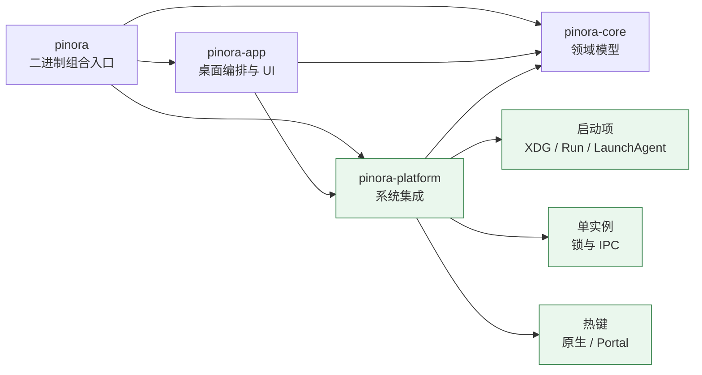
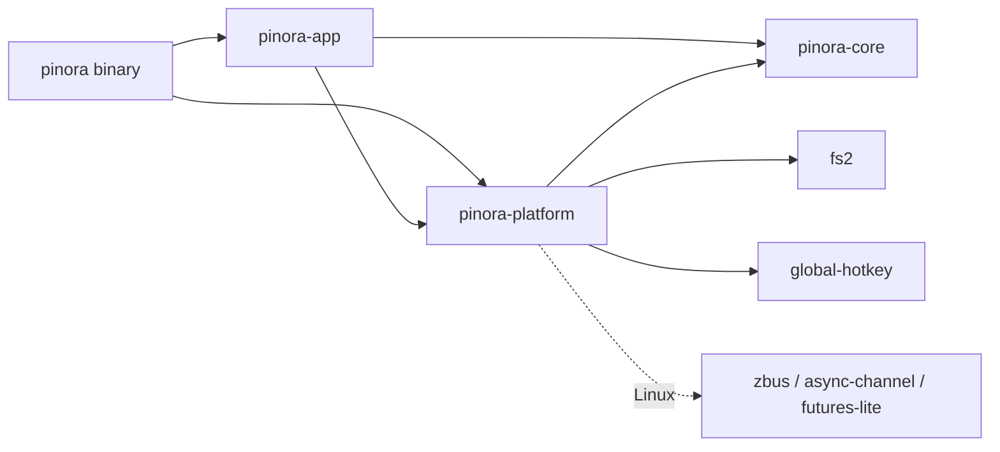

# 计划 105：功能化 crate 边界

- 状态：已完成
- 负责人：Codex
- 当前任务：`.context/tasks/105_platform_integration_crate.md`

## 目标

将与产品功能直接对应的系统集成能力从泛化的 `pinora-app` 拆出为 `pinora-platform`：用户级启动项、单实例锁与 IPC、全局热键及 Linux Wayland Portal。拆分后 `pinora-app` 仅消费该 crate 的稳定端口和适配器，不再直接依赖这些系统 SDK。

## 目标依赖图

## 非目标

- 本任务不迁移截图、OCR、导出、历史存储、任务监督、Overlay、贴图或 tray UI。
- 不重写领域模型，不改变设置 v9、IPC 帧、热键绑定、启动项格式或 tray-only 语义。
- 不新增依赖，不以交叉编译或单元测试替代原生 GUI、登录会话或性能验收。

## 约束

- `pinora-platform` 只拥有系统集成适配器，不得反向依赖 `pinora-app`、UI 状态或业务工作流。
- 迁移必须保持现有公共类型、IPC 帧、启动项格式、热键默认值和 tray-only 生命周期不变。
- 平台 SDK 继续按 target 条件编译；Linux Portal 的后台 worker 不得阻塞 GUI 事件循环。
- 每次迁移先保留原有契约测试，再以新 crate 的测试作为唯一回归入口；不得用 `allow` 或放宽 lint 隐藏问题。

## 依赖关系

`pinora-app` 不再直接声明平台 SDK；`pinora-core` 仍是纯领域下层。

## 检查点

1. 新 crate 编译、测试和严格 Clippy 通过，平台条件依赖不泄漏到 `pinora-app`。
2. 根入口只组装 `pinora-platform` 的单实例、IPC、热键和 desktop entry API。
3. 迁移前后的启动项、IPC、热键和 Portal 契约测试保持等价，失败语义与窗口生命周期不变。
4. 上下文、设计文档和 Cargo workspace 对当前 crate 边界给出一致事实。

## 计划级风险

- 真实桌面会话、登录启动、热键授权和任务栏/Dock 隔离仍不能由静态编译证明。
- `desktop_shell.rs` 仍承载大量 UI 与业务编排；后续拆分必须按单一功能边界逐项迁移，不能一次性重写。

## 阶段

1. 建立 `pinora-platform` crate，确定仅依赖 `pinora-core` 和已使用的系统 SDK。
2. 迁移启动项、单实例/IPC、热键/Portal 源文件与测试，更新 workspace 依赖和导入。
3. 以源码守卫、定向测试、workspace 门禁、Windows target 和上下文校验确认边界。
4. 后续任务按功能继续拆分：`pinora-capture`、`pinora-jobs`、`pinora-storage`、`pinora-desktop`；每个任务只迁移一个可验证边界。

## 完成标准

- `crates/pinora-platform` 是上述系统集成功能的唯一所有者；`pinora-app` 不再声明或编译其模块。
- `pinora-app` 不直接依赖 `fs2`、`global-hotkey`、`zbus`、`async-channel` 或 `futures-lite`。
- 根入口直接从 `pinora-platform` 获取 OS 单实例与桌面注册 API；桌面壳和 runtime 只依赖平台 crate 的公共契约。
- 原有单实例、热键、Portal、启动项、设置和 tray-only 回归通过；无公共协议、状态字符串或配置形状变化。

## 风险与回滚

- 该阶段跨越 Linux target 条件依赖和 GUI 线程热键生命周期；需保留既有 target 条件与纯 Wayland 的非阻塞 Portal 路径。
- 回滚时恢复 `pinora-app` 的模块声明和依赖，删除新 crate；领域、设置文件、IPC 帧、用户启动项和 UI 行为不变。

## 完成记录

- 已新增 `crates/pinora-platform`，迁移启动项、单实例/IPC、全局热键和 Linux Wayland Portal；`pinora-app` 已移除对应模块与直接平台依赖。
- 已更新根入口、runtime、desktop shell、workspace manifest 与设计/上下文文档；当前边界和后续 `capture/jobs/storage/desktop/ocr` 路线已用 Mermaid 记录。
- 已验证 `pinora-platform` 21 项测试、workspace 全量测试（app 286 通过、2 忽略；core 90 通过；platform 21 通过；根入口 1 通过）、`cargo check --workspace`、严格 Clippy、Windows target、fmt、diff 和 `ctx validate`。
- 真实桌面、登录会话、任务栏/Dock/分页器、Wayland 授权与性能仍按既有风险登记，不由本任务宣称完成。
