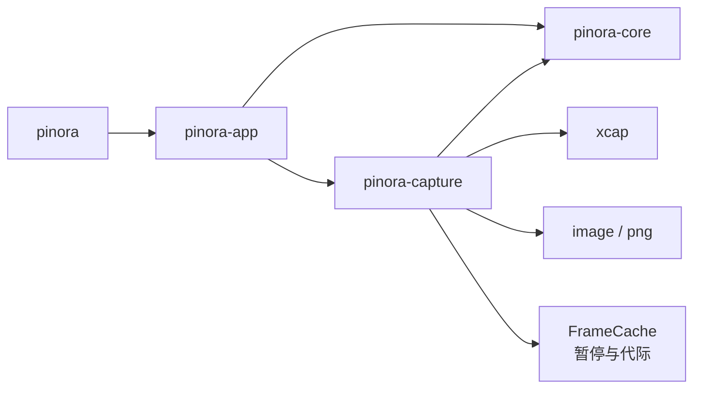

# 计划 106：捕获功能 crate

- 状态：已完成
- 负责人：Codex
- 当前任务：`.context/tasks/106_capture_crate.md`

## 目标

将真实截图后端选择、KDE/Spectacle 适配、xcap 适配、显式 fake 测试后端和预截帧缓存从 `pinora-app` 拆入 `pinora-capture`。应用层只消费捕获 trait、后端能力摘要和帧缓存端口，不改变截图请求、显示器/窗口快照校验、失败语义或 tray-only 生命周期。

## 非目标

- 不迁移 `desktop_shell`、Overlay、托盘、窗口策略、OCR、导出、设置存储或通用任务监督。
- 不新增生产 fake 回退，不把 KDE、xcap 或 Wayland 能力扩展为未验证的平台承诺。
- 不改变 `pinora-core` 的 `CaptureProvider`、`CaptureRequest`、`CaptureImage`、显示器/窗口 DTO 或错误码。

## 约束

- `pinora-capture` 只能依赖 `pinora-core` 及捕获所需的 `image`、`png`、`xcap`；不得依赖 `pinora-app` 或窗口 UI。
- `FrameCache` 的暂停代际、显示器 ID、来源矩形、尺寸和 scale 精确匹配语义必须保持不变；陈旧帧不得交付。
- KDE 后端继续执行真实拓扑探测与 workspace 尺寸校验；多显示器不能使用当前鼠标屏幕的 `-m` 快路径。
- `FakeCaptureProvider` 只能通过显式测试/开发 API 注入，自动探测失败必须返回 `Unavailable`。
- 迁移采用兼容 re-export，先移动所有权再更新调用方；测试必须随模块移动，不能复制两份实现。

## 依赖关系

## 检查点

1. 新 crate 的 provider、选择器和 FrameCache 测试全部通过，app 不再编译同名旧模块。
2. `pinora-app` 对外 re-export 保持 `FakeCaptureProvider`、`KdeSpectacleCaptureProvider`、`SelectedCaptureProvider`、`XcapCaptureProvider` 和 `fake_only` 的兼容路径。
3. runtime、desktop shell、history load job 的导入改为 `pinora_capture`，不形成 `capture ↔ app` 反向依赖。
4. workspace 测试、严格 Clippy、fmt、Windows target、diff 和 ctx 校验通过。

## 计划级风险

- KDE/Spectacle、xcap、Wayland/HiDPI 和真实屏幕权限无法由离线测试证明；保持风险登记中的未验证声明。
- `desktop_shell.rs` 仍约 7491 行，FrameCache 迁移只建立捕获边界，不等于完成 UI/事件循环拆分。

## 阶段

1. 创建 `pinora-capture` manifest 与模块入口，复制并改造捕获模块的 crate 内导入。
2. 更新 app manifest、lib re-export、runtime/desktop/history_load_job 引用。
3. 删除 app 内旧模块，执行定向和 workspace 质量门禁。
4. 更新 system/设计文档，完成记录后提交推送。

## 完成标准

- 捕获模块和 FrameCache 的唯一实现位于 `crates/pinora-capture`。
- 既有截图契约和失败语义无变化，生产自动探测不伪造 fake 成功。
- 所有代码与文档验证通过，真实桌面缺口被明确记录。

## 风险与回滚

- 风险：条件依赖或公共 re-export 漏接导致 Windows target、runtime 或历史加载编译失败。
- 回滚：恢复 app 模块声明和依赖，移除 `pinora-capture` workspace 成员；不改领域 DTO、截图协议或用户数据。

## 完成记录

- 已新增 `pinora-capture`，迁移 `capture_fake`、`capture_kde`、`capture_select`、`capture_xcap` 和 `frame_cache`；app 通过兼容 re-export 继续提供原有类型路径。
- 已将 runtime、desktop shell、history load job 和能力探测切换到新 crate，app 不再声明或编译旧捕获模块，也不再直接依赖 `xcap`。
- 已验证捕获 crate 26 项测试（25 通过、1 个真实桌面测试忽略）、runtime 定向测试、workspace check 与 cargo tree；完整静态门禁和上下文校验记录在任务文件。
- 真实屏幕权限、KDE/xcap/Wayland、HiDPI 和帧延迟仍需原生桌面探针，不由本计划宣称完成。
