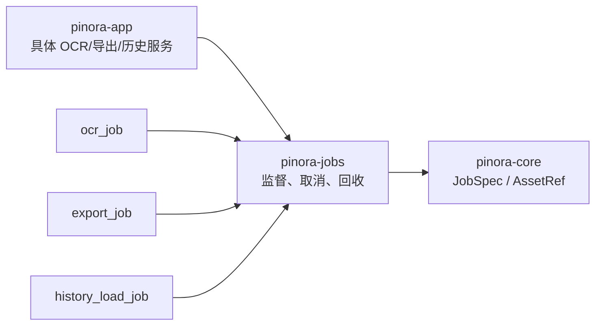

# 计划 107：任务监督 crate

- 状态：已完成
- 负责人：Codex
- 当前任务：`.context/tasks/107_jobs_crate.md`

## 目标

将任务状态机、协作式取消令牌、结果代际/owner 门禁和有界 worker 回收从 `pinora-app` 提取为 `pinora-jobs`。OCR、导出、历史加载等具体服务继续由上层拥有其线程和子进程，只消费通用监督器。

## 非目标

- 不迁移 `ocr_job`、`export_job`、`history_load_job`、`image_sink` 或任何 OCR/导出/存储实现。
- 不改变 `JobSpec`、`JobResultRef`、`JobTerminalState`、取消时机、超时语义、worker 回收期限或对用户数据的处理。
- 不新增线程池、异步运行时、外部任务队列或依赖。

## 约束

- `pinora-jobs` 只依赖 `pinora-core` 与标准库；不得依赖 app、capture、desktop、OCR、存储或平台 crate。
- `JobSupervisor` 不运行工作单元，具体服务必须继续持有自身创建的线程/子进程并负责取消与回收。
- 正常轮询只能 join 已结束 worker；退出等待必须有明确期限并如实报告未完成数量。
- app 保留兼容 re-export，迁移后不得存在第二份任务状态机实现。

## 依赖关系

## 检查点

1. 新 crate 持有 `JobSupervisor` 与 worker 回收的唯一实现和原有单元测试。
2. `ocr_job`、`export_job`、`history_load_job`、`image_sink`、`ocr` 与桌面壳全部直接导入 `pinora_jobs`。
3. 任务关闭、取消、超时、陈旧资产和 worker 收敛契约保持不变。
4. workspace、严格 Clippy、Windows target、fmt、diff 和 ctx 校验通过。

## 计划级风险

- 取消是协作式的，不能保证任意 OCR/剪贴板/文件 worker 在期限内停止；残留数必须继续如实报告。
- 此次只建立通用底座，`desktop_shell.rs` 和具体服务的生命周期编排复杂度仍保留在 app。

## 阶段

1. 创建 `pinora-jobs` 并迁移通用状态机/回收工具及测试。
2. 更新 app 的所有消费者和兼容导出，删除 app 旧模块。
3. 执行定向、workspace 和跨 target 门禁，更新上下文与设计图。
4. 提交并推送后再评估 storage 或 OCR 的独立边界。

## 完成标准

- `pinora-jobs` 成为通用任务监督与 worker 回收的唯一所有者。
- 具体功能服务没有改变线程、子进程、数据格式或结果交付语义。
- 全部质量门禁通过，真实桌面/外部进程残留风险仍明确记录。

## 风险与回滚

- 风险：public 可见性或导入路径遗漏会破坏具体服务、测试或 Windows 编译。
- 回滚：恢复 app 内两个模块和直接引用，移除 `pinora-jobs`；不改任务协议、设置、历史或截图数据。

## 完成记录

- 已新增 `pinora-jobs`，迁移 `JobSupervisor`、协作式 `JobCancellation`、结果门禁和有界 worker 回收；crate 只依赖 `pinora-core` 与标准库。
- `ocr_job`、`export_job`、`history_load_job`、`image_sink`、`ocr` 和桌面壳已直接消费新 crate；app 仍通过兼容 re-export 提供原有公开任务类型。
- 已验证 jobs 基础 7 项测试、OCR 13 项、导出 12 项、历史加载 10 项定向测试；完整 workspace、Clippy、Windows target、fmt、diff 和 ctx 校验通过。
- 协作式取消与真实子进程/文件系统收敛仍需原生桌面和压力探针，不能由迁移测试替代。
