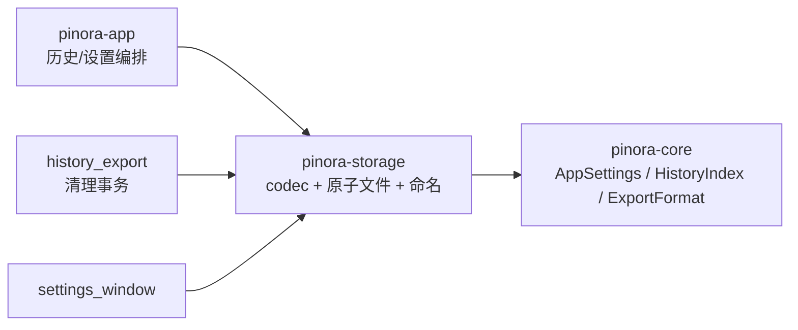

# 计划 108：本地存储 crate

- 状态：已完成
- 负责人：Codex
- 当前任务：`.context/tasks/108_storage_crate.md`

## 目标

将版本化设置 codec、历史索引 codec/原子存储和受管导出文件名分配从 `pinora-app` 拆入 `pinora-storage`。该 crate 只处理本地文件与领域索引，不拥有窗口、任务线程、剪贴板子进程或 OCR。

## 非目标

- 不迁移 `history_export` 的历史清理编排、`image_sink` 的图像编码/系统剪贴板或 `export_job`。
- 不改变设置 schema v9、历史索引格式、文件名格式、原子写入/回读校验、配额字段或用户目录策略。
- 不新增数据库、网络、云同步、自动更新或第三方服务。

## 约束

- `pinora-storage` 只依赖 `pinora-core` 与标准库；不得依赖 app、jobs、capture、platform、UI 或外部进程。
- 所有写入继续同目录临时文件、`sync_all`、原子 rename、回读校验；损坏/未知版本保留源文件并返回受控 Invalid。
- `ExportNameAllocator` 只能生成固定 ASCII 名称和受支持扩展名，不读取截图、OCR、剪贴板或窗口内容。
- app 通过兼容 re-export 使用新类型；不得复制第二份 codec 或导出命名实现。

## 依赖关系

## 检查点

1. 新 crate 唯一拥有 `SettingsStore`、`HistoryStore`、`HistoryLoad`、`ExportNameAllocator` 和对应测试。
2. app 的设置窗口、历史导出编排、desktop shell 与根入口切换到 `pinora_storage`；公共导出路径保持兼容。
3. schema 迁移、非法值修复、历史校验、原子回读、文件名冲突和边界测试保持通过。
4. workspace、严格 Clippy、Windows target、fmt、diff 和 ctx 校验通过。

## 计划级风险

- 跨平台文件系统、断电持久性、权限和网络/只读目录仍不能由本地离线测试证明。
- `history_export` 仍在 app 负责索引与受管 PNG 清理事务，可能在后续拆分中形成更细的 storage port。

## 阶段

1. 建立 `pinora-storage` 并迁移三个纯本地文件模块。
2. 更新 app、根入口和历史/设置调用方，删除旧模块并保留 re-export。
3. 执行定向与全量门禁，更新设计图、系统事实和风险。
4. 提交推送后再拆 desktop/OCR 或文件导出适配器。

## 完成标准

- 纯本地设置、历史索引和文件命名能力的唯一实现位于 `pinora-storage`。
- 不改变任何持久化数据形状、状态字符串、用户路径或导出命名行为。
- 所有质量门禁通过，真实文件系统/桌面探针缺口明确保留。

## 风险与回滚

- 风险：`pub(crate)` 导出命名器跨 crate 可见性、测试私有 codec 访问和历史编排导入遗漏。
- 回滚：恢复 app 内三个模块及导入，移除 `pinora-storage`；不删除用户文件或索引。

## 完成记录

- 已建立 `pinora-storage`，并迁移 `SettingsStore`、`HistoryStore`、`HistoryLoad`、`ExportNameAllocator` 及全部原有测试。
- 已更新 workspace、app 依赖和调用方，删除 app 内旧实现，保留公共兼容 re-export；设计文档和系统事实已同步。
- 已验证：`PINORA_NO_SYSTEM_CLIPBOARD=1 cargo test --workspace`（根 1、app 226 通过/1 忽略、capture 25/1 忽略、core 90、jobs 7、platform 21、storage 28），`cargo check --workspace`，`cargo clippy --workspace --all-targets -- -D warnings`，`cargo check --workspace --target x86_64-pc-windows-msvc`，`cargo fmt --check`，`git diff --check`，`ctx validate` 均通过。
- 未覆盖：真实桌面窗口/托盘、权限、断电、只读或网络文件系统、Wayland/HiDPI、性能和 GUI 端到端行为；这些风险继续由 `.context/system/risks.md` 跟踪。
