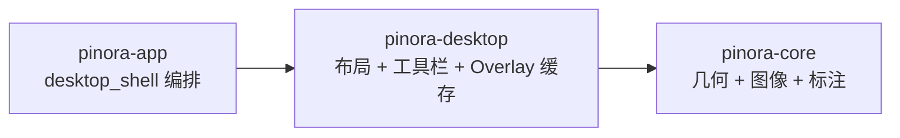

# 计划 109：桌面交互原语 crate

- 状态：已完成
- 负责人：Codex
- 当前任务：`.context/tasks/109_desktop_primitives.md`

## 目标

建立 `pinora-desktop` 的第一条可验证边界，迁移贴图尺寸/定位策略、Overlay 工具栏布局与命中、Overlay 已提交预览缓存。新 crate 只提供无窗口句柄的桌面交互原语，供现有 `desktop_shell` 编排；不把整个事件循环一次性搬迁。

## 非目标

- 不迁移 `desktop_shell` 事件循环、托盘、`window_policy`、历史/设置/诊断窗口或平台窗口实现。
- 不改变贴图缩放/定位、工具栏动作、标注预览缓存、`AssetRef` generation 或用户可见快捷键语义。
- 不新增 UI 框架、线程、异步运行时、系统服务或外部进程。

## 计划级风险

- `pinora-desktop` 当前只承载无窗口句柄的交互原语，窗口策略、托盘和事件循环仍在 `pinora-app`，单体化风险尚未消除。
- 跨 crate API 变为 `pub` 后需要保持文档和命名稳定，后续窗口适配迁移前不得把 app 私有状态泄漏进新 crate。

## 约束

- `pinora-desktop` 仅依赖 `pinora-core` 与标准库；不得依赖 app、winit、tray、capture、jobs 或 storage。
- 迁移模块不得持有窗口、事件循环、剪贴板、文件系统或 OCR 资源；所有输入输出保持纯数据/像素缓冲。
- app 通过兼容 re-export 保持既有导出路径；迁移后不得保留第二份实现。

## 依赖关系

## 检查点

1. 新 crate 唯一拥有 `pin_layout`、`overlay_toolbar`、`overlay_preview_cache` 的实现和测试。
2. `desktop_shell` 直接导入 `pinora_desktop`，app 公开 re-export 保持 `scaled_window_size` 等现有路径。
3. 贴图边界、工具栏布局/命中、预览缓存失效与草稿合成测试保持通过。
4. workspace、严格 Clippy、Windows target、fmt、diff 和 ctx 校验通过。

## 阶段

1. 建立 `pinora-desktop` 并迁移贴图几何、工具栏和预览缓存。
2. 更新 desktop shell、兼容导出、workspace 依赖和设计上下文。
3. 执行定向与全量门禁，记录真实桌面验证缺口。
4. 提交推送后再迁移窗口策略、托盘或 OCR 适配器。

## 风险与回滚

- 风险：跨 crate 可见性扩大后形成不稳定 API，或 `desktop_shell` 遗漏旧模块导入。
- 回滚：恢复 app 内三个模块和导入，移除 `pinora-desktop`；不改变截图、贴图、设置、历史或用户数据。

## 完成标准

- 三个纯桌面交互原语的唯一实现位于 `pinora-desktop`。
- 不改变任何窗口生命周期、持久化格式、状态字符串、平台能力或任务语义。
- 离线门禁通过，真实窗口/托盘/合成器行为缺口继续明确记录。

## 完成记录

- 已新增 `pinora-desktop`，唯一拥有 `pin_layout`、`overlay_toolbar`、`overlay_preview_cache` 及其原有 25 项测试；crate 仅依赖 `pinora-core` 与标准库。
- `desktop_shell` 已直接导入新 crate，app 删除旧模块并保留 `scaled_window_size` 兼容 re-export；无窗口、任务、文件或用户数据行为变更。
- 已验证：新 crate 25 项测试、workspace 全量测试（根 1、app 201/1 忽略、capture 25/1 忽略、core 90、desktop 25、jobs 7、platform 21、storage 28）、`cargo check --workspace`、严格 Clippy、Windows target、fmt、diff 和 `ctx validate`。
- 未覆盖：真实窗口/托盘、HiDPI、合成器任务栏隔离、输入延迟和帧时间；窗口策略与托盘仍由 app 后续迁移。
