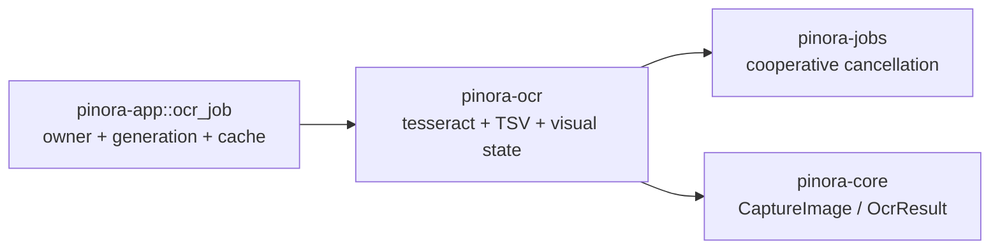

# 计划 110：OCR crate

- 状态：已完成
- 负责人：Codex
- 当前任务：`.context/tasks/110_ocr_crate.md`

## 目标

将系统 `tesseract` CLI 适配、PNG 临时输入、TSV 解析、协作式取消和词框视觉状态从 `pinora-app` 拆入 `pinora-ocr`。具体 OCR 任务监督和窗口交互仍由 app 负责。

## 非目标

- 不改变 OCR 结果结构、语言 wire 值、错误码、30 秒截止时间、16 MiB 输出上限或临时文件清理。
- 不迁移 `ocr_job` 的 owner/asset generation 门禁、缓存和任务提交编排。
- 不自动下载模型、不连接网络、不引入 C/C++ OCR 库或新的运行时。

## 约束

- `pinora-ocr` 仅依赖 `pinora-core`、`pinora-jobs`、既有 `png` 编码库与标准库；不依赖 app、desktop、capture、platform、storage 或 UI。
- 子进程必须由 OCR crate 自身持有并协作式取消、回收；不得把句柄交给 UI 或丢失 worker。
- app 通过兼容 re-export 保持原有公开 OCR API；迁移后不得存在第二份解析/适配实现。

## 计划级风险

- 本地 `tesseract`/语言模型、权限、慢进程和真实剪贴板/窗口行为仍需桌面探针，不能由离线 TSV 测试替代。
- 将 `recognize_image_with_language` 从 app 私有接口提升为 crate API，需要保持语言和错误语义稳定。

## 阶段

1. 建立 `pinora-ocr`，迁移 OCR 适配和词框呈现状态及测试。
2. 更新 app OCR 任务、desktop shell、公共导出和 workspace 依赖。
3. 执行 OCR 定向、workspace、Clippy、Windows target、fmt、diff 和 ctx 门禁。
4. 提交推送后再拆 OCR 任务编排或图像导出适配器。

## 依赖关系

## 检查点

1. 新 crate 持有 OCR CLI、TSV 解析、临时 PNG 和词框视觉状态的唯一实现与测试。
2. `ocr_job`、desktop shell 与 app 公共入口切换到 `pinora_ocr`，任务监督边界不变。
3. 语言模型选择、取消/超时/输出上限、临时文件清理和词框状态测试保持通过。
4. workspace、严格 Clippy、Windows target、fmt、diff 和 ctx 校验通过。

## 完成标准

- `pinora-ocr` 成为 OCR CLI、TSV 解析和词框视觉状态的唯一实现。
- 不改变 OCR worker 的任务、取消、缓存、错误或用户反馈语义。
- 离线门禁通过，真实引擎/模型和桌面权限缺口明确记录。

## 完成记录

- 已新增 `pinora-ocr`，唯一拥有 OCR CLI、PNG 临时输入、TSV 解析、取消/超时/输出上限和词框视觉状态；保留原有 13 项测试。
- `ocr_job` 已直接调用 `pinora_ocr`，app 删除旧 `ocr.rs`、`ocr_presentation.rs` 并保留公共 OCR API re-export；任务 owner、资产 generation、缓存和 worker 句柄仍由 app/jobs 负责。
- 已验证：`cargo test -p pinora-ocr -- --nocapture`（13 项）、workspace 全量测试（根 1、app 188/1 忽略、capture 25/1 忽略、core 90、desktop 25、jobs 7、ocr 13、platform 21、storage 28）、`cargo check --workspace`、严格 Clippy、Windows target、fmt、diff 和 `ctx validate`。
- 未覆盖：真实 tesseract 语言模型/权限、长时间进程压力、桌面词框呈现、HiDPI、系统剪贴板和 GUI 端到端行为。
