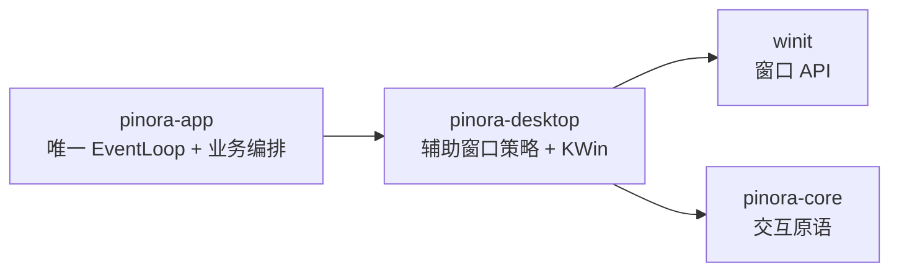

# 计划 111：桌面窗口策略边界

- 状态：已完成
- 负责人：Codex
- 当前任务：`.context/tasks/111_window_policy.md`

## 目标

将辅助窗口的统一创建/隐藏/映射策略、任务栏/Dock/分页器隔离和 KDE Wayland 位置适配从 `pinora-app` 拆入 `pinora-desktop`。app 只消费稳定的窗口策略 API，确保 tray-only 约束有单一实现入口。

## 非目标

- 不迁移 `desktop_shell` EventLoop、Overlay/Pin 状态、托盘菜单、截图或 OCR 任务。
- 不改变窗口类型、可见性顺序、KWin 脚本语义、标题匹配、延迟或平台降级错误行为。
- 不宣称静态策略等同于真实任务栏/Dock/分页器验收。

## 约束

- `pinora-desktop` 继续只依赖已有 `pinora-core` 与 `winit`；KWin 适配仅在 Linux 条件编译，不能拉入 app。
- 所有生产窗口仍只能通过 `window_policy` 创建和显示；隐藏 display handle 不得映射。
- app 通过兼容 re-export 保持 `run_desktop_shell` 及必要类型路径，禁止复制第二份策略。

## 计划级风险

- Windows/macOS/X11/KDE Wayland 窗口管理器可能忽略或延迟隔离属性，真实桌面探针仍是高风险门禁。
- 公开跨 crate 窗口 API 后，后续迁移必须保持唯一 EventLoop 和生命周期所有权，避免出现第二个窗口宿主。

## 阶段

1. 迁移 `window_policy` 与 `kwin_place`，更新 desktop crate 导出和 app 调用方。
2. 运行源码守卫、定向测试和跨 target 门禁。
3. 更新设计文档、系统事实和风险，提交推送后再拆托盘/窗口适配。

## 依赖关系

## 检查点

1. 新 crate 唯一拥有所有辅助窗口创建、映射和 KWin policy 实现。
2. app 源码除 `pinora_desktop` 调用外不直接构造/显示窗口，不保留旧模块。
3. window policy、KWin 脚本、workspace、Clippy、Windows target、fmt、diff 和 ctx 校验通过。

## 完成标准

- `pinora-desktop` 成为辅助窗口隔离策略的唯一实现，既有 tray-only 静态契约保持通过。
- 不改变任何用户数据、任务、截图、贴图或 OCR 语义；真实桌面缺口明确记录。

## 完成记录

- 已将 `window_policy` 与 `kwin_place` 迁入 `pinora-desktop`，公开稳定策略入口；app 删除旧模块，desktop shell、历史/设置/诊断窗口切换到新 crate。
- 新 crate 窗口策略/KWin 定向测试 8 项通过；workspace 全量测试（根 1、app 180/1 忽略、capture 25/1 忽略、core 90、desktop 33、jobs 7、ocr 13、platform 21、storage 28）、workspace check、严格 Clippy、Windows target、fmt、diff 和 `ctx validate` 均通过。
- 未覆盖：真实 Windows/macOS/X11/KDE Wayland 任务栏/Dock/分页器、焦点、首帧、HiDPI 和帧时间；静态源码守卫不替代窗口管理器探针。
