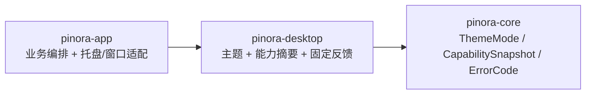

# 计划 112：桌面呈现状态 crate 边界

- 状态：已完成
- 负责人：Codex
- 当前任务：`.context/tasks/112_desktop_presentation.md`

## 目标

把共享面板主题 token、系统外观解析、tray 能力摘要和受控操作反馈从 `pinora-app` 迁入既有 `pinora-desktop`，让窗口/托盘呈现状态不再和业务编排同 crate。

## 非目标

- 不迁移托盘句柄、菜单注册、窗口 EventLoop、设置/历史/诊断业务状态或截图/OCR/导出任务。
- 不改变主题覆盖优先级、固定中文反馈、错误码映射、敏感信息脱敏或用户可见菜单语义。

## 约束

- `pinora-desktop` 只依赖已有 `pinora-core` 与 `winit`；不得依赖 app、platform、capture、jobs、storage 或系统服务。
- 反馈文本只能来自固定枚举和稳定错误码；不得携带路径、运行时 notes、OCR/剪贴板内容或原始后端错误。
- app 通过兼容 re-export 保持既有公开类型路径；不得复制第二份主题/反馈实现。

## 依赖关系

## 计划级风险

- 公开呈现 token 后，后续真正窗口/托盘适配仍可能误把受控文案与原始错误混用，需要源码守卫和固定标签测试。
- `PanelThemeState` 的系统外观刷新依赖 winit 事件时序，离线测试不能证明所有平台的 `ThemeChanged` 事件完整。

## 阶段

1. 迁移三个纯呈现模块及测试，更新 desktop crate 导出。
2. 更新 app 面板、托盘、诊断和 desktop shell 导入，保留兼容 re-export。
3. 执行定向与全量门禁，更新上下文并提交推送。

## 检查点

1. desktop crate 唯一拥有主题、能力摘要和 tray 反馈实现。
2. 设置/历史/诊断面板和托盘行为测试保持通过。
3. workspace、严格 Clippy、Windows target、fmt、diff 和 ctx 校验通过。

## 完成标准

- 三个纯呈现模块不再由 app 编译，公共 API 和反馈语义不变。
- 真实 tray/窗口管理器和系统主题事件缺口明确记录。

## 完成记录

- 已迁移 `panel_theme`、`tray_capabilities`、`tray_feedback` 及全部既有测试至 `pinora-desktop`；app 通过 crate 内 re-export 保留既有模块调用路径。
- desktop crate 现仅由既有 `pinora-core` 和 `winit` 等已存在依赖组成，无业务线程/托盘句柄/外部服务所有权。
- 已验证：desktop 43 项测试、workspace 全量测试（根 1、app 170/1 忽略、capture 25/1 忽略、core 90、desktop 43、jobs 7、ocr 13、platform 21、storage 28）、workspace check、严格 Clippy、Windows target、fmt、diff 和 `ctx validate`。
- 未覆盖：真实 tray 菜单、系统主题事件、窗口管理器和 HiDPI/性能；由现有风险记录继续跟踪。
