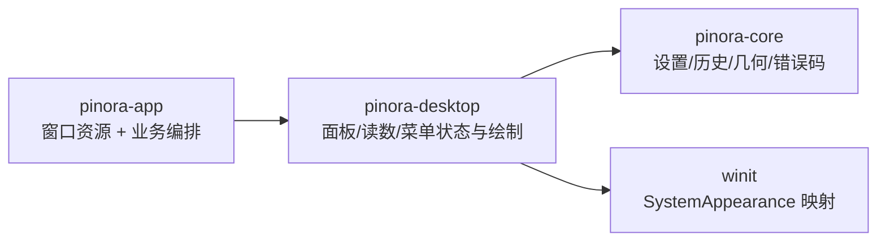

# 计划 113：自绘桌面面板 crate 边界

- 状态：已完成
- 负责人：Codex
- 当前任务：`.context/tasks/113_desktop_panels.md`

## 目标

将设置、历史、诊断的纯状态/布局/自绘，以及 Overlay 选区读数和贴图客户区菜单从 `pinora-app` 迁入 `pinora-desktop`。保留窗口资源、业务保存、历史加载、托盘和 EventLoop 在 app。

## 非目标

- 不迁移 `settings_window`、`history_window`、`diagnostics_window` 的 winit 资源、文件调用或业务工作流。
- 不改变面板尺寸、键盘/鼠标命中、主题 token、固定反馈、历史操作、文本绘制或 OCR/导出语义。
- 不引入新的 UI 框架、字体依赖、窗口、线程、进程或外部服务。

## 约束

- `pinora-desktop` 只使用已有 `pinora-core` 和 `winit`，不依赖 app、storage、jobs、capture、OCR 或 tray-icon。
- 自绘模块只处理数据、布局和 XRGB 像素缓冲；不得访问文件、窗口句柄、任务或系统剪贴板。
- app 以 crate 内兼容 re-export 使用迁移模块，防止出现第二份绘制/命中实现。

## 依赖关系

## 计划级风险

- 跨 crate 可见性扩大后，面板和像素绘制 API 需要保持小而稳定；不得把 app 工作流状态反向泄入 desktop。
- 离线像素/布局测试无法证明真实窗口缩放、输入法、焦点、任务栏/Dock 或性能。

## 阶段

1. 迁移五个纯 UI 模块和既有测试，更新 desktop crate 导出。
2. app 通过内部模块 re-export 兼容调用，删除旧实现。
3. 跑定向与全量门禁，更新上下文并提交推送。

## 检查点

1. desktop crate 唯一拥有面板、读数和贴图菜单的布局/绘制/命中实现。
2. 设置、历史、诊断、读数和菜单现有契约测试保持通过。
3. workspace、Clippy、Windows target、fmt、diff 和 ctx 校验通过。

## 完成标准

- app 不再编译五个纯 UI 模块，窗口适配器和业务边界不变。
- 真实 GUI/HiDPI/性能缺口明确记录，不将离线像素测试外推。

## 完成记录

- 已核对 `crates/pinora-desktop` 目录树与依赖，确认 crate 仅依赖 `pinora-core` 和 `winit`，并由 `pinora-app` 通过 `pinora_desktop` 兼容 re-export 复用纯 UI 模块。
- 已验证 `cargo tree -p pinora-desktop --depth 1`、`cargo tree -p pinora-app --depth 1`、`cargo test -p pinora-desktop -- --nocapture`（77 通过），以及 `cargo fmt --check`、`cargo check --workspace`、`cargo clippy --workspace --all-targets -- -D warnings`、`git diff --check` 和 `ctx validate`。
- 真实 GUI、HiDPI、输入法、焦点、tray/taskbar 和性能仍按风险记录保留。
