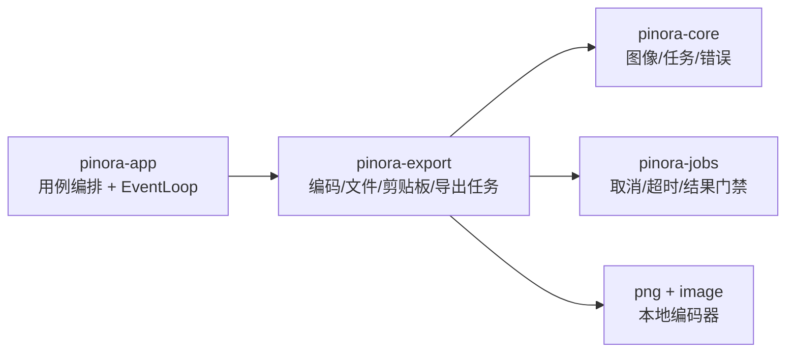

# 计划 114：导出与剪贴板 crate 边界

- 状态：已完成
- 负责人：Codex
- 当前任务：`.context/tasks/114_export_crate.md`

## 目标

将文件图像导出、系统剪贴板适配和受监督导出任务从 `pinora-app` 迁入独立的 `pinora-export`，让 app 只负责用例编排、窗口生命周期和结果呈现。

## 非目标

- 不迁移历史索引、历史加载、历史清理或 `HistoryStore` 编排。
- 不改变 PNG/JPEG/WebP 编码、原子文件发布、系统剪贴板回收、取消/超时和错误码语义。
- 不新增窗口、线程模型、外部服务、持久化格式或数据库能力。

## 约束

- `pinora-export` 只能依赖 `pinora-core`、`pinora-jobs` 及现有编码依赖；不得依赖 app、desktop、storage、capture、ocr 或 tray-icon。
- 外部剪贴板子进程必须由导出 crate 自身持有并回收；worker 结果继续通过 `JobSupervisor` 门禁。
- app 通过 crate re-export 保持现有公共调用面，避免出现第二份导出实现。

## 依赖关系



## 计划级风险

- 跨 crate 可见性变化可能遗漏 app 关闭路径或测试注入边界。
- 系统剪贴板与原子文件发布仍依赖原生桌面权限，离线测试不能替代平台探针。

## 检查点

1. `pinora-export` 唯一拥有导出和剪贴板实现，app 不再编译旧模块。
2. 导出任务的 owner、asset、终态、取消和超时门禁行为保持不变。
3. workspace、Clippy、Windows target、fmt、diff 和 ctx 校验通过。

## 变更前记录

```text
目的：隔离导出与剪贴板 IO，缩小 pinora-app 的应用编排边界。
影响路径：workspace 成员、pinora-export 新 crate、pinora-app 导入/re-export、desktop_shell 导出调用、设计与上下文文档。
兼容性：ExportJobInput/Runner/Service/Completion、LocalImageSink、编码格式、路径校验、取消/超时、错误码保持不变。
外部副作用：仅保留原有本地文件写入和系统剪贴板子进程；不新增外部服务。
回滚点：删除 pinora-export 成员并恢复 app 内两个模块及导入。
验证场景：导出 worker 结果门禁、格式/质量校验、原子保存、剪贴板失败保留内存副本、取消和超时回收。
```

## 阶段

1. 建立 `pinora-export` crate，迁移 `image_sink` 与 `export_job` 及原有测试。
2. app 使用兼容 re-export，删除旧实现并核对所有引用。
3. 更新设计/系统/风险文档，执行 workspace 与目标平台门禁并提交推送。

## 完成标准

- `pinora-export` 唯一拥有导出与剪贴板实现；app 不再编译同名旧模块。
- 既有导出、剪贴板、任务取消/超时测试保持通过。
- 真实桌面剪贴板权限、跨平台 GUI 和性能缺口明确记录，不将离线测试外推。

## 完成记录

- 2026-08-03：新增 `pinora-export`，迁移 `image_sink` 与 `export_job` 及原有契约测试；app 通过公开 API 和依赖注入继续编排导出。
- 2026-08-03：验证定向导出测试、workspace 测试、workspace check、Clippy、Windows target、fmt、diff 和 ctx 校验；真实系统剪贴板与原生桌面性能风险保留。
