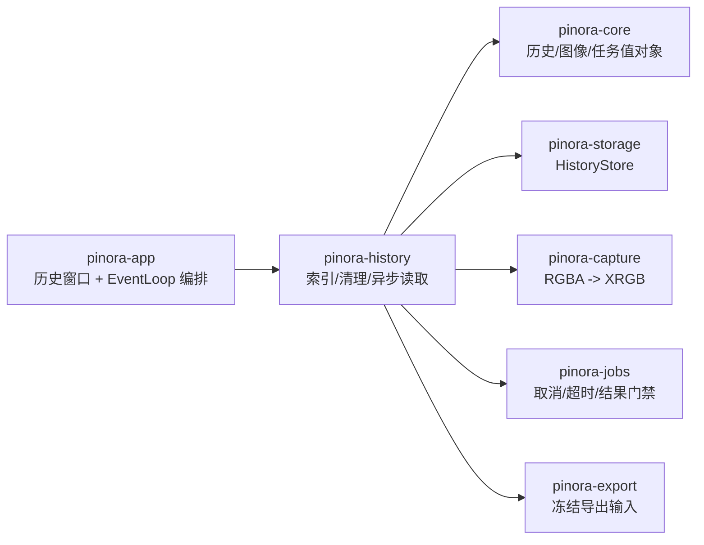

# 计划 115：历史工作流 crate 边界

- 状态：已完成
- 负责人：Codex
- 当前任务：`.context/tasks/115_history_crate.md`

## 目标

将历史索引加载、受管 PNG 记录/清理、历史删除/清空和异步历史图像读取从 `pinora-app` 迁入独立 `pinora-history`，让 app 保留窗口交互和历史用例编排。

## 非目标

- 不迁移 `history_window` 的 winit 资源、面板绘制或用户交互。
- 不改变历史索引 schema、tombstone、摘要校验、配额/保留期和图像身份语义。
- 不引入数据库、网络、后台服务或新的窗口/线程模型。

## 约束

- `pinora-history` 只依赖领域模型、存储、捕获像素转换、任务监督和导出输入契约；不依赖 app、desktop、tray 或 EventLoop。
- 所有历史文件路径必须继续限制在受管导出目录；历史读取 worker 的 owner、generation、终态、取消和超时门禁保持不变。
- app 通过 crate re-export 复用 API，避免保留第二份历史实现。

## 依赖关系

## 计划级风险

- 跨 crate 可见性调整可能遗漏历史窗口异步结果消费或关闭回收路径。
- `history_export` 当前读取导出输入，需保持与 `pinora-export` 的单向依赖且不形成循环。
- 离线文件测试无法证明真实权限、断电、网络文件系统和多进程竞争。

## 检查点

1. `pinora-history` 唯一拥有历史策略与异步加载实现，app 不再编译旧模块。
2. 历史索引、tombstone、摘要校验和异步结果门禁测试保持通过。
3. workspace、Clippy、Windows target、fmt、diff 和 ctx 校验通过。

## 阶段

1. 迁移历史索引/文件策略与异步读取服务及原有测试。
2. app 改为通过 crate re-export 编排历史窗口和结果消费，删除旧实现。
3. 更新设计/系统/风险文档，执行完整门禁并提交推送。

## 完成标准

- app 只持有历史窗口资源、面板交互和业务编排；历史文件与 worker 实现归属新 crate。
- 真实权限、断电、网络文件系统和 GUI 行为缺口明确记录，不将离线测试外推。

## 完成记录

- 2026-08-03：新增 `pinora-history`，迁移 `history_export` 与 `history_load_job` 及原有契约测试；app 通过 crate re-export 继续编排历史窗口和异步结果。
- 2026-08-03：验证 `cargo test -p pinora-history -- --nocapture`（26 通过）、workspace 测试、workspace check、Clippy、Windows target、fmt、diff 和 ctx 校验。
- 2026-08-03：真实文件权限、断电、网络文件系统、GUI 与性能风险保留在 R-066。
