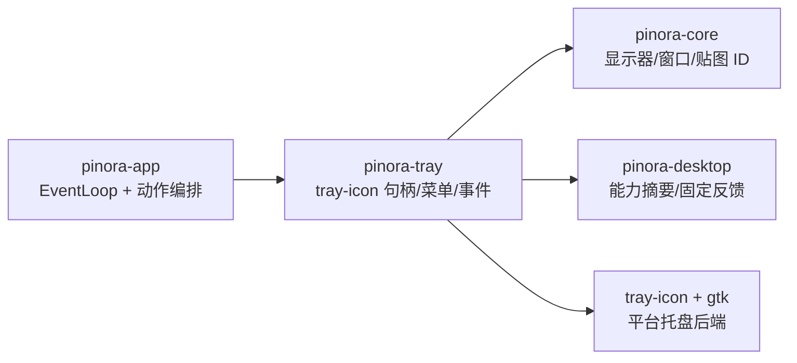

# 计划 116：托盘适配 crate 边界

- 状态：已完成
- 负责人：Codex
- 当前任务：`.context/tasks/116_tray_crate.md`

## 目标

将 `tray-icon` 菜单构造、平台托盘句柄、菜单事件映射、贴图动态列表与能力反馈从 `pinora-app` 迁入独立 `pinora-tray`，app 只保留动作编排和唯一 EventLoop。

## 非目标

- 不改变托盘菜单动作、标签、禁用状态、贴图排序或固定反馈语义。
- 不迁移 `pinora-desktop` 的纯能力摘要/反馈值对象，不引入第二个托盘实例。
- 不新增窗口、线程、网络、持久化格式或真实系统服务。

## 约束

- `pinora-tray` 只依赖 `pinora-core`、`pinora-desktop`、`tray-icon` 及 Linux 必需的 `gtk`；不得依赖 app、capture、jobs、storage 或 EventLoop。
- 托盘创建失败仍必须返回受控错误，不能留下不可达进程；Tray、Overlay、贴图和辅助窗口的 tray-only 约束保持不变。
- app 通过 crate re-export 使用 `AppTray`、`TrayAction` 和 `TrayPinListEntry`，避免保留第二份事件映射实现。

## 依赖关系

## 计划级风险

- tray-icon/GTK 的跨平台编译和原生后端行为可能与 app 现有初始化时序不同。
- 动态菜单 ID 与贴图恢复动作的可见性若迁移遗漏，会造成 tray 入口失效但不影响核心状态。
- 离线 MenuId 测试不能证明真实 StatusNotifier、任务栏/Dock、窗口列表或托盘重连。

## 检查点

1. `pinora-tray` 唯一拥有 `tray-icon` 菜单和句柄代码，app 删除旧模块。
2. 托盘动作映射、热键标签、窗口候选清洗、贴图列表排序和反馈更新测试保持通过。
3. workspace、Clippy、Windows target、fmt、diff 和 ctx 校验通过。

## 阶段

1. 迁移托盘菜单、句柄、事件映射和既有测试到 `pinora-tray`。
2. app 改为通过 crate re-export 消费动作，删除旧实现和直接平台依赖。
3. 更新设计/系统/风险文档，执行完整门禁并提交推送。

## 完成记录

- 已新增 `crates/pinora-tray`，独立拥有 `tray-icon` 菜单、句柄、事件轮询、动态贴图列表和固定反馈。
- 已删除 `pinora-app/src/tray.rs`，app 通过 `pinora-tray` re-export 消费 `AppTray`、`TrayAction` 和 `TrayPinListEntry`；app 不再直接声明 `tray-icon` 或 Linux GTK。
- 已完成托盘定向测试、workspace 测试、workspace 编译、严格 Clippy、Windows target 编译、格式、差异和 `ctx validate` 校验。
- 真实原生托盘、任务栏/Dock、菜单点击、重连和性能仍按 R-067 保持开放，未由离线门禁外推。

## 完成标准

- Pinora 空闲仍只由一个托盘实例作为用户入口；辅助窗口展示策略不改变。
- 真实原生托盘、任务栏/Dock、菜单点击和重连缺口明确记录，不将离线测试外推。
