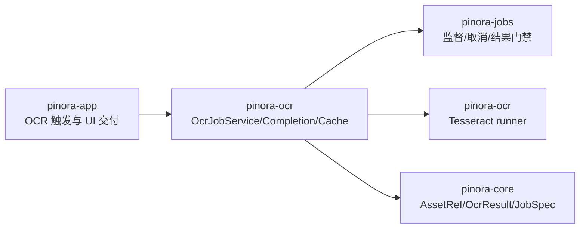

# 计划 117：OCR 任务服务 crate 边界

- 状态：已完成
- 负责人：Codex
- 当前任务：`.context/tasks/117_ocr_service_crate.md`

## 目标

将 `pinora-app` 中与窗口无关的 OCR 任务服务、结果缓存、worker 监督和结果门禁迁入现有 `pinora-ocr`，使 app 只保留 OCR 触发、owner/asset 当前状态查询和 UI 结果消费。

## 非目标

- 不改变 Tesseract 命令、语言设置、缓存容量、超时、取消或 `JobOwner`/`AssetRef` 门禁语义。
- 不改变 Overlay、贴图、剪贴板、托盘、持久化数据或窗口策略。
- 不新增线程模型、外部服务、依赖或公共产品入口。

## 约束

- `pinora-ocr` 只依赖 `pinora-core`、`pinora-jobs`、既有 `png` 和标准库；不得依赖 app、窗口、托盘、存储或剪贴板。
- `OcrJobService` 的 owner、资产 generation、截止时间、取消、缓存容量和 worker 回收契约保持不变。
- app 仍是唯一 EventLoop 所有者，OCR 服务不得直接创建、显示或更新窗口。

## 边界设计

## 依赖关系

## 计划级风险

- 将 `pub(crate)` 退出回收 API 移出 app 后，若没有提升到恰当公开边界，可能留下无效调用或 dead code。
- 服务的自 crate 导入、原有测试路径和 app 的兼容 re-export 若遗漏，可能在迁移后破坏编译或公共库 API。
- 离线任务门禁不能证明真实 Tesseract 进程、GUI 词框交付、窗口隔离或性能。

## 检查点

1. `pinora-app` 删除 `ocr_job` 模块，`pinora-ocr` 导出完整服务 API 与既有测试。
2. `pinora-ocr` 依赖树只包含 core、jobs、png，不反向依赖 app。
3. 定向和 workspace 门禁完成，文档明确真实桌面风险。

## 阶段

1. 迁移 OCR 服务与测试至 `pinora-ocr`，修正 crate 内导入和公开边界。
2. app 改用 `pinora-ocr` 服务导出，验证既有 desktop shell 调用。
3. 更新系统/设计/风险文档，执行完整门禁并提交推送。

## 完成标准

1. `pinora-ocr` 唯一拥有 `OcrJobService`、`OcrRunner`、结果类型和进程内缓存；app 删除 `ocr_job` 模块并通过 crate re-export 兼容现有调用。
2. 原有 OCR 定向测试和 workspace 测试全部通过，任务 owner、资产代际、截止时间、取消、失败和缓存隔离行为不变。
3. crate 依赖保持单向：`pinora-ocr -> pinora-core/pinora-jobs`，不依赖 app。
4. fmt、Clippy、workspace 编译、Windows target、diff 和 ctx 校验通过。

## 风险与回滚

- 风险：模块内 `pinora_ocr` 自引用、可见性 re-export、测试路径和 workspace feature 配置迁移遗漏。
- 回滚：恢复 `crates/pinora-app/src/ocr_job.rs` 与 `mod ocr_job`，移除 `pinora-ocr::job` 导出；不改变核心数据格式和窗口流程。

## 完成记录

- 已将 app 的 `ocr_job.rs` 和 13 项既有服务测试迁入 `pinora-ocr/src/job.rs`；crate 现在统一拥有本地 runner、worker 生命周期、缓存和结果门禁。
- `OcrJobService::cancel_all_and_wait` 已作为受控公开退出 API，app 的 2 秒协作式取消/回收调用保持不变。
- `cargo tree -p pinora-ocr --depth 1` 仅显示 `pinora-core`、`pinora-jobs` 和 `png`，未形成 app 反向依赖。
- 已通过定向测试、app 回归、完整 workspace 门禁和 ctx 校验；真实 Tesseract、GUI、窗口管理器及性能风险仍按 R-068 保持开放。
