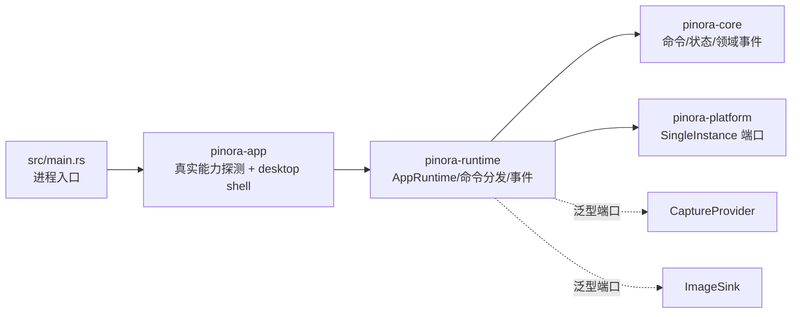

# 计划 118：应用运行时工作流 crate 边界

- 状态：已完成
- 负责人：Codex
- 当前任务：`.context/tasks/118_runtime_crate.md`

## 目标

将 `pinora-app` 中与窗口无关的 `AppRuntime`、命令分发、单实例启动/转发、领域事件和能力探测端口迁入独立 `pinora-runtime`，让 app 只保留真实平台探测实现、桌面 shell 与唯一 EventLoop。

## 非目标

- 不改变 `Command`、`DomainEvent`、`AppPhase`、`PinId`、图像或设置持久化格式。
- 不改变截图、剪贴板、托盘、Overlay、贴图、OCR、历史和窗口策略的用户行为。
- 不新增线程、窗口、网络、数据库或外部服务，不把 runtime 变成第二个 EventLoop。

## 约束

- `pinora-runtime` 只依赖 `pinora-core` 和 `pinora-platform`；捕获与图像输出通过既有 trait 泛型注入。
- `CapabilityProbe` 由 runtime 定义稳定端口，app 的真实 `RuntimeCapabilityProbe` 通过该端口实现；runtime 不读取系统环境或剪贴板命令。
- `AppRuntime` 的 bootstrap、secondary forward、shutdown、owner 状态和事件顺序保持不变。

## 依赖关系

## 计划级风险

- `CapabilityProbe` 的 crate 所有权迁移若遗漏，会导致 app 和 runtime 出现两份同名 trait 或泛型边界不一致。
- runtime 测试原先依赖 app 的 fake 类型，迁移后需使用 dev-dependency 或测试内 fake，不能把 app 反向加入 runtime。
- 离线事件测试不能证明真实单实例、屏幕权限、剪贴板和桌面生命周期。

## 检查点

1. `pinora-runtime` 唯一拥有 `AppRuntime`、`BootstrapOutcome`、`DispatchResult` 和 `CapabilityProbe`。
2. app 删除 `runtime.rs` 中的工作流实现，仅保留 `platform.rs` 的真实能力探测适配。
3. 根入口和 desktop shell 通过兼容 re-export 使用同一 runtime 类型，workspace 依赖保持无环。

## 阶段

1. 建立 crate、迁移 runtime 与测试，修正 dev-dependency 和能力探测 trait。
2. app、根入口和 desktop shell 切换至 runtime crate，删除旧模块。
3. 更新设计/系统/风险文档，执行完整门禁并提交推送。

## 完成标准

- runtime 定向测试、workspace 测试、Clippy、workspace/Windows 编译、fmt、diff 和 ctx 校验全部通过。
- 真实桌面与跨平台单实例、权限、窗口隔离和性能缺口继续明确记录，不由离线测试外推。

## 完成记录

- 已新增 `pinora-runtime`，迁入 `AppRuntime`、命令分发、单实例 bootstrap/forward/shutdown、事件发布和 `CapabilityProbe` 端口。
- app 删除本地 runtime 模块，保留 `RuntimeCapabilityProbe` 与 `FakeCapabilityProbe` 实现，并通过 re-export 维持根入口和 desktop shell 的使用方式。
- 原有 14 项 runtime 契约测试已迁入新 crate；`pinora-runtime` 生产依赖只包含 core 与 platform，测试依赖使用 capture/export fake 端口且不反向依赖 app。
- 已通过完整门禁；真实单实例、权限、窗口隔离和性能继续按 R-069 保持开放。
