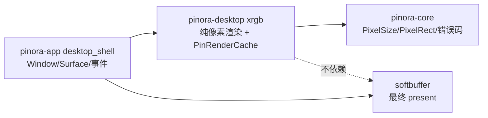

# 计划 119：桌面 XRGB 渲染原语边界

- 状态：已完成
- 负责人：Codex
- 当前任务：`.context/tasks/119_desktop_xrgb_renderer.md`

## 目标

将 `desktop_shell` 中不持有窗口的 XRGB 缩放、压暗、脏区恢复、选区/词框/贴图边框绘制及贴图基础帧缓存迁入 `pinora-desktop`，使 app 只持有窗口状态并调用纯渲染原语。

## 非目标

- 不迁移 `Window`、`Surface`、`Context`、Overlay/贴图状态机、输入事件、任务编排或 EventLoop。
- 不改变缩放算法、压暗近似、边框像素、选区手柄尺寸、缓存命中键或任何用户可见交互。
- 不改变截图、导出、OCR、托盘、持久化和窗口策略。

## 约束

- `pinora-desktop` 仅继续依赖 `pinora-core` 与既有 `winit`；不依赖 app、capture、history、jobs、softbuffer 或 tray。
- 渲染 API 只接收 XRGB slice、`PixelSize`、`PixelRect` 和标量，不接收 `Window`/`Surface` 或业务 owner。
- 缓存建造必须继续校验源/目标像素数量并返回受控 `PinoraError`，不得因坏尺寸 panic 或隐式截断。

## 依赖关系

## 计划级风险

- 函数签名由宽高整数改为 `PixelSize` 时，调用点可能把源/目标尺寸传反。
- 手柄常量、边框裁剪和近乎不透明的压暗阈值若误改，可能造成微小但可见的像素回归。
- 纯像素测试不证明真实 softbuffer、HiDPI、连续 resize、焦点或任务栏/Dock 行为。

## 检查点

1. `pinora-desktop` 导出 `PinRenderCache` 和命名明确的 XRGB 绘制/缩放原语，原有缓存测试迁移到 crate。
2. app 删除重复实现，只保留 `PinWin.render_cache` 持有及 `Surface` 上传。
3. `pinora-desktop` 依赖树不增加 capture/app/softbuffer，workspace 门禁通过。

## 阶段

1. 在 desktop crate 新建纯渲染模块，先写像素回归测试。
2. app 切换调用并删除旧的无状态像素实现与测试。
3. 同步设计/系统/风险文档，执行完整门禁并提交推送。

## 完成标准

- XRGB 定向测试、desktop/app 回归、workspace 测试、Clippy、Windows target、fmt、diff 和 ctx 校验通过。
- 真实桌面帧时间、HiDPI、输入延迟、焦点、tray-only 和任务栏/Dock 风险保持开放。

## 完成记录

- 代码迁移：新增 `pinora-desktop::xrgb`，统一拥有 `PinRenderCache`、最近邻缩放、压暗、脏区恢复、矩形/词框/贴图边框和选区手柄绘制；`pinora-app` 已删除重复的无窗口像素实现，只保留 `Window`/`Surface` 上传、状态与输入编排。
- 定向验证：`cargo test -p pinora-desktop -- --nocapture`，83 项通过；`cargo test -p pinora-app --lib -- --nocapture`，41 项通过；`PINORA_NO_SYSTEM_CLIPBOARD=1 cargo test --workspace` 通过，capture/export 各 1 项真实桌面测试按既有约定忽略。
- 最终门禁：`cargo check --workspace`、`cargo clippy --workspace --all-targets -- -D warnings`、`cargo check --workspace --target x86_64-pc-windows-msvc`、`cargo fmt --check`、`git diff --check` 与 `ctx validate` 全部通过。
- 已验证事实：离线像素语义、crate 依赖方向和 Windows 交叉编译通过；未知项：真实 softbuffer、HiDPI、连续 resize、焦点、任务栏/Dock 与性能仍待原生桌面会话验证。
