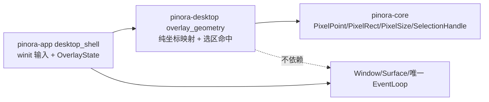

# 计划 120：桌面 Overlay 坐标与选区命中边界

- 状态：已完成
- 负责人：Codex
- 当前任务：`.context/tasks/120_desktop_overlay_geometry.md`

## 目标

将 `desktop_shell` 中不持有窗口的 Overlay 像素坐标映射、选区调整资格和选区手柄命中迁入 `pinora-desktop`，让 app 只将 winit 输入转换为物理像素后调用纯几何原语。

## 非目标

- 不迁移 `OverlayState`、`SelectionSession`、标注事务、窗口/Surface、输入事件、事件循环或 capture 编排。
- 不改变选区边缘取整、越界拖动、手柄优先级、OCR 文字拖选区域或标注坐标的既有语义。
- 不修改截图、导出、OCR、托盘、持久化、窗口策略或跨平台适配器。

## 约束

- `pinora-desktop` 只依赖 `pinora-core` 与既有 `winit`，坐标模块不得依赖 app、capture、jobs、softbuffer、tray 或外部进程。
- API 必须以 `PixelPoint`、`PixelRect` 与 `PixelSize` 表达物理像素空间；窗口逻辑尺寸和 winit 类型不得泄漏到纯映射层。
- 映射必须对零尺寸、倒序端点、负坐标和重叠手柄保持受控、确定的结果，不得产生除零或数组访问。

## 依赖关系

## 阶段

1. 将 app 的既有坐标与手柄回归场景迁入 desktop crate，并补充退化尺寸/端点覆盖。
2. 新建 `overlay_geometry` 模块，切换 app 调用并删除重复纯函数。
3. 同步设计与系统事实，执行 workspace、Windows target 与上下文门禁，提交推送。

## 检查点

- `pinora-desktop` 唯一拥有 Overlay 缓冲/原图/窗口物理像素的转换、选区局部坐标映射和手柄命中规则。
- app 保留 `OverlayState`、`SelectionSession`、事件分派、窗口与 Surface 所有权，用户可见选区行为保持不变。
- 定向测试、workspace 测试、Clippy、Windows target、fmt、diff 和 `ctx validate` 通过。

## 完成标准

- app 不再定义 Overlay 的纯坐标映射或选区手柄命中函数，所有调用均使用 `pinora-desktop` 导出。
- 常规、退化与边界输入的离线几何测试通过，且不新增上行依赖。
- 真实桌面验证缺口明确保留在风险登记，不由静态或离线测试替代。

## 计划级风险

- 整数取整方向若改变，会造成 HiDPI 或缩放贴图的单像素 OCR/标注偏移。
- 选区手柄重叠时的最近距离/稳定枚举顺序若变化，会改变窄选区的拖拽目标。
- 离线几何测试无法证明真实 winit 逻辑/物理坐标、HiDPI、焦点、任务栏/Dock 或连续输入延迟。

## 完成记录

- 代码迁移：新增 `pinora-desktop::overlay_geometry`，统一拥有缓冲选区到源图、显示选区到标注局部坐标、窗口物理点/矩形到图像坐标的映射，以及选区调整资格和最近手柄命中；极大图像尺寸不会因 `u32` 转换为负的 `i32` 边界。
- app 变化：`desktop_shell` 删除重复纯函数与 5 项迁移后的回归测试，继续独占 `OverlayState`、`SelectionSession`、winit 输入、Window/Surface 和唯一 EventLoop；没有新增窗口、线程、文件、网络或平台调用。
- 定向验证：`cargo test -p pinora-desktop -- --nocapture`，87 项通过；`cargo test -p pinora-app --lib -- --nocapture`，36 项通过；`PINORA_NO_SYSTEM_CLIPBOARD=1 cargo test --workspace` 通过，capture/export 各 1 项真实桌面测试按既有约定忽略。
- 最终门禁：`cargo check --workspace`、`cargo clippy --workspace --all-targets -- -D warnings`、`cargo check --workspace --target x86_64-pc-windows-msvc`、`cargo fmt --check`、`git diff --check` 与 `ctx validate` 全部通过。
- 已验证事实：纯物理像素映射、手柄命中优先级、crate 依赖方向和 Windows 交叉编译通过；未知项：真实 winit 缩放、HiDPI、连续输入、焦点、任务栏/Dock 与帧时间仍待原生桌面会话验证。
