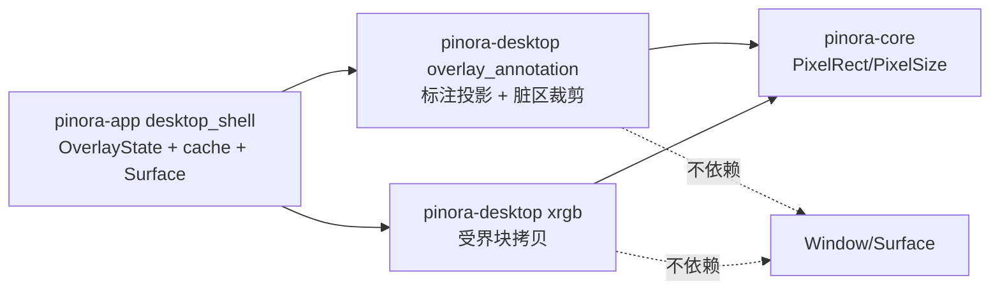

# 计划 121：桌面 Overlay 标注投影与脏区原语

- 状态：已完成
- 负责人：Codex
- 当前任务：`.context/tasks/121_desktop_overlay_damage.md`

## 目标

将 `desktop_shell` 中不持有窗口的已选标注显示投影、脏区扩张和 XRGB 块拷贝迁入 `pinora-desktop`，使 app 仅从 Overlay 状态取出输入并管理缓存、Window/Surface 和 present。

## 非目标

- 不迁移 `OverlayState`、标注预览缓存生命周期、RGBA 合成、截图图像、Window/Surface、softbuffer damage 适配、输入事件或 EventLoop。
- 不改变标注选中框缩放取整、脏区边缘裁剪、XRGB 块拷贝或任何用户可见渲染结果。

## 约束

- `pinora-desktop` 继续仅依赖 `pinora-core` 与既有 `winit`；纯原语不得依赖 app、capture、softbuffer、jobs、tray 或外部进程。
- API 使用 `PixelRect` 与 `PixelSize`，必须对零尺寸、越界源框和缓冲不匹配保持不 panic 的受控结果。
- app 保留唯一 EventLoop、窗口生命周期和 tray-only 策略；不得以本任务引入新窗口或 Surface 所有者。

## 依赖关系

## 阶段

1. 以现有投影、裁剪与块拷贝逻辑建立 desktop 单元测试。
2. 新建 `overlay_annotation` 并扩展 `xrgb`，切换 app 调用，删除重复纯函数。
3. 同步文档、执行 workspace 与 Windows 门禁，提交推送。

## 检查点

- desktop 唯一拥有标注局部框到显示选区的投影、脏区裁剪和受界 XRGB 块拷贝。
- app 保留标注文档查询、缓存失效、RGBA 合成、Window/Surface 与 present。

## 完成标准

- 缩放、零尺寸、越界投影、脏区裁剪和短源缓冲均由 desktop 测试覆盖。
- app 删除对应重复纯函数，workspace 依赖方向不变。
- 离线验证缺口不被描述为真实 GUI 或性能验收。

## 计划级风险

- 右下边缘的向上取整或选中框最小一像素规则改变，可能造成视觉选框偏移。
- 脏区或块拷贝边界错误，可能导致残影、局部不刷新或越界 panic。
- 离线像素测试不能证明 softbuffer present、HiDPI、连续拖动、焦点、任务栏/Dock 或帧时间。

## 完成记录

- 2026-08-03：新增 `pinora-desktop::overlay_annotation`，收拢标注局部边界到显示选区的投影和脏区扩张裁剪；`xrgb` 新增受界块拷贝。`desktop_shell` 删除对应重复纯函数，继续仅拥有标注状态、缓存、`Window`/`Surface` 与 present。
- 已验证：`cargo test -p pinora-desktop -- --nocapture`（91 通过）、`cargo test -p pinora-app --lib -- --nocapture`（36 通过）、`PINORA_NO_SYSTEM_CLIPBOARD=1 cargo test --workspace`（capture/export 各 1 项真实桌面测试按既有约定忽略）、`cargo check --workspace`、`cargo clippy --workspace --all-targets -- -D warnings`、`cargo check --workspace --target x86_64-pc-windows-msvc`、`cargo fmt --check`、`git diff --check` 与 `python /home/neo/.agents/skills/ctx/scripts/context_bootstrap.py validate --root /home/neo/Projects/neo/pub/pinora`。
- 未覆盖：真实 softbuffer present、HiDPI、多显示器、连续拖动帧时间、焦点及 tray-only/任务栏/Dock 行为仍须在原生桌面会话验证。
