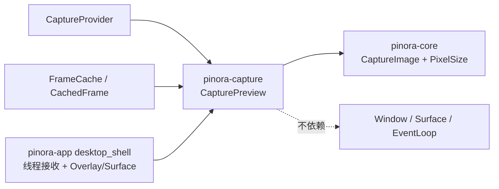

# 计划 122：捕获预览帧数据契约

- 状态：已完成
- 负责人：Codex
- 当前任务：`.context/tasks/122_capture_preview_frame.md`

## 目标

将冷捕获与预截帧共用的“原始图像 + XRGB 基础帧 + 暗化帧”数据契约归属到 `pinora-capture`，消除 `desktop_shell` 对预览像素转换和缓冲长度校验的本地实现。

## 非目标

- 不改变截图后端选择、预截帧刷新、后台线程、接收通道、捕获目标、Overlay 状态、窗口、`Surface`、softbuffer present、事件循环或 tray-only 策略。
- 不改变 RGBA 到 XRGB 的颜色/暗化公式、图像所有权移交或用户可见截图结果。

## 约束

- `pinora-capture` 继续仅依赖 `pinora-core`；预览值对象不得依赖 app、desktop、softbuffer、jobs、tray 或窗口类型。
- 预览长度校验必须使用图像物理像素尺寸并安全处理不可表示的尺寸，不得 panic。
- app 只消费 capture crate 提供的预览值对象，仍独占 `OverlayTarget`、窗口生命周期、Surface 上传与唯一 EventLoop。

## 依赖关系

## 阶段

1. 在 capture crate 为冷捕获与缓存帧定义预览值对象，并用像素长度与转换测试锁定语义。
2. 切换 app 的冷捕获通道、缓存帧移交与 Overlay 打开路径，删除本地 `PreparedPreview` 及辅助函数。
3. 同步文档，执行定向、工作区、跨目标和上下文门禁，提交推送。

## 检查点

- `pinora-capture` 唯一拥有预览帧生成、缓存帧到预览帧的所有权移交与缓冲完整性校验。
- `pinora-app` 保留冷捕获编排、错误映射、Overlay 目标和图形表面生命周期。

## 完成标准

- 预览转换、完整缓冲和短缓冲拒绝均由 capture 单元测试覆盖。
- app 不再声明 `PreparedPreview`、预览转换或长度匹配辅助函数。
- 离线测试与交叉编译不被描述为真实屏幕、GUI 或性能验收。

## 计划级风险

- 冷捕获与预截帧移交顺序变化可能复制整帧、错误复用过期像素或使无效帧进入 Overlay。
- 缓冲长度校验错误可能让错误映射从受控 `Internal` 退化为越界访问。
- 离线测试不能证明真实捕获权限、KDE/Wayland/X11/Windows/macOS、HiDPI、软缓冲 present、任务栏/Dock 或帧时间。

## 完成记录

- 2026-08-03：新增 `pinora-capture::CapturePreview`，统一冷捕获与预截帧的原图、XRGB 基础帧和暗化帧契约；`CachedFrame` 以一次所有权移交同时返回预览和显示器信息，避免整屏像素克隆。app 删除本地 `PreparedPreview`、转换与长度检查，仅在打开 Overlay 前调用 capture crate 的完整性校验。
- 已验证：`cargo test -p pinora-capture -- --nocapture`（27 通过、1 项真实显示会话测试按既有约定忽略）、`cargo test -p pinora-app --lib -- --nocapture`（35 通过）、`cargo run --quiet -- --version`（输出 `pinora 0.1.0`）、`PINORA_NO_SYSTEM_CLIPBOARD=1 cargo test --workspace`（capture/export 各 1 项真实桌面测试按既有约定忽略）、`cargo check --workspace`、`cargo clippy --workspace --all-targets -- -D warnings`、`cargo check --workspace --target x86_64-pc-windows-msvc`、`cargo fmt --check`、`git diff --check` 与 `python /home/neo/.agents/skills/ctx/scripts/context_bootstrap.py validate --root /home/neo/Projects/neo/pub/pinora`。
- 未覆盖：真实捕获权限、缓存/冷捕获时序、窗口、softbuffer、HiDPI、多显示器、连续热键、焦点、tray-only/任务栏/Dock 与性能仍须在原生桌面会话验证。
