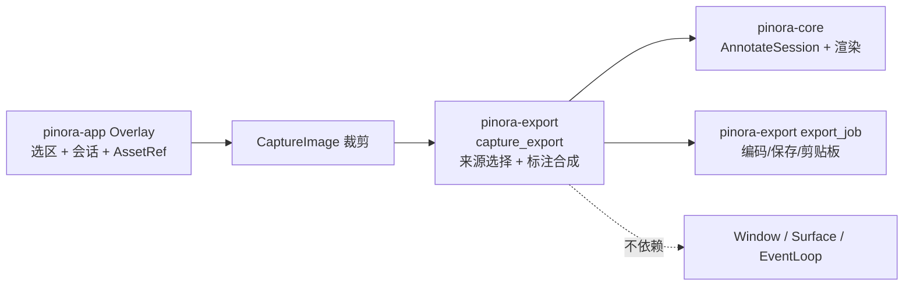

# 计划 123：标注导出图像合成契约

- 状态：已完成
- 负责人：Codex
- 当前任务：`.context/tasks/123_annotation_export_composition.md`

## 目标

将 Overlay 的原图/标注图导出来源、标注文档烧录和仅有草稿时的预览回退迁入 `pinora-export`，使 `desktop_shell` 只裁剪当前选区、冻结会话身份并提交导出任务。

## 非目标

- 不改变工具栏的原图/标注图切换、复制/保存默认标注图、贴图始终使用标注图、OCR 使用标注图或任何用户可见导出结果。
- 不改变图像编码、文件/剪贴板 IO、导出 worker、Window/Surface、EventLoop、标注输入、截图、历史或托盘。

## 约束

- `pinora-export` 仅依赖既有 `pinora-core`、`pinora-jobs` 与编码库；合成函数不得依赖 app、desktop、winit、softbuffer、窗口或外部进程。
- 原图来源不得读取或修改标注文档/草稿；标注来源保持“已提交文档优先、仅草稿时渲染预览、长度不匹配回退裁剪原图”的既有语义。
- app 保留选区裁剪、资产 generation、Overlay 生命周期、用户交互、导出任务所有者和错误反馈。

## 依赖关系

## 阶段

1. 在 export crate 建立导出来源枚举与图像合成模块，用原图、已提交标注和草稿回退测试锁定语义。
2. 切换 app 的工具栏状态、Overlay 裁剪与贴图复制/保存路径，删除本地合成与贴图导出副本函数。
3. 同步文档，执行定向、工作区、跨目标和上下文门禁，提交推送。

## 检查点

- `pinora-export` 唯一拥有导出来源枚举与 CaptureImage 标注合成。
- app 仍唯一拥有选区裁剪、`AssetRef` 盖章、Overlay 会话、Window/Surface、任务提交与事件循环。

## 完成标准

- 原图不触碰标注、已提交文档优先、仅草稿预览和长度不匹配回退都由 export 测试覆盖。
- app 删除 `OverlayExportSource`、本地标注合成函数和贴图图像克隆辅助函数，保留贴图强制标注来源规则。
- 离线测试与交叉编译不被描述为真实导出、桌面 GUI 或性能验收。

## 计划级风险

- 来源选择映射错误可能使复制/保存/贴图导出错误图层，或把草稿/标注遗漏或意外烧录。
- 合成长度回退变化可能让异常输入进入编码 worker，或改变既有裁剪原图降级语义。
- 离线测试不能证明真实剪贴板、文件权限、窗口关闭时序、HiDPI、tray-only、任务栏/Dock 或性能。

## 完成记录

- 2026-08-03 完成。`pinora-export::capture_export` 统一拥有导出来源与标注合成；
  `pinora-app` 已删除本地来源枚举、标注合成与贴图导出副本函数，仅保留选区裁剪、
  资产身份、Overlay 语义和受监督导出编排。离线定向测试、完整 workspace 测试、
  Clippy、Windows 交叉编译、格式、差异和上下文校验均通过；真实剪贴板、文件权限、
  GUI、任务栏/Dock、HiDPI 与性能验收仍由 R-074 跟踪。
