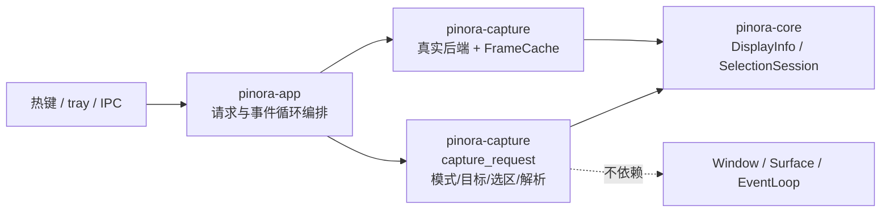

# 计划 124：捕获请求契约

- 状态：已完成
- 负责人：Codex
- 当前任务：`.context/tasks/124_capture_request_contract.md`

## 目标

将截图模式、捕获目标、Overlay 初始选区策略和显示器目标解析迁入 `pinora-capture`，使
`desktop_shell` 只保留请求发起、窗口/事件循环编排与失败后的 tray 反馈。

## 非目标

- 不改变区域、全屏、全部显示器或窗口截图的用户入口、默认目标、稳定日志标签、错误码或
  初始选区行为。
- 不迁移 `Window`、`Surface`、`EventLoop`、托盘、倒计时、失败恢复、截图后端、预截帧、
  Overlay 创建、渲染、标注、OCR、导出、历史或贴图。
- 不将离线/交叉编译结论描述为真实截图、窗口、任务栏/Dock、HiDPI 或性能验收。

## 约束

- `pinora-capture::capture_request` 只依赖 `pinora-core`，不得引入 app、desktop、winit、
  softbuffer、线程、外部进程或窗口依赖。
- 显示器目标解析必须在目标消失时返回既有 `ErrorCode::NotFound`，不得回退为另一块屏幕；
  非显示器目标必须继续返回 `ErrorCode::InvalidState`。
- Capture mode 到初始选区的映射保持：区域为手动选区；全屏、全部显示器和窗口截图为全图
  选区。

## 依赖关系

## 阶段

1. 在 `pinora-capture` 建立请求契约及纯测试，锁定模式标签、目标标签、初始选区和目标消失
   时的错误语义。
2. 切换 app 使用 crate 导出，删除 shell 中重复值类型和函数；保留失败恢复与窗口编排。
3. 更新架构、风险与验证台账，执行定向、workspace、跨目标和上下文门禁，提交推送。

## 检查点

- `pinora-capture` 唯一拥有截图模式、捕获目标、初始选区与显示器解析。
- `pinora-app` 仍唯一拥有 tray 行为、倒计时、失败恢复、Overlay 生命周期、Window/Surface 和
  EventLoop。

## 完成标准

- 新 crate 测试覆盖四种模式、四种目标、默认最大面积显示器、显式显示器消失、非显示器解析
  拒绝和全图选区。
- app 删除本地捕获请求契约实现，现有失败范围和真实后端选择逻辑不变。
- 离线测试、工作区门禁与 Windows 交叉编译通过，并明确其不构成真实桌面验收。

## 计划级风险

- 目标迁移映射错误可能把窗口/全部显示器请求错误解析为单屏，或在显示器热插拔时回退到
  错误显示器。
- 初始选区变化会破坏全屏、窗口或历史编辑后的 Overlay 行为。
- 离线测试无法证明真实权限、捕获延迟、窗口焦点、任务栏/Dock、HiDPI 或性能。

## 完成记录

- 2026-08-03 完成。`pinora-capture::capture_request` 统一拥有截图模式、目标、初始选区
  与显示器目标解析；`pinora-app` 已删除同类本地定义，仅保留请求发起、倒计时、失败恢复、
  实际捕获和窗口/事件循环编排。离线定向测试、完整 workspace 测试、Clippy、Windows
  交叉编译、格式、差异和上下文校验均通过；真实截图、GUI、任务栏/Dock、HiDPI 与性能
  验收仍由 R-075 跟踪。
