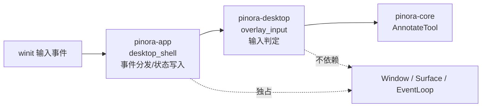

# 计划 125：Overlay 输入意图契约

- 状态：已完成
- 负责人：Codex
- 当前任务：`.context/tasks/125_overlay_input_intents.md`

## 目标

将 Overlay 的键盘/鼠标输入判定迁入 `pinora-desktop::overlay_input`，使 `desktop_shell`
只接收已归一化的输入意图并负责实际的标注文档、导出和窗口生命周期编排。

## 非目标

- 不改变 Ctrl+Z、Ctrl+Shift+Z、Ctrl+Y、Shift+Enter、Enter、Shift+方向键或双击复制的
  用户可见行为。
- 不迁移 winit 事件分发、Overlay 状态、标注文档修改、工具栏、Window/Surface、EventLoop、
  捕获、OCR、导出、历史、贴图或托盘。
- 不将离线测试描述为真实输入延迟、焦点、输入法、窗口、任务栏/Dock 或性能验收。

## 约束

- `pinora-desktop::overlay_input` 仅依赖既有 `pinora-core` 与 `winit`，不得依赖 app、
  capture、jobs、窗口句柄、线程、外部进程或文件系统。
- 输入模块只能返回意图；实际状态写入、异步提交、错误反馈和窗口操作必须继续留在 app。
- 双击复制必须继续排除 `AnnotateTool::Number` 与 `AnnotateTool::Select`，避免序号双击被
  错误解释为复制。

## 依赖关系

## 阶段

1. 在 desktop crate 建立输入意图类型与判定函数，迁移输入契约测试。
2. 切换 app 的 Overlay 键盘/鼠标路径，删除 shell 中重复枚举和函数。
3. 更新架构、风险与验证台账，执行定向、workspace、跨目标和上下文门禁，提交推送。

## 检查点

- `pinora-desktop` 唯一拥有 Overlay 输入语义判定。
- `pinora-app` 仍唯一拥有 winit 事件循环、Overlay 状态、标注文档、任务提交和窗口生命周期。

## 完成标准

- desktop 测试覆盖撤销/重做、文本换行/提交、1/10 像素微调和双击复制豁免工具。
- app 删除本地同类枚举/函数，现有 Overlay 事件流和用户行为不变。
- 离线测试、工作区门禁与 Windows 交叉编译通过，并明确其不构成真实桌面验收。

## 计划级风险

- 修饰键映射错误会误触撤销、重做、文本提交或 10 像素微调。
- 双击判定错误会改变序号或选择工具的交互语义。
- 离线测试无法证明真实输入法、焦点、HiDPI、呈现时序、任务栏/Dock 或性能。

## 完成记录

- 2026-08-03 完成。`pinora-desktop::overlay_input` 统一拥有 Overlay 的撤销/重做、文本
  Enter、微调步长和双击复制判定；`pinora-app` 已删除本地副本，仅保留 winit 事件分发、
  Overlay 状态、标注文档写入、任务和窗口/事件循环编排。离线定向测试、完整 workspace
  测试、Clippy、Windows 交叉编译、格式、差异和上下文校验均通过；真实输入法、GUI、
  任务栏/Dock、HiDPI 与性能验收仍由 R-076 跟踪。
