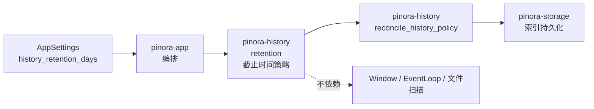

# 计划 126：历史保留期时间策略

- 状态：已完成
- 负责人：Codex
- 当前任务：`.context/tasks/126_history_retention_time_policy.md`

## 目标

将历史保留期的当前时间读取、天数到毫秒的安全转换和截止时间计算迁入 `pinora-history`，
使 app 只把设置值交给既有历史策略。

## 非目标

- 不改变设置 schema、保留期默认值、过期边界、tombstone 清理、历史索引、受管文件、窗口、
  EventLoop、截图、OCR、导出、贴图或托盘。
- 不访问真实网络、数据库、缓存、队列、对象存储、Webhook 或第三方服务。
- 不将离线时间测试描述为真实文件系统、断电、窗口、任务栏/Dock 或性能验收。

## 约束

- `pinora-history::retention` 只依赖标准库；不得依赖 app、winit、`pinora-core`、
  窗口、线程、外部进程或真实时钟以外的基础设施。
- `retention_days == 0` 必须继续表示不应用截止时间，且不读取时钟；系统时间早于 epoch 或
  无法表示为毫秒时必须稳定返回 `None`；最大 `u16` 输入必须可表示，回推必须使用饱和减法。
- app 继续拥有何时执行 `reconcile_history_policy`、窗口刷新和错误反馈。

## 依赖关系

## 阶段

1. 在 history crate 建立保留期时间模块及边界测试。
2. 切换 app 调用并删除本地时间/截止函数及重复测试。
3. 更新架构、风险与验证台账，执行定向、workspace、跨目标和上下文门禁，提交推送。

## 检查点

- `pinora-history` 唯一拥有历史保留期的时间计算。
- `pinora-app` 仍唯一拥有设置保存后的策略调用、窗口刷新、错误反馈和 EventLoop。

## 完成标准

- history 测试覆盖零天、正常回推、早期时钟饱和、最大 `u16` 输入和当前时间不可用。
- app 删除本地同类函数，保留现有历史策略调用路径。
- 离线测试、工作区门禁与 Windows 交叉编译通过，并明确其不构成真实桌面验收。

## 计划级风险

- 截止时间计算改变可能提前/延后 tombstone 清理，影响用户保留历史。
- 时间源异常或截止时间计算偏差可能造成意外清理。
- 离线测试无法证明真实文件权限、断电、网络文件系统、GUI、任务栏/Dock 或性能。

## 完成记录

- 2026-08-03 完成。`pinora-history::retention` 现唯一拥有当前 Unix 毫秒读取和保留期
  截止时间计算；零天不读取时钟且不应用时间清理，时钟不可用时保守返回 `None`，回推继续
  饱和到 epoch。`pinora-app` 已删除本地副本，仍独占三处 `reconcile_history_policy`
  调用时机、窗口刷新、错误反馈、Window/Surface 与唯一 EventLoop。
- 已验证：`cargo test -p pinora-history -- --nocapture`（32 通过）、
  `cargo test -p pinora-app --lib -- --nocapture`（25 通过）、
  `PINORA_NO_SYSTEM_CLIPBOARD=1 cargo test --workspace`、`cargo check --workspace`、
  `cargo clippy --workspace --all-targets -- -D warnings`、
  `cargo check --workspace --target x86_64-pc-windows-msvc`、
  `cargo run --quiet -- --version`、`cargo fmt --check`、`git diff --check` 与 `ctx validate`。
- 未验证：离线时间测试、Windows 交叉编译和版本探针不构成真实系统时钟跳变、断电/文件
  系统、历史窗口刷新、GUI、tray-only、任务栏/Dock 或性能验收；由 R-054 与 R-077 跟踪。
