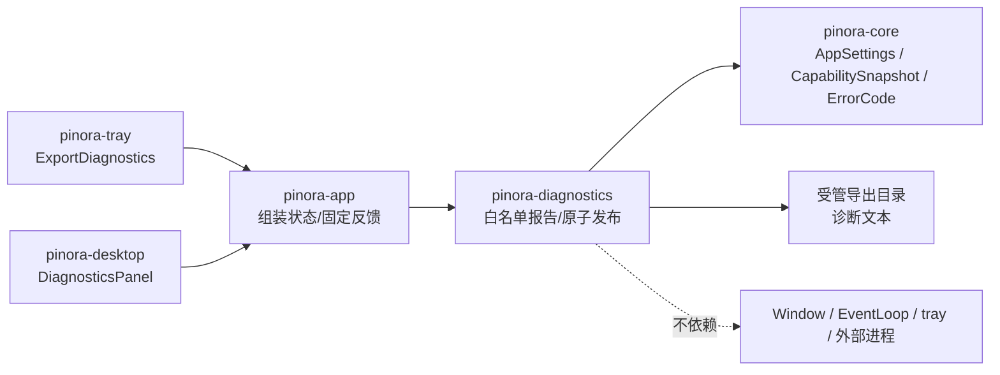

# 计划 127：诊断报告功能 crate 边界

- 状态：已完成
- 负责人：Codex
- 当前任务：`.context/tasks/127_diagnostics_crate.md`

## 目标

将固定白名单诊断报告模型、脱敏设置摘要和原子文件发布迁入独立的 `pinora-diagnostics`，
让 app 只负责从既有诊断面板和运行时状态组装输入、响应托盘动作和更新固定反馈。

## 非目标

- 不改变诊断报告的 `PINORA_DIAGNOSTICS_V1` 格式、字段、脱敏边界、文件命名或原子发布协议。
- 不改变诊断面板绘制、主题、窗口策略、托盘菜单、能力探测、设置 schema、截图、OCR、导出、
  历史、贴图、EventLoop 或用户可见反馈。
- 不访问网络、数据库、缓存、队列、对象存储、Webhook 或真实共享基础设施。
- 不把离线报告测试、target 编译或版本探针描述为真实文件权限、托盘、窗口或性能验收。

## 约束

- `pinora-diagnostics` 只依赖 `pinora-core` 和标准库，不依赖 app、desktop、tray、winit、
  Window、EventLoop、线程或外部进程。
- 报告只能接受固定平台/能力/反馈标签、稳定 `ErrorCode`、枚举和数值设置；不得接受原始
  路径、截图像素、OCR 全文、剪贴板内容或平台错误字符串。
- 同目录临时文件、`sync_all`、原子 rename、可读性校验和失败清理语义必须保持不变。

## 依赖关系

## 阶段

1. 建立 diagnostics crate，迁移报告模型、序列化、原子写入和测试。
2. 切换 app 诊断导出调用，删除 app 内副本并保持面板/托盘编排。
3. 更新 workspace、架构、风险与验证台账，执行门禁、提交推送。

## 检查点

- `pinora-diagnostics` 唯一拥有诊断报告字段白名单、固定平台/反馈标签校验、设置脱敏、
  渲染和同目录原子文件发布。
- `pinora-app` 仍唯一拥有诊断面板、托盘动作、运行时能力组装、固定反馈、Window/Surface
  和唯一 EventLoop；它不再编译 app 内报告 IO 副本。

## 完成标准

- `pinora-diagnostics` 唯一拥有诊断报告字段白名单、固定标签和原子发布。
- app 不再编译 `diagnostics_export.rs`，仍由唯一 EventLoop 组装状态并消费固定结果。
- 报告金样、敏感字段排除、临时文件清理和 app 回归测试通过。
- workspace、严格 Clippy、Windows 目标编译、格式、差异和上下文校验通过，并明确真实桌面风险。

## 计划级风险

- crate 迁移时字段顺序、版本头或错误映射变化会破坏用户诊断包解析。
- 只读目录、文件占用或中断发生在 rename 前后时，离线测试无法证明跨平台持久性。

## 完成记录

- 2026-08-03 完成。新增 `pinora-diagnostics` workspace crate，将诊断报告模型、固定标签
  校验、字段顺序、设置摘要、渲染、原子文件发布和测试从 `pinora-app` 迁出；app 通过
  `DiagnosticReportInput` 传入固定平台、五项能力、反馈、稳定错误码和 `AppSettings`，继续
  编排托盘动作、面板状态、固定成功/失败反馈及窗口生命周期。
- 已验证：`PINORA_NO_SYSTEM_CLIPBOARD=1 cargo test --workspace`、`cargo check --workspace`、
  `cargo clippy --workspace --all-targets -- -D warnings`、
  `cargo check --workspace --target x86_64-pc-windows-msvc`、`cargo run --quiet -- --version`
  （输出 `pinora 0.1.0`）、`cargo fmt --all -- --check`、`git diff --check` 和 `ctx validate`。
- 定向结果：`pinora-diagnostics` 5 项测试、`pinora-app` 22 项回归测试全部通过。
- 未验证：离线报告测试、Windows 交叉编译和版本探针不构成真实只读目录、断电/文件占用、
  托盘点击、窗口隔离、任务栏/Dock、GUI 或性能验收；继续由 R-078 及既有窗口风险跟踪。
