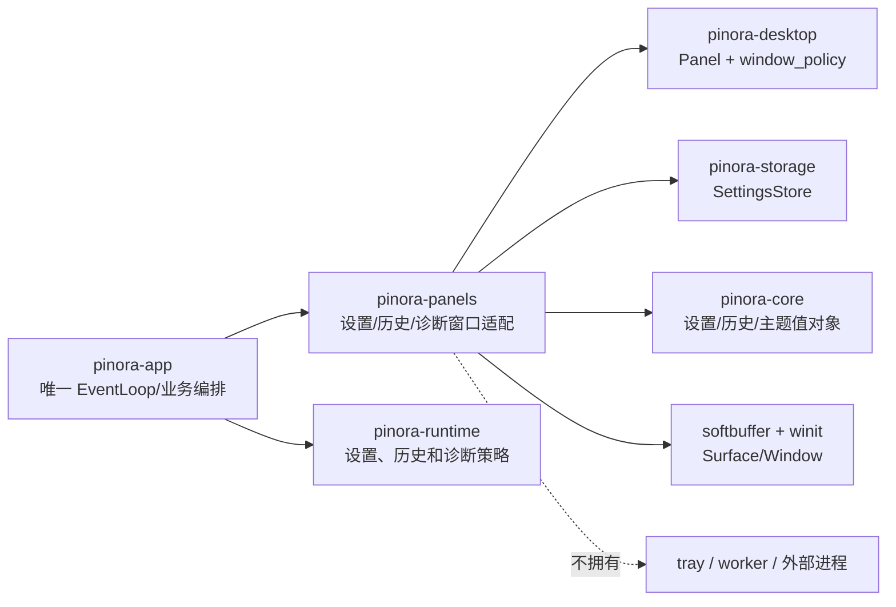

# 计划 128：辅助面板窗口适配 crate

- 状态：已完成
- 负责人：Codex
- 当前任务：`.context/tasks/128_panels_crate.md`

## 目标

将设置、历史和诊断三个辅助面板的 winit/softbuffer 窗口适配器迁入独立的
`pinora-panels` crate，使 `pinora-app` 只负责唯一 EventLoop、业务状态、存储/历史策略、
托盘动作和用户可见反馈。

## 非目标

- 不改变三个面板的布局、主题、键盘/鼠标行为、窗口标题、尺寸、任务栏/Dock 隔离或绘制像素。
- 不改变设置 schema、原子保存、热键重绑定、历史索引/文件策略、诊断报告格式、托盘菜单、
  截图、贴图、OCR、导出、IPC 或退出语义。
- 不创建第二个 EventLoop，不改变 `window_policy` 的唯一窗口创建/展示入口，不访问网络或
  真实共享基础设施。
- 不把交叉编译、离线面板测试或版本探针描述为真实桌面窗口、焦点、任务栏/Dock、HiDPI 或
  性能验收。

## 约束

- `pinora-panels` 只拥有三个面板的窗口句柄、softbuffer surface、面板状态和呈现适配；
  不拥有 `ApplicationHandler`、托盘句柄、截图/贴图业务、任务 worker 或 EventLoop。
- 所有面板窗口必须通过 `pinora-desktop::window_policy::{create_auxiliary_window,
  show_auxiliary_window}` 隐藏创建并映射，禁止直接调用 `create_window` 或 `set_visible(true)`。
- 设置保存仍由既有 `SettingsStore` 入口执行，app 仍决定保存成功后何时更新 runtime、热键、
  历史策略和诊断主题；历史加载/删除和诊断导出仍由 app 编排。
- 不新增第三方依赖；新 crate 仅组合既有 `pinora-core`、`pinora-desktop`、`pinora-storage`、
  `softbuffer` 和 `winit`。

## 依赖关系

## 阶段

1. 建立 `pinora-panels` crate，迁移三个窗口适配器并收紧其公开 API。
2. 切换 app 导入，删除 app 内重复窗口模块，保持既有 EventLoop 和业务方法调用。
3. 更新 workspace、设计文档、系统边界和风险台账，执行定向、workspace、跨目标与上下文门禁，提交推送。

## 检查点

- `pinora-panels` 唯一拥有设置、历史、诊断窗口的 Window/Surface 资源、Panel 状态和绘制适配。
- `pinora-app` 仍唯一拥有 `ApplicationHandler`、EventLoop、业务状态写入、设置保存后的副作用、
  历史加载/删除、诊断导出、托盘和退出控制。
- `pinora-desktop::window_policy` 仍是所有面板窗口创建与展示的唯一策略入口。

## 完成标准

- `pinora-app/src` 删除 `settings_window.rs`、`history_window.rs`、`diagnostics_window.rs`，
  app 仅通过 `pinora-panels` 使用对应适配器。
- 三个面板窗口的标题、尺寸、主题刷新、输入转发、resize、绘制和关闭行为保持不变。
- 新 crate 不创建 EventLoop，不直接创建或显示窗口，依赖方向不反向进入 app。
- 定向测试、workspace 测试、严格 Clippy、Windows 目标编译、格式、差异和上下文校验通过，并
  明确真实桌面风险。

## 计划级风险

- 跨 crate 可见性调整可能遗漏 app 调用点，导致面板事件或保存/历史反馈行为改变。
- 面板适配器绕过 `window_policy` 会破坏 tray-only 和任务栏/Dock 隔离约束。
- softbuffer surface 生命周期或主题刷新迁移错误可能造成首帧空白、焦点丢失或重绘异常。
- 离线测试和交叉编译无法证明真实窗口管理器、输入法、焦点、HiDPI、任务栏/Dock 或性能。

## 完成记录

- 2026-08-03 完成。新增 `pinora-panels` workspace crate，将 `SettingsWindow`、`HistoryWindow` 和
  `DiagnosticsWindow` 的 Window/Surface、Panel 状态、主题刷新、输入转发、resize、绘制和关闭
  适配从 `pinora-app` 迁出；三个适配器继续通过 `pinora-desktop::window_policy` 隐藏创建和映射。
  `pinora-app` 仅导入适配器并保留唯一 `ApplicationHandler`/EventLoop、打开时机、设置保存后的
  runtime/热键/历史副作用、历史加载/删除、诊断导出、托盘和退出编排。
- 已验证：`cargo test -p pinora-panels -- --nocapture`（1 项源码守卫）、
  `cargo test -p pinora-app --lib -- --nocapture`（22 项）、
  `PINORA_NO_SYSTEM_CLIPBOARD=1 cargo test --workspace`、`cargo check --workspace`、
  `cargo clippy --workspace --all-targets -- -D warnings`、
  `cargo check --workspace --target x86_64-pc-windows-msvc`、`cargo run --quiet -- --version`
  （输出 `pinora 0.1.0`）、`cargo fmt --all -- --check`、`git diff --check` 和 `ctx validate`。
- 未验证：上述离线门禁、Windows 交叉编译和版本探针不构成真实窗口管理器、主题事件、输入法、
  焦点、任务栏/Dock、tray-only、HiDPI、文件权限或性能验收；由 R-079 及既有桌面风险继续跟踪。
