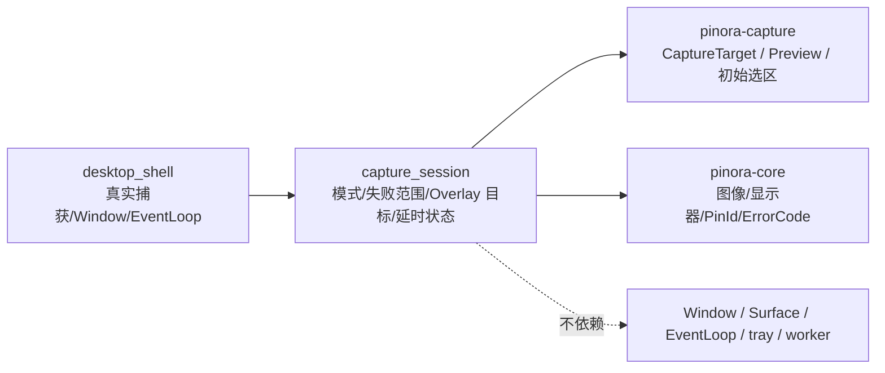

# 计划 129：捕获会话状态模块

- 状态：已完成
- 负责人：Codex
- 当前任务：`.context/tasks/129_capture_session_state.md`

## 目标

将 `pinora-app::desktop_shell` 中不依赖 Window、Surface 或 EventLoop 的捕获会话状态迁入
`pinora-app::capture_session`，明确截图模式、延时清理、失败恢复范围和 Overlay 目标映射的
边界，让桌面壳只负责真实捕获、线程、窗口生命周期和业务副作用。

## 非目标

- 不改变区域/全屏/全部显示器/窗口/历史编辑/贴图编辑的捕获行为、初始选区、窗口标题、尺寸、
  主题、任务栏/Dock 策略、托盘反馈、历史、导出、OCR、贴图或设置 schema。
- 不迁移 Window、Surface、EventLoop、ApplicationHandler、线程启动、CaptureProvider 调用、
  tray 句柄或任务 worker；不新增 crate 或第三方依赖。
- 不把离线状态测试、Windows target 或版本探针描述为真实截图权限、桌面窗口、焦点、HiDPI、
  tray-only 或性能验收。

## 约束

- `capture_session` 只定义 app 内捕获工作流需要的值对象和有限状态：`Mode`、
  `CaptureFailureScope`、`OverlayPresentation`、`LoadingState`、`DelayedCapture`、
  `OverlayTarget` 及其构造/判定函数。
- 状态模块不得直接创建窗口、启动线程、调用捕获后端、修改 runtime、操作 tray 或写入文件；
  `desktop_shell` 继续拥有这些副作用和唯一 EventLoop。
- 显式窗口目标、虚拟桌面、历史编辑和贴图编辑的 display/origin/初始选区/最小边长/编辑 PinId
  映射必须保持原值；延时可见性快照只恢复开始时仍由 Pinora 记录为可见的贴图。

## 依赖关系

## 阶段

1. 建立 `capture_session` 模块，迁移值对象、构造函数和边界测试。
2. 切换 `desktop_shell` 导入，删除重复定义，保持捕获与失败恢复方法不变。
3. 更新设计文档、系统边界和风险台账，执行定向、workspace、跨目标与上下文门禁，提交推送。

## 检查点

- `capture_session` 唯一拥有捕获会话模式、Overlay 目标映射、延时状态和失败范围判定。
- `desktop_shell` 仍唯一拥有实际 CaptureProvider、线程、FrameCache、Window/Surface、EventLoop、
  tray 反馈、worker 和恢复副作用。

## 完成标准

- `desktop_shell` 删除同类本地类型/函数，所有现有捕获调用点和测试继续通过。
- 状态模块新增测试覆盖标准/窗口/延时失败范围、延时截止判定、历史/窗口/贴图编辑目标和虚拟桌面目标。
- workspace 测试、check、严格 Clippy、Windows 目标编译、格式、差异和上下文校验通过，并明确
  真实桌面风险。

## 计划级风险

- 目标映射或失败范围调整可能让窗口/延时截图走错误恢复路径，破坏贴图可见性或 tray 连续驻留。
- 状态字段可见性调整可能导致 app 调用点绕过构造函数或写入不一致的尺寸/坐标。
- 离线状态测试和交叉编译无法证明真实捕获权限、窗口管理器、焦点、HiDPI、tray-only 或性能。

## 完成记录

- 已新增 `pinora-app::capture_session`，唯一承载捕获模式、加载状态、延时状态、失败范围和
  屏幕/虚拟桌面/窗口/历史/贴图编辑 Overlay 目标构造。延时快照改为领域 `PinId`，由
  `desktop_shell` 映射回仍存在的窗口；没有迁移或新增真实捕获、线程、Window/Surface、EventLoop、
  tray、worker 或恢复副作用。
- 已将 6 项状态映射与截止时间测试从 `desktop_shell` 迁入新模块；`desktop_shell` 删除同类定义，
  所有目标构造调用点通过模块入口收敛。
- 已验证：状态测试 6 项、app 库测试 22 项、workspace 测试、workspace check、严格 Clippy、
  Windows target check、`--version`、fmt、diff 和 `ctx validate`。
- 已知风险：上述离线和交叉编译证据不证明真实捕获权限、窗口管理器、焦点、HiDPI、tray-only 或
  性能；后续原生会话按 R-080 验证。
