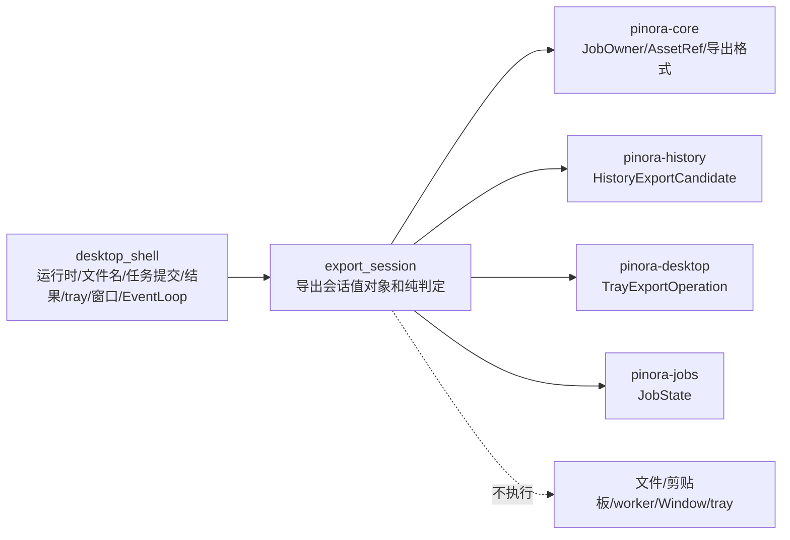

# 计划 130：导出会话状态模块

- 状态：已完成
- 负责人：Codex
- 当前任务：`.context/tasks/130_export_session_state.md`

## 目标

将 `pinora-app::desktop_shell` 中无窗口、无文件写入副作用的导出会话值对象迁入
`pinora-app::export_session`，集中 Overlay 完成动作、待处理导出元数据、文件保存取消筛选、
资产归属校验和 tray 导出操作映射；桌面壳仍拥有运行时设置读取、文件名分配、任务提交、结果消费、
tray 调用、Window/Surface 和 EventLoop。

## 非目标

- 不改变 PNG/JPEG/WebP 编码、原子写入、系统剪贴板、导出文件名、历史记录、资产 generation、
  任务 owner、取消语义、tray 文案、窗口策略或设置 schema。
- 不迁移 `ExportJobService`、`LocalImageSink`、`ExportNameAllocator`、运行时读取、worker、线程、
  Window/Surface、EventLoop 或 tray 句柄；不新增 crate 或第三方依赖。
- 不把离线会话测试、Windows target 或版本探针描述为真实文件系统、系统剪贴板、tray、窗口、
  HiDPI 或性能验收。

## 约束

- `export_session` 唯一拥有 `OverlayFinish`、`PendingExportAction`、`FrozenExportTarget`、
  `PendingExport` 及其纯判定函数：贴图动作固定输出标注图、文件保存任务筛选、owner/资产匹配与
  tray 操作映射。
- 模块不得创建窗口、启动线程、提交任务、读取 runtime、分配文件名、写入文件、操作 tray 或修改
  历史；`desktop_shell` 保留所有副作用和唯一 EventLoop。
- `FrozenExportTarget` 的路径、格式和 JPEG 质量必须按提交时冻结；取消仅选择仍在
  `JobState::Running` 的文件保存，不影响复制图像或文本。

## 依赖关系

## 阶段

1. 建立 `export_session` 模块，迁移导出会话值对象和纯判定测试。
2. 切换 `desktop_shell` 导入，删除重复定义，保持任务提交和结果处理时机不变。
3. 更新设计文档、系统边界和风险台账，执行定向、workspace、跨目标与上下文门禁，提交推送。

## 检查点

- `export_session` 唯一拥有 Overlay 完成来源选择、待处理导出状态、文件保存取消筛选和 tray 映射。
- `desktop_shell` 仍唯一拥有 runtime、文件名分配、`ExportJobService`、结果消费、tray 调用、
  Window/Surface、EventLoop 和 worker 生命周期。

## 完成标准

- `desktop_shell` 删除同类本地类型/函数，所有导出调用点和回归测试继续通过。
- 状态模块测试覆盖原图/标注图来源、三类 tray 操作、仅运行中文件保存可取消、owner/资产匹配和
  冻结参数。
- workspace 测试、check、严格 Clippy、Windows 目标编译、格式、差异和上下文校验通过，并明确
  真实文件系统/剪贴板/tray/性能风险。

## 计划级风险

- 动作映射或待处理状态迁移错误可能让贴图导出原图、错误取消复制任务或接受错 owner 的结果。
- 字段可见性调整可能让桌面壳绕过提交时冻结约束，改变文件格式或 JPEG 质量。
- 离线测试和交叉编译无法证明真实文件权限、剪贴板、tray、窗口管理器、焦点、HiDPI 或性能。

## 完成记录

- 已新增 `pinora-app::export_session`，唯一承载 Overlay 完成动作、待处理导出元数据、冻结输出参数、
  导出来源、文件保存取消筛选、owner/资产匹配和 tray 操作映射；没有迁移或新增 runtime、文件名分配、
  任务提交、文件/剪贴板 IO、tray、worker、Window/Surface 或 EventLoop。
- 已将 5 项导出会话测试从 `desktop_shell` 迁入新模块；`desktop_shell` 删除同类定义，所有导出调用点
  保持现有副作用时机。
- 已验证：状态测试 5 项、app 库测试 24 项、workspace 测试、workspace check、严格 Clippy、
  Windows target check、`--version`、fmt、diff 和 `ctx validate`。
- 已知风险：上述离线和交叉编译证据不证明真实文件系统、系统剪贴板、tray、窗口管理器、焦点、
  HiDPI 或性能；后续原生会话按 R-081 验证。
