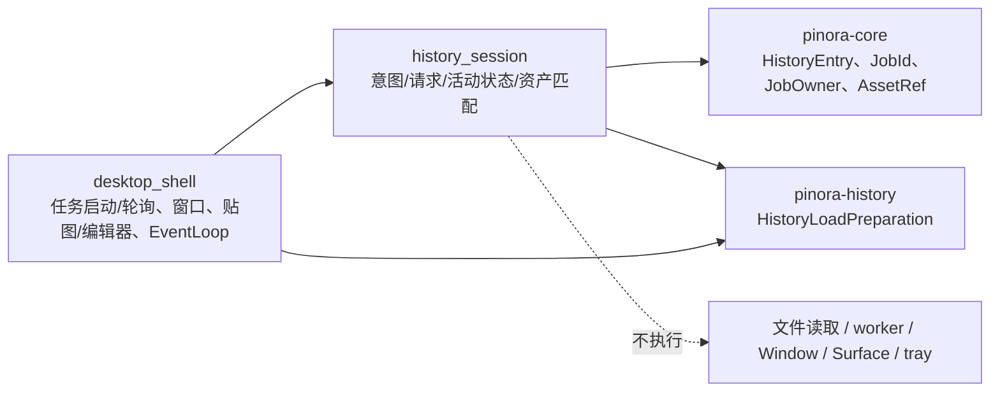

# 计划 131：历史加载会话状态模块

- 状态：已完成
- 负责人：Codex
- 当前任务：`.context/tasks/131_history_session_state.md`

## 目标

将 `pinora-app::desktop_shell` 中不依赖 Window、Surface、EventLoop 或 worker 的历史加载会话
值对象迁入 `pinora-app::history_session`，收敛历史预览、重新贴图和重新编辑的意图映射、请求、
活动任务与结果资产匹配；桌面壳继续独占历史读取任务、窗口更新、贴图/编辑器创建、错误反馈和唯一
事件循环。

## 非目标

- 不改变历史索引、受管 PNG 校验、异步读取、超时、取消、任务 owner、资产 generation、预览、贴图、
  编辑器、窗口标题、主题、任务栏/Dock 策略、托盘反馈或设置 schema。
- 不迁移 `HistoryLoadJobService`、worker 启动/轮询/回收、`HistoryWindow`、Window/Surface、
  EventLoop、文件读取、历史删除或导出；不新增 crate 或第三方依赖。
- 不把离线状态测试、Windows target 或版本探针描述为真实文件系统、历史窗口、任务栏/Dock、HiDPI、
  焦点、tray-only 或性能验收。

## 约束

- `history_session` 只定义 `HistoryLoadIntent`、`HistoryLoadRequest`、`ActiveHistoryLoad` 及其纯
  判定；意图到 `HistoryLoadPreparation` 的映射必须只有一份。
- 模块不得创建窗口、启动线程、读取文件、提交或轮询任务、修改历史索引、操作 tray 或 runtime；
  `desktop_shell` 继续持有全部副作用和唯一 EventLoop。
- 结果只在 job id、`JobOwner::History`、当前选中条目 image id 和 generation 都与活动请求一致时接受；
  请求启动前仍必须重新确认条目仍被选中。

## 依赖关系

## 阶段

1. 建立 `history_session`，迁移纯值对象、准备类型映射和资产匹配回归测试。
2. 切换 `desktop_shell` 导入，删除重复定义，保持排队、启动、轮询、窗口更新和失败处理时机不变。
3. 更新设计文档、系统边界和风险台账，执行定向与 workspace 门禁。

## 检查点

- `history_session` 唯一拥有历史加载意图、请求、活动请求和结果资产匹配逻辑。
- `desktop_shell` 仍唯一拥有 `HistoryLoadJobService`、worker 生命周期、文件系统调用入口、
  `HistoryWindow`、Window/Surface、EventLoop、贴图/编辑器创建和错误反馈。

## 完成标准

- `desktop_shell` 删除同类本地类型/函数，所有历史加载调用点保持原副作用时机。
- 模块测试覆盖三种准备类型、匹配结果、错误 job/owner/选中条目和 generation 变化。
- workspace 测试、check、严格 Clippy、Windows 目标编译、格式、差异和上下文校验通过，并明确真实桌面风险。

## 计划级风险

- 错误的匹配条件会接受过期结果，导致预览、贴图或编辑器显示已切换/删除历史条目的图像。
- 可见性或消费顺序变化可能让取消后的完成结果改变面板状态。
- 离线测试和交叉编译无法证明真实历史目录权限、文件系统、窗口管理器、焦点、HiDPI、tray-only 或性能。

## 完成记录

- 已新增 `pinora-app::history_session`，唯一承载历史预览、重新贴图与重新编辑的意图、请求、活动
  任务、准备类型映射和结果资产门禁；结果必须同时匹配 job id、`JobOwner::History`、当前选中条目的
  image id 与 generation。
- `desktop_shell` 已删除重复值对象和匹配函数，仍独占 `HistoryLoadJobService` 的取消、启动、轮询和
  结果消费，以及历史窗口、贴图/编辑器创建、错误反馈、Window/Surface 和 EventLoop。
- 已验证：状态模块 3 项、app 库 26 项、`PINORA_NO_SYSTEM_CLIPBOARD=1 cargo test --workspace`、
  `cargo check --workspace`、`cargo clippy --workspace --all-targets -- -D warnings`、
  `cargo check --workspace --target x86_64-pc-windows-msvc`、格式、差异和上下文校验通过。
- 已知风险：离线与交叉编译不能证明真实历史目录权限、worker 时序、窗口管理器、焦点、HiDPI、
  tray-only 或性能；后续原生会话按 R-082 验证。
