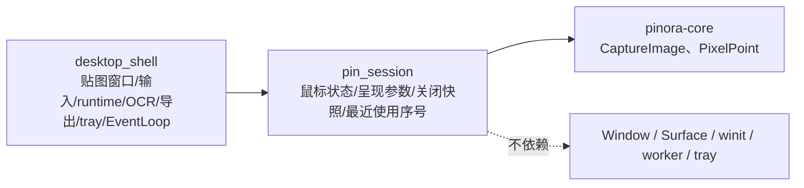

# 计划 132：贴图会话状态模块

- 状态：已完成
- 负责人：Codex
- 当前任务：`.context/tasks/132_pin_session_state.md`

## 目标

将 `pinora-app::desktop_shell` 中不依赖 Window、Surface、EventLoop、runtime、worker 或 tray 的贴图
会话值对象迁入 `pinora-app::pin_session`，集中鼠标命中状态、平台请求后状态、贴图创建呈现参数、关闭
恢复快照和进程内最近使用序号；桌面壳继续独占真实贴图窗口、缩放/输入、OCR、导出、runtime 命令和 tray。

## 非目标

- 不改变贴图创建、窗口标题、位置、缩放、不透明度、锁定、置顶、鼠标穿透、关闭恢复、PinId、
  AssetRef、OCR、导出、tray 列表或状态字符串。
- 不迁移 `PinWin`、`PinResizeDrag`、Window/Surface、winit 输入、窗口策略、平台命中调用、
  runtime 命令、OCR/导出任务、贴图渲染或 EventLoop；不新增 crate 或第三方依赖。
- 不把离线状态测试、Windows target 或版本探针描述为真实鼠标命中、任务栏/Dock、窗口管理器、
  HiDPI、焦点、tray-only 或性能验收。

## 约束

- `pin_session` 只定义 `PinMouseMode`、`PinPresentation`、`ClosedPinSnapshot`、最近使用序号和
  纯状态转移；模块只依赖 `pinora-core`。
- 贴图鼠标模式只有平台明确接受请求后才变更；平台失败必须保留当前模式。
- 关闭恢复快照不得包含 WindowId、Window、Surface、tray、worker、鼠标穿透或任何不应跨窗口生命周期
  恢复的瞬态状态。

## 依赖关系

## 阶段

1. 建立 `pin_session`，迁移贴图纯值对象和鼠标/最近使用状态测试。
2. 切换 `desktop_shell` 导入，删除重复定义，保持窗口、平台请求和恢复副作用时机不变。
3. 更新设计文档、系统边界和风险台账，执行定向与 workspace 门禁。

## 检查点

- `pin_session` 唯一拥有贴图会话的无窗口值对象与纯状态转移。
- `desktop_shell` 仍唯一拥有 `PinWin`、Window/Surface、输入、平台调用、runtime、OCR、导出、tray 和 EventLoop。

## 完成标准

- `desktop_shell` 删除同类本地类型/函数，所有贴图调用点保持副作用时机和字段值不变。
- 模块测试覆盖成功/失败鼠标模式转移、命中启用、最近使用序号饱和和关闭恢复快照的持久字段。
- workspace 测试、check、严格 Clippy、Windows 目标编译、格式、差异和上下文校验通过，并明确真实桌面风险。

## 计划级风险

- 错误的鼠标模式转移可能使贴图在平台拒绝穿透后仍丢失交互，或恢复时错误携带跨窗口瞬态状态。
- 离线测试和交叉编译无法证明真实命中测试、窗口管理器、焦点、任务栏/Dock、HiDPI、tray-only 或性能。

## 完成记录

- 已新增 `pinora-app::pin_session`，唯一承载贴图鼠标模式、平台请求后的纯状态转移、创建呈现参数、
  关闭恢复快照和饱和最近使用序号；模块只依赖 `pinora-core`，不依赖 winit。
- `desktop_shell` 已删除同类本地类型/函数，仍独占 `PinWin`、Window/Surface、输入、平台命中请求、
  runtime 命令、OCR、导出、tray 和 EventLoop；关闭恢复继续只保存图像和用户可见呈现参数。
- 已验证：状态模块 3 项、app 库 27 项、`PINORA_NO_SYSTEM_CLIPBOARD=1 cargo test --workspace`、
  `cargo check --workspace`、`cargo clippy --workspace --all-targets -- -D warnings`、
  `cargo check --workspace --target x86_64-pc-windows-msvc`、格式、差异和上下文校验通过。
- 已知风险：离线与交叉编译不能证明真实鼠标命中、窗口管理器、焦点、任务栏/Dock、HiDPI、tray-only 或
  性能；后续原生会话按 R-083 验证。
