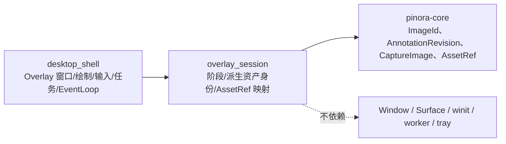

# 计划 133：Overlay 会话状态模块

- 状态：已完成
- 负责人：Codex
- 当前任务：`.context/tasks/133_overlay_session_state.md`

## 目标

将 `desktop_shell` 的无窗口 Overlay 阶段与派生资产身份迁入 `pinora-app::overlay_session`，集中选区
阶段、重选身份、标注 revision 到 `AssetRef` 的映射和图像身份盖章；桌面壳继续独占 Overlay 窗口、
绘制、输入、标注文档写入、任务提交和 EventLoop。

## 非目标

- 不改变选区、标注 revision、ImageId、AssetRef generation、OCR/导出结果门禁、重选、窗口、绘制、
  输入、任务、tray 或历史行为。
- 不迁移 `OverlayState`、`SelectedAnnotationDrag`、Window/Surface、softbuffer、winit 事件、标注渲染或任务服务。

## 约束

- `overlay_session` 只依赖 `pinora-core`，不得依赖 winit、Window、Surface、worker、runtime 或 tray。
- 同一确认选区的标注只推进 generation；重选必须创建新的 ImageId；未建立身份时不得接受会话任务结果。

## 依赖关系

## 阶段

1. 建立 `overlay_session`，迁移纯状态、资产映射和回归测试。
2. 切换桌面壳导入，删除重复定义，保持所有 Overlay 副作用时机。
3. 更新设计、系统事实和风险台账，执行完整门禁。

## 检查点

1. `overlay_session` 不依赖窗口、绘制、输入、任务或 tray 类型，纯身份语义由离线测试锁定。
2. `desktop_shell` 仍拥有 Overlay 的真实副作用与唯一 EventLoop，未迁移 Window/Surface 或 winit 路径。
3. 完整 workspace、严格 Clippy、Windows target、版本、格式、差异与上下文门禁通过后才关闭任务。

## 计划级风险

- 将图像身份或 revision 映射迁错会接受迟到 OCR/导出结果，或使确认重选复用旧图像身份。
- 离线验证不覆盖真实 GUI、任务栏/Dock、tray-only、焦点、HiDPI 和帧时间；这些风险由 R-084 持续跟踪。

## 完成标准

- 新模块唯一拥有 Overlay 阶段、资产身份、revision 映射与盖章。
- 现有迟到 OCR/导出结果门禁和重选身份语义保持不变。
- 定向、workspace、Clippy、Windows target、fmt、diff 和 ctx validate 通过；真实 GUI 风险明确记录。

## 风险与回滚

- 风险：错误的身份或 revision 映射可能接受陈旧结果，或让重选复用旧图像身份。
- 回滚：恢复 `desktop_shell` 内类型/函数并移除 `overlay_session`；不触碰窗口、图像数据、标注、任务、tray 或设置。

## 完成记录

- 2026-08-03：`overlay_session` 已成为 Overlay 阶段、派生资产身份、revision 映射和派生图像盖章的唯一所有者。
- `desktop_shell` 保持 Overlay Window/Surface、绘制、输入、标注文档、OCR/导出任务、tray 与 EventLoop；无公共接口、持久化形状或状态字符串变更。
- 定向测试、完整 workspace、严格 Clippy、Windows target、版本、格式、差异与上下文校验通过；真实桌面风险继续由 R-084 记录。
