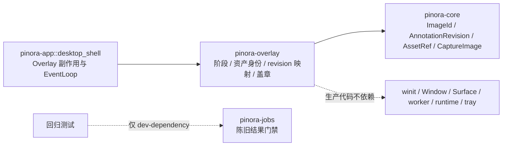

# 计划 134：Overlay 会话 crate

- 状态：已完成
- 负责人：Codex
- 当前任务：`.context/tasks/134_overlay_crate.md`

## 目标

将已验证的 Overlay 纯会话边界从 `pinora-app::overlay_session` 迁入独立的
`pinora-overlay` crate，使 Overlay 阶段、派生资产身份、revision 到 `AssetRef` 映射和派生图像身份盖章
拥有明确的功能 crate；`pinora-app::desktop_shell` 继续独占所有窗口与任务副作用。

## 非目标

- 不改变 `OverlayPhase`、`ImageId`、`AssetRef` generation、标注 revision、OCR/导出结果门禁或重选语义。
- 不迁移 `OverlayState`、Window/Surface、softbuffer、winit 输入、标注文档、绘制、任务、tray 或 EventLoop。
- 不引入新的第三方依赖、网络、线程、运行时或警告抑制。

## 约束

- `pinora-overlay` 的生产依赖只能是 `pinora-core`；`pinora-jobs` 只能作为测试依赖，用于现有陈旧结果门禁回归。
- root workspace 和 `pinora-app` 必须以显式 path workspace dependency 接入该 crate；不得复制实现或保留兼容包装器。
- 新 crate 的公开项仅限 app 需要的阶段、资产身份和映射函数；不暴露窗口或平台类型。

## 依赖关系

## 阶段

1. 新建 `pinora-overlay` workspace crate，并将纯会话实现与三项回归测试迁入。
2. 切换 `pinora-app` 到 crate 依赖，删除内部模块，检查所有引用无重复实现。
3. 更新设计、系统事实和风险台账，执行定向、workspace、跨目标与上下文门禁。

## 检查点

1. 新 crate 唯一拥有 `OverlayPhase`、`OverlayAssetIdentity` 与 `overlay_asset_for_revision`。
2. app 只导入 crate 契约，保留 `desktop_shell` 的 Window/Surface、输入、绘制、标注文档、任务和 tray 路径。
3. 只有通过定向测试、workspace、严格 Clippy、Windows target、版本、格式、差异与上下文校验后，才能关闭任务。

## 计划级风险

- crate 可见性或依赖方向错误会将窗口/任务类型泄漏到纯会话边界，或破坏现有的结果拒绝语义。
- 离线门禁不能验证真实 GUI、任务栏/Dock、tray-only、焦点、HiDPI 或性能；R-084 持续覆盖这些风险。

## 完成标准

- `pinora-overlay` 成为唯一实现位置，生产依赖图只包含 `pinora-core`。
- app 不再存在 `overlay_session` 内部模块，所有调用保持原副作用时机与资产版本语义。
- 定向、workspace、Clippy、Windows target、fmt、diff 与 ctx validate 通过；真实桌面风险明确记录。

## 风险与回滚

- 风险：错误的 crate 迁移可能重建身份、接受陈旧结果，或不必要地扩大公共 API。
- 回滚：移除 workspace 成员与 app 依赖，将纯实现恢复至 `pinora-app::overlay_session`；不改变窗口、图像数据、标注文档、任务、tray、历史或设置。

## 完成记录

- 2026-08-03：新增 `pinora-overlay` workspace crate，成为 Overlay 阶段、派生资产身份、revision 映射和
  派生图像盖章的唯一实现位置；生产依赖图仅为 `pinora-overlay -> pinora-core`。
- `pinora-app` 删除 `overlay_session` 内部模块，只从新 crate 导入契约；`desktop_shell` 的 Window/Surface、
  绘制、输入、标注文档、OCR/导出任务、tray 与 EventLoop 路径不变。
- 定向测试、完整 workspace、严格 Clippy、Windows target、版本、格式、差异与上下文校验通过；真实桌面风险
  继续由 R-084 记录。
