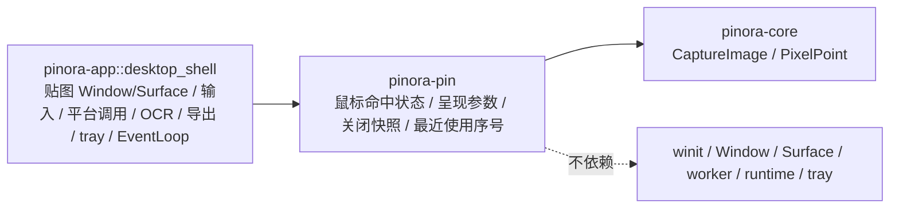

# 计划 135：贴图会话 crate

- 状态：已完成
- 负责人：Codex
- 当前任务：`.context/tasks/135_pin_crate.md`

## 目标

将 `pinora-app::pin_session` 的无窗口贴图会话值对象迁入独立的 `pinora-pin` crate，使鼠标命中状态、
平台确认后的纯状态转移、贴图呈现参数、关闭恢复快照和饱和最近使用序号拥有明确功能边界；
`desktop_shell` 继续独占贴图 Window/Surface、输入、平台调用、OCR、导出、tray 和 EventLoop。

## 非目标

- 不改变 `PinId`、`CaptureImage`、鼠标穿透状态、贴图呈现参数、关闭恢复语义、tray 排序或状态字符串。
- 不迁移 `PinWin`、Window/Surface、winit 输入、平台鼠标命中调用、OCR、导出、tray 或 EventLoop。
- 不引入第三方依赖、网络、线程、运行时或警告抑制。

## 约束

- `pinora-pin` 的生产依赖只能是 `pinora-core`，不得依赖 winit、Window、Surface、worker、runtime 或 tray。
- root workspace 与 `pinora-app` 必须以显式 path workspace dependency 接入；不得保留 app 内复制实现。
- crate 公开契约只描述纯贴图会话数据和状态转移，不能接收或保存窗口/平台句柄。

## 依赖关系

## 阶段

1. 新建 `pinora-pin` workspace crate，迁移纯会话实现与三项回归测试。
2. 切换 `pinora-app` 到 crate 依赖，删除内部模块并检查没有重复引用。
3. 更新设计、系统事实和风险台账，执行定向、workspace、跨目标与上下文门禁。

## 检查点

1. `pinora-pin` 唯一拥有 `PinMouseMode`、状态转移、`PinPresentation`、`ClosedPinSnapshot` 与最近使用计数。
2. app 仅消费 crate 契约，`desktop_shell` 的原生贴图副作用和唯一 EventLoop 路径不变。
3. 只有通过定向测试、workspace、严格 Clippy、Windows target、版本、格式、差异与上下文校验后才能关闭任务。

## 计划级风险

- 可见性或依赖方向错误可能把窗口类型引入纯贴图模块，或使平台失败后错误推进鼠标穿透状态。
- 离线门禁不能验证真实鼠标命中、窗口管理器、任务栏/Dock、tray-only、焦点、HiDPI 或性能；R-083 持续覆盖。

## 完成标准

- `pinora-pin` 成为唯一实现位置，生产依赖图只包含 `pinora-core`。
- app 不再存在 `pin_session` 内部模块，贴图平台调用与副作用时机不变。
- 定向、workspace、Clippy、Windows target、fmt、diff 与 ctx validate 通过；真实桌面风险明确记录。

## 风险与回滚

- 风险：crate 迁移可能改变平台失败回退、关闭恢复字段或 tray 最近使用排序。
- 回滚：移除 workspace 成员与 app 依赖，并恢复 `pinora-app::pin_session`；不改变窗口、图像、OCR、导出、tray、历史或设置。

## 完成记录

- 已完成：新增 `pinora-pin` workspace crate，迁移贴图鼠标命中状态、平台确认后的纯状态转移、
  呈现参数、关闭恢复快照和饱和最近使用序号；`pinora-app` 已改为消费 crate，删除内部
  `pin_session` 模块。`desktop_shell` 的窗口、Surface、输入、平台调用、OCR、导出、tray 和唯一
  EventLoop 路径未迁移。
- 已验证：`cargo test -p pinora-pin -- --nocapture`（3 通过）、`cargo test -p pinora-app --lib -- --nocapture`
  （21 通过）、`PINORA_NO_SYSTEM_CLIPBOARD=1 cargo test --workspace`、`cargo check --workspace`、
  `cargo clippy --workspace --all-targets -- -D warnings`、`cargo check --workspace --target x86_64-pc-windows-msvc`、
  `cargo run --quiet -- --version`、`cargo fmt --all -- --check`、`git diff --check` 与 `ctx validate`
  均已通过。
- 未覆盖：真实鼠标命中、窗口管理器、tray-only、任务栏/Dock、焦点、HiDPI 与性能仍需原生桌面会话验收，
  持续由 R-083 跟踪。
