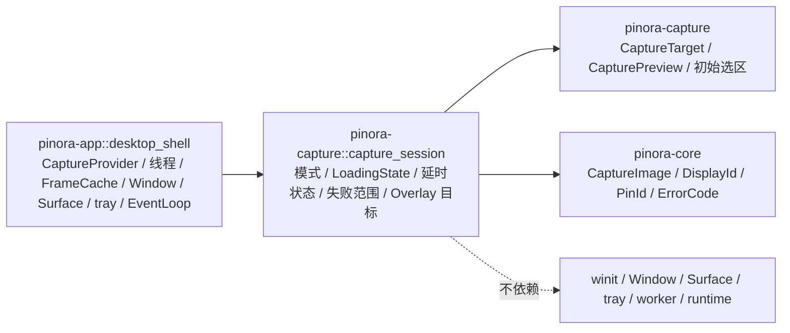

# 计划 136：捕获会话 crate

- 状态：已完成
- 负责人：Codex
- 当前任务：`.context/tasks/136_capture_session_crate.md`

## 目标

将 `pinora-app::capture_session` 的无窗口捕获会话契约迁入既有 `pinora-capture` crate，使捕获模式、
平台结果接收、延时清理、失败恢复范围和 Overlay 目标映射与捕获请求/预览处于同一功能边界；
`desktop_shell` 继续独占 CaptureProvider 调用、线程创建、FrameCache、Window/Surface、tray、恢复副作用
和唯一 EventLoop。

## 非目标

- 不改变区域、全屏、全部显示器、窗口、历史编辑或贴图编辑的初始选区、坐标、尺寸、最小边长、编辑
  `PinId`、失败优先级或延时恢复语义。
- 不迁移 winit/Window/Surface、实际线程启动、CaptureProvider 调用、FrameCache、tray、OCR、导出、
  历史、runtime 或 EventLoop。
- 不新增第三方依赖、网络、线程、警告抑制或真实 GUI 测试。

## 约束

- 新模块只使用标准库、`pinora-core` 与现有 `pinora-capture` 内部契约；不得依赖 `pinora-app`、
  `pinora-desktop`、winit、Window、Surface、tray、worker、runtime 或平台窗口句柄。
- 新 crate 契约使用 `CaptureSessionMode`，不得向功能 crate 导出泛化的 `Mode` 名称；其余迁移类型与函数
  保持既有语义。
- `LoadingState` 只传递 `CapturePreview` 或稳定 `ErrorCode` 的接收端；不在 crate 中创建线程或消费
  结果。延时快照只保存领域 `PinId`。

## 依赖关系

## 阶段

1. 将 `capture_session.rs` 移入 `pinora-capture`，以 `CaptureSessionMode` 明确 crate 公共契约，并保留六项回归测试。
2. 切换 `pinora-app` 导入，删除 app 私有模块，确认没有 `capture_session` 重复实现或 app 反向依赖。
3. 更新设计/系统事实/风险台账，执行 crate、app、workspace、静态、Windows、版本、格式、差异和上下文门禁。

## 检查点

1. `pinora-capture` 唯一拥有捕获会话模式、结果接收、延时状态、失败范围和 Overlay 目标映射。
2. `desktop_shell` 的 CaptureProvider 调用、线程、窗口、tray、错误恢复和 EventLoop 时机不变。
3. 新模块不引入 UI 或平台窗口依赖，延时可见性快照保持领域 `PinId`。

## 计划级风险

- 名称或可见性迁移可能使失败恢复范围、目标坐标或延时恢复路径发生变化。
- 离线测试无法验证真实捕获权限、屏幕拓扑变化、窗口管理器、tray-only、焦点、HiDPI 或性能；R-080 持续覆盖。

## 完成标准

- app 不再保留 `capture_session` 内部模块，`pinora-capture` 拥有唯一实现与六项回归测试。
- 生产依赖图不出现 `pinora-app`、`pinora-desktop` 或 winit，shell 仍独占所有真实副作用。
- 通过定向、workspace、严格 Clippy、Windows target、版本、fmt、diff 与 ctx validate；真实桌面风险明确记录。

## 风险与回滚

- 风险：模块迁移可能破坏捕获失败恢复、Overlay 目标映射或延时贴图恢复。
- 回滚：移除 `pinora-capture::capture_session` 并恢复 `pinora-app::capture_session`；不改动捕获后端、图像、
  历史、窗口、tray、OCR、导出或设置。

## 完成记录

- 已完成：新增 `pinora-capture::capture_session`，迁移捕获模式、平台结果接收、延时状态、失败范围和
  屏幕/虚拟桌面/窗口/历史/贴图编辑 Overlay 目标构造；模式公开名收敛为 `CaptureSessionMode`。
  `pinora-app` 已删除内部 `capture_session` 模块并改为消费 crate。CaptureProvider 调用、线程、
  FrameCache、Window/Surface、tray、失败恢复和唯一 EventLoop 仍由 `desktop_shell` 持有。
- 已验证：`cargo test -p pinora-capture -- --nocapture`（39 通过，1 项真实显示会话忽略）、
  `cargo test -p pinora-app --lib -- --nocapture`（15 通过）、`PINORA_NO_SYSTEM_CLIPBOARD=1 cargo test --workspace`、
  `cargo check --workspace`、`cargo clippy --workspace --all-targets -- -D warnings`、
  `cargo check --workspace --target x86_64-pc-windows-msvc`、`cargo run --quiet -- --version`、
  `cargo fmt --all -- --check`、`git diff --check`、`cargo metadata --no-deps --format-version 1` 与
  `ctx validate` 均通过。`cargo tree -p pinora-capture -e normal --depth 1` 仅显示既有的
  `image`、`pinora-core`、`png` 与 `xcap` 依赖，没有 app、desktop 或 winit。
- 未覆盖：真实捕获权限、屏幕热插拔、窗口管理器、tray-only、任务栏/Dock、焦点、HiDPI 与性能仍需
  原生桌面会话验收，持续由 R-080 跟踪。
