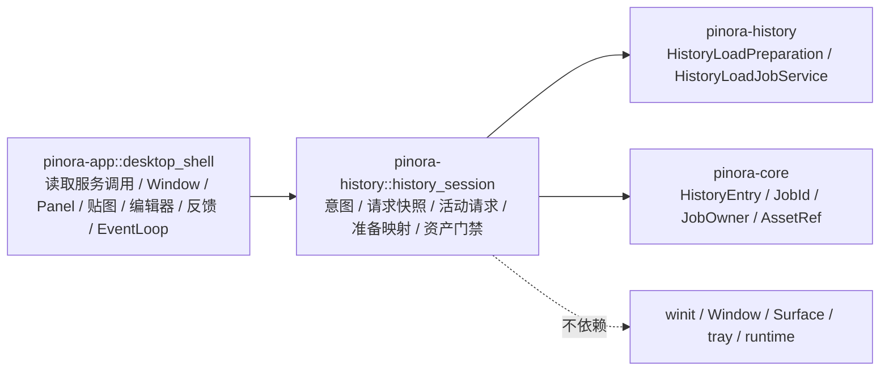

# 计划 137：历史加载会话 crate

- 状态：已完成
- 负责人：Codex
- 当前任务：`.context/tasks/137_history_session_crate.md`

## 目标

将 `pinora-app::history_session` 的历史加载意图、请求快照、活动请求和结果资产门禁迁入既有
`pinora-history` crate，使历史读取服务、准备类型和会话匹配处于同一功能边界；`desktop_shell` 继续
独占读取服务调用时机、窗口/贴图/编辑器、错误反馈和唯一 EventLoop。

## 非目标

- 不改变历史条目的 image id、generation、文件格式、受管路径、读取策略、worker 协议、任务 owner、
  预览/重新贴图/编辑器意图或结果接收语义。
- 不迁移文件读取、worker 启动/轮询、Window/Surface、Panel、tray、OCR、导出、runtime 或 EventLoop。
- 不新增第三方依赖、网络、线程、警告抑制或真实 GUI 测试。

## 约束

- 新模块只使用 `pinora-core` 与 `pinora-history` 内的 `HistoryLoadPreparation`；不得依赖
  `pinora-app`、`pinora-desktop`、winit、Window、Surface、tray、runtime 或窗口句柄。
- `ActiveHistoryLoad::accepts_result` 必须继续同时验证 job id、`JobOwner::History(image_id)` 和当前
  `HistoryEntry` 的 image id/generation；不得以文件名或历史索引位置替代资产身份门禁。
- app 只消费 crate 契约；`HistoryLoadJobService` 的实际启动、取消、结果轮询和 UI 交付仍留在 shell。

## 依赖关系

## 阶段

1. 将 `history_session.rs` 迁入 `pinora-history` 并保留三项意图、generation 和 owner 门禁回归测试。
2. 切换 app 导入，删除 app 私有模块，确认没有重复实现或 app 反向依赖。
3. 更新设计、系统事实和 R-082，执行 crate、app、workspace、静态、Windows、版本、格式、差异和上下文门禁。

## 检查点

1. `pinora-history` 唯一拥有加载意图、请求、活动状态与结果资产门禁。
2. `desktop_shell` 的 worker、窗口、贴图、编辑器、tray 和 EventLoop 时机不变。
3. 新模块不引入 UI 或运行时依赖；结果匹配仍拒绝过期 job、错误 owner 和 generation。

## 计划级风险

- 迁移遗漏可能接受过期读取结果，或让预览、贴图、编辑器使用错误历史条目。
- 离线测试不能验证真实文件系统、worker 时序、窗口管理器、tray-only、焦点、HiDPI 或性能；R-082 持续覆盖。

## 完成标准

- app 不再保留 `history_session` 内部模块，`pinora-history` 成为唯一实现和三项回归测试位置。
- 生产依赖图不出现 app、desktop 或 winit，shell 保持所有真实副作用。
- 通过定向、workspace、严格 Clippy、Windows target、版本、fmt、diff 与 ctx validate；真实桌面风险明确记录。

## 风险与回滚

- 风险：迁移可能破坏历史读取结果的 job/owner/generation 门禁。
- 回滚：移除 `pinora-history::history_session` 并恢复 `pinora-app::history_session`；不改动历史索引、
  受管 PNG、worker、窗口、贴图、tray、OCR、导出或设置。

## 完成记录

- 已完成：新增 `pinora-history::history_session`，迁移历史加载意图、请求快照、活动请求、准备类型映射
  和 job/owner/generation 结果资产门禁；app 已删除内部 `history_session` 模块并改为消费 crate。
  `desktop_shell` 仍持有读取服务调用、worker 编排、历史窗口、贴图/编辑器、错误反馈和唯一 EventLoop。
- 已验证：`cargo test -p pinora-history -- --nocapture`（35 通过）、`cargo test -p pinora-app --lib -- --nocapture`
  （12 通过）、`PINORA_NO_SYSTEM_CLIPBOARD=1 cargo test --workspace`、`cargo check --workspace`、
  `cargo clippy --workspace --all-targets -- -D warnings`、`cargo check --workspace --target x86_64-pc-windows-msvc`、
  `cargo run --quiet -- --version`、`cargo fmt --all -- --check`、`git diff --check`、
  `cargo metadata --no-deps --format-version 1` 与 `ctx validate` 均通过。`cargo tree -p pinora-history -e normal --depth 1`
  仅显示既有功能依赖，不含 app、desktop 或 winit。
- 未覆盖：真实历史目录权限、损坏/占用文件、worker 时序、窗口管理器、tray-only、任务栏/Dock、焦点、
  HiDPI 与性能仍需原生桌面会话验收，持续由 R-082 跟踪。
