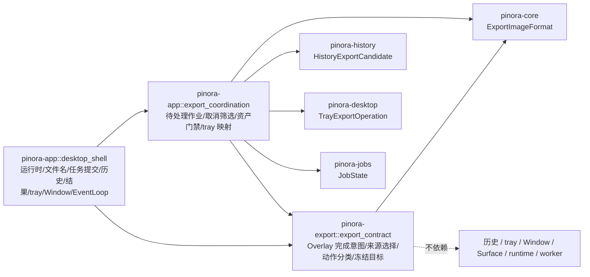

# 计划 138：导出请求契约 crate

- 状态：已完成
- 负责人：Codex
- 当前任务：`.context/tasks/138_export_contract_crate.md`

## 目标

将不含历史、tray、窗口与运行时副作用的 Overlay 导出完成意图、导出来源选择、导出动作分类和冻结目标迁入既有
`pinora-export` crate；保留 app 对待处理作业、历史登记、取消筛选、结果资产门禁和 tray 反馈的协调职责，避免
`pinora-history -> pinora-export` 已有方向反转成循环依赖。

## 非目标

- 不迁移 `PendingExport`、`HistoryExportCandidate`、运行中文件保存筛选、结果资产匹配或 tray 映射。
- 不改变 `Copy`、`Pin`、`Save` 的行为；贴图仍强制使用标注合成图，复制/保存仍遵循当前会话选择。
- 不迁移文件名分配、文件/剪贴板 IO、导出 worker、历史写入、Window/Surface、tray、runtime 或 EventLoop。
- 不新增依赖、网络、线程、警告抑制或真实 GUI 测试。

## 约束

- `pinora-export::export_contract` 只依赖既有 `pinora-core` 与同 crate 的导出来源类型；不得引入 app、history、desktop、winit、tray、runtime 或窗口句柄。
- `pinora-app::export_coordination` 是协调层而非导出契约所有者；仅持有与历史候选、`JobState`、结果资产门禁和 `TrayExportOperation` 耦合的状态。
- 所有导出 IO、任务启动/轮询、历史写入、tray 反馈、Window/Surface 与唯一 EventLoop 继续由 `desktop_shell` 独占。
- 不改变公共行为、持久化形状、状态字符串、`Copy`/`Pin`/`Save` 语义、路径/格式/质量冻结或取消范围。

## 依赖关系

## 阶段

1. 在 `pinora-export` 新增纯导出请求契约，迁移来源选择、动作分类和冻结目标及其回归测试。
2. 将 app 私有模块收敛为导出协调状态，切换 shell 导入，删除重复的纯契约实现。
3. 更新设计、系统事实与 R-081，验证依赖图、定向测试、workspace、Windows、版本、格式、差异和上下文门禁。

## 检查点

1. `pinora-export` 不依赖 app、history、desktop、winit、tray 或 runtime。
2. `Pin` 永远选择 `CaptureExportSource::Annotated`；`Copy` 和 `Save` 保留用户选择。
3. app 仍独占 `PendingExport`、历史候选、取消时机、结果交付和 tray 副作用。

## 计划级风险

- 迁移错误可能让贴图导出原图、将复制任务视为可取消保存，或破坏现有 tray 反馈映射。
- 离线测试无法验证真实文件系统、系统剪贴板、tray、窗口管理器、任务栏/Dock、焦点、HiDPI 或性能；R-081 持续跟踪。

## 完成标准

- `pinora-export` 成为导出意图、来源选择、动作分类和冻结输出参数的唯一实现及测试位置。
- `pinora-app` 不再保留这些纯值对象，且仍不向 `pinora-export` 引入 history/desktop/UI 依赖。
- 通过 crate、app、workspace、严格 Clippy、Windows target、版本、fmt、diff 与 ctx validate；真实桌面风险明确记录。

## 风险与回滚

- 风险：类型迁移可能改变 Overlay 完成时的像素来源、保存格式/质量冻结或反馈分类。
- 回滚：移除 `pinora-export::export_contract` 并恢复 app 私有纯值对象；不改动历史索引、导出 IO、任务协议、窗口、tray、OCR 或设置。

## 完成记录

- 已完成：`pinora-export::export_contract` 成为 `OverlayExportAction`、Overlay 来源选择、`ExportAction`、
  `ExportOperation` 和 `FrozenExportTarget` 的唯一实现与测试位置；`pinora-app::export_coordination` 只保留
  `PendingExport`、历史候选、运行中文件保存筛选、结果资产门禁和 tray 映射。
- 已验证：`cargo test -p pinora-export -- --nocapture`（33 通过，1 项真实剪贴板会话忽略）、
  `cargo test -p pinora-app --lib -- --nocapture`（10 通过）、`PINORA_NO_SYSTEM_CLIPBOARD=1 cargo test --workspace`、
  `cargo check --workspace`、严格 Clippy、Windows target、`cargo run --quiet -- --version`、fmt、diff 与
  `ctx validate` 均通过。`cargo tree -p pinora-export -e normal --depth 1` 仅含既有 `image`、`pinora-core`、
  `pinora-jobs` 和 `png`，不含 app、history、desktop 或 winit。
- 未覆盖：真实文件系统、系统剪贴板、tray、窗口管理器、任务栏/Dock、焦点、HiDPI 与性能仍需原生桌面会话验收，
  由 R-081 持续跟踪。
