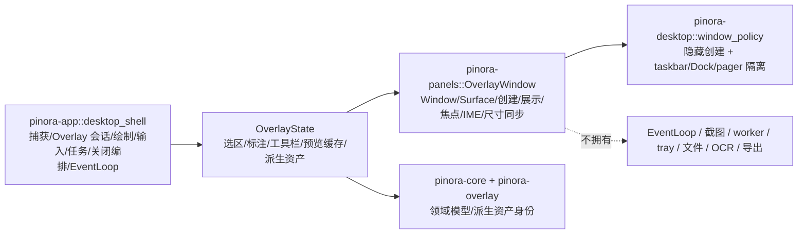

# 计划 139：Overlay 窗口适配器

- 状态：已完成
- 负责人：Codex
- 当前任务：`.context/tasks/139_overlay_window_adapter.md`

## 目标

将 Overlay 的 `Window`、`Surface`、统一窗口策略调用及其资源级操作迁入既有 `pinora-panels` 的
`OverlayWindow` 适配器，使 `pinora-app::OverlayState` 只组合 Overlay 会话和交互状态；app 继续独占
截图编排、选区/标注、绘制内容、输入、导出/OCR、窗口关闭时的 owner 回收和唯一 EventLoop。

## 非目标

- 不迁移 `OverlayState` 的选区、标注、预览缓存、工具栏、坐标映射、绘制像素、输入或派生资产身份。
- 不改变五种 `OverlayPresentation` 的标题、尺寸、全屏/位置、装饰、可调整、置顶、IME、焦点或展示顺序。
- 不迁移贴图窗口、文件/剪贴板 IO、任务服务、tray、runtime 或 EventLoop。
- 不新增依赖、网络、线程、警告抑制或真实 GUI 测试。

## 约束

- `pinora-panels::OverlayWindow` 必须经 `pinora-desktop::window_policy` 创建、展示和隐藏；不得让 Overlay
  在任务栏、Dock 或分页器出现新的窗口入口。
- app 只能通过适配器的资源级方法访问 Overlay 窗口；`Window`/`Surface` 不得重新落回 `OverlayState` 字段。
- 适配器不拥有 ApplicationHandler、EventLoop、截图、标注、任务、tray、文件、OCR、导出或业务状态。
- 保持单 Overlay 生命周期、原始 XRGB 尺寸同步、现有关闭 owner 语义和输出像素行为。

## 依赖关系

## 阶段

1. 在 `pinora-panels` 新增 Overlay 窗口/表面资源适配器，复用现有隐藏创建和展示策略，并为源码边界增加守卫。
2. 将 `OverlayState` 的直接 `Window`/`Surface` 字段替换为适配器，切换七个资源访问点，不改变 Overlay 行为。
3. 更新设计、系统事实和 R-085，执行 panels、app、workspace、静态、Windows、版本、格式、差异和上下文门禁。

## 检查点

1. `pinora-app` 不再以字段形式持有 Overlay 的 `Window` 或 `Surface`。
2. 关闭、展示、焦点、IME 和表面尺寸仍只针对当前 Overlay；窗口必须保持隐藏创建和 taskbar/Dock/pager 隔离。
3. `pinora-panels` 不依赖 app、capture、jobs、export、history、ocr、tray 或 runtime。

## 计划级风险

- 资源迁移遗漏可能让 Overlay 首帧空白、关闭后仍显示、resize 后 buffer 不一致，或破坏焦点/IME。
- 离线测试无法验证真实窗口管理器、tray-only、任务栏/Dock、焦点、HiDPI 和连续拖拽帧时间；新建 R-085 跟踪。

## 完成标准

- `OverlayWindow` 成为 Overlay 窗口与 Surface 的唯一所有者，app 仅经适配器操作资源。
- 生产依赖图保持 panels 不依赖 app/capture/业务服务，app 仍独占所有 UI 流程副作用。
- 通过定向、workspace、严格 Clippy、Windows target、版本、fmt、diff 与 ctx validate；真实桌面风险明确记录。

## 风险与回滚

- 风险：适配器行为可能在平台上改变 Overlay 的窗口映射、首帧、焦点或表面 resize 时序。
- 回滚：移除 `OverlayWindow` 并恢复 `OverlayState` 的直接资源字段；不改动选区、标注、任务、导出、OCR、tray 或设置。

## 完成记录

- 已完成：`pinora-panels::OverlayWindow` 成为 Overlay `Window`/`Surface`、隐藏创建、展示、隐藏、焦点、IME、
  重绘和固定像素尺寸同步的唯一资源所有者。`OverlayState` 只持有该适配器与既有会话/交互状态；关闭 owner、
  绘制、输入、任务和 EventLoop 保持在 app。
- 已验证：`cargo test -p pinora-panels -- --nocapture`（1 通过）、`cargo test -p pinora-app --lib -- --nocapture`
  （11 通过）、`PINORA_NO_SYSTEM_CLIPBOARD=1 cargo test --workspace`、`cargo check --workspace`、严格 Clippy、
  Windows target、`cargo run --quiet -- --version`、fmt、diff 与 `ctx validate` 均通过。
  `cargo tree -p pinora-panels -e normal --depth 1` 仅含既有 core、desktop、storage、softbuffer、winit，不含
  app、capture、jobs、export、history、ocr、tray 或 runtime。
- 未覆盖：真实任务栏/Dock/分页器、tray-only、首帧、焦点、IME、HiDPI 和连续拖拽帧时间仍需原生桌面会话验收，
  由 R-085 跟踪。
