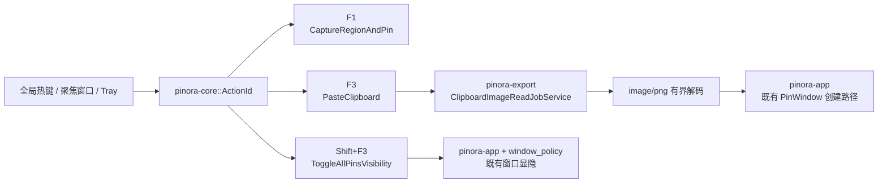

# 计划 140：Snipaste 默认快捷键契约

- 状态：已完成
- 负责人：Codex
- 当前任务：`.context/tasks/140_snipaste_hotkey_contract.md`

## 目标

将 Pinora 的默认快捷键与 Snipaste 的核心操作对齐：F1 启动区域截图，F3 将系统剪贴板中的 PNG
图像创建为贴图，Shift+F3 切换全部贴图的显示状态。全屏截图继续由托盘和既有 IPC 入口提供，
不占用默认全局键位。

## 非目标

- 不引入 Snipaste 私有协议、闭源组件或新的外部服务。
- 不改变全屏截图能力、截图后端、贴图渲染、历史、OCR、导出和 tray 的持久化数据形状；设置 schema
  升级仅用于键位语义迁移。
- 不在 GUI 线程同步等待剪贴板进程，不创建额外的任务栏、Dock 或分页器窗口。

## 约束

- F1 与 F3 是可录制的区域截图和剪贴板贴图主键；Shift+F3 固定为全部贴图显隐键，另外两项不得占用它。
- v1-v9 设置中的旧全屏键位必须重置为 F1/F3，不能静默重解释为剪贴板贴图；当前 v10 设置仍保留用户已保存组合。
- X11、Wayland Portal、tray 与已聚焦辅助窗口必须路由到稳定 `ActionId`；Portal 必须完整接受三项绑定才报告可用。
- F3 worker 只接受 `image/png`，并在 worker 内执行 MIME、字节、像素和解码边界检查；主线程只接收已验证图像。
- Shift+F3 只操作既有 `PinWin` 可见性；显示必须通过 `window_policy`，不得新建资产、历史或窗口类别。

## 依赖关系

## 阶段

1. 定义动作、默认键位和 v10 设置迁移，移除旧备用键与全屏主键语义。
2. 更新 X11/原生热键、Wayland Portal、desktop entry、tray 和聚焦窗口路由。
3. 建立有界、可取消、可验证的 PNG 剪贴板读回 worker，并接入既有贴图创建路径。
4. 更新设计、系统事实与风险；运行完整离线、静态、跨目标和上下文门禁。

## 检查点

1. F1、F3、Shift+F3 分别只映射到区域截图、剪贴板贴图和全部贴图显隐。
2. 旧 v1-v9 设置不再注册历史全屏键位，v10 round-trip 不会丢失用户的两项可录制组合。
3. 剪贴板读回取消、图像身份错配、非 PNG、超时和超限均不创建贴图且不阻塞 GUI。
4. 显示全部贴图复用 `window_policy`；隐藏与显示不创建任务栏、Dock 或分页器入口。

## 计划级风险

- 不同 Linux 桌面剪贴板工具的 MIME 参数、所有权时序和权限可能不同；Windows/macOS 尚无原生读回实现。
- Portal 版本或授权可能不能完整接受三项绑定；真实热键冲突与唤醒时序仍需原生会话验证。
- 真实窗口管理器可能暴露焦点抖动、任务栏/Dock/分页器项或帧时间退化，离线测试不能替代该证据。

## 完成标准

- 代码、设置迁移、全局/Portal/聚焦窗口路由、tray、剪贴板 worker 和显隐行为共同满足三键位契约。
- 设计文档、系统事实、风险、计划和任务均记录已验证事实、推断与未覆盖风险。
- 通过定向测试、workspace 测试、严格 Clippy、Windows target、fmt、diff 与 ctx validate；真实桌面风险明确开放。

## 风险与回滚

- 风险：剪贴板后端或原生窗口管理器的真实行为与离线模型不一致。
- 回滚：移除 clipboard read worker 与两项新增动作路由，保留 F1 区域截图和 tray/IPC 全屏入口；不删除现有设置数据文件。

## 完成记录

- 已完成：默认键位统一为 F1 区域截图、F3 剪贴板 PNG 贴图与 Shift+F3 全部贴图显隐；
  `PasteClipboard`、`ToggleAllPinsVisibility` 与 `JobOwner::Clipboard(ImageId)` 已接入 core、原生热键、
  Wayland Portal、tray、已聚焦辅助窗口和 desktop shell。全屏截图仍由 tray/IPC 提供，不再占用默认全局键。
- 已完成：设置 schema 升级至 v10；v1-v9 中历史全屏键位读取后重置为 F1/F3，避免把旧 F3 静默解释成
  剪贴板贴图；v10 记录继续保存用户的两项可录制组合。旧 `Ctrl+N` 与 `Ctrl+Shift+S` 没有作为隐藏备用键保留。
- 已完成：Linux F3 读回在受监督 worker 内优先使用 `wl-paste --type image/png`、再回退 `xclip`，并对
  MIME、3 秒截止时间、64 MiB PNG、5,000 万像素、200 MiB 解码缓冲、取消和图像身份实施门禁；只有验证成功的
  图像才经既有贴图窗口和 `window_policy` 进入 GUI。Shift+F3 只显隐当前 `PinWin`，不创建资产、历史或窗口类别。
- 已验证：`PINORA_NO_SYSTEM_CLIPBOARD=1 cargo test --workspace`、`cargo check --workspace`、
  `cargo clippy --workspace --all-targets -- -D warnings`、
  `cargo check --workspace --target x86_64-pc-windows-msvc`、`cargo fmt --all -- --check`、
  `git diff --check` 与 `ctx validate` 均通过。
- 未覆盖：用户已确认不会再运行 Snipaste，因此不存在该应用的快捷键竞争；但真实 Linux X11/KDE Wayland、
  Windows 和 macOS 的系统级占用、Portal 授权、剪贴板权限/所有权时序、任务栏/Dock/分页器隔离、焦点、
  HiDPI 以及连续 F3/Shift+F3 的帧时间仍须在原生桌面会话验收，由 R-086 跟踪。
