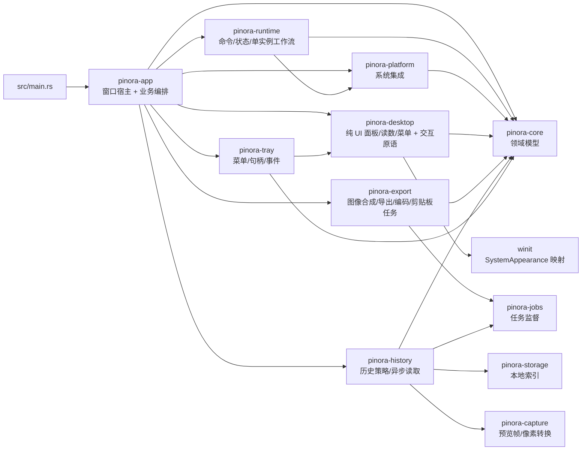

# 代码规范与上下文规则

## 当前工程约定

- Cargo workspace：唯一二进制入口为根 `src/main.rs`（package `pinora`）；领域在 `pinora-core`，系统集成在 `pinora-platform`，桌面编排/UI 仍在 `pinora-app`；后续 crate 按设计文档 `crates/pinora-*` 拆分。
- 依赖方向：`src/main.rs` 只负责组合 `pinora-app`、`pinora-platform` 和 `pinora-core`；功能 crate 只能向下依赖 `pinora-core`/能力端口，`pinora-core` 不得依赖 app、UI 或平台适配器。
- 命令表示意图、事件表示已发生事实；事件须带 `event_id`、`correlation_id`、`occurred_at_ms`；日志不得写入截图像素、OCR 全文或凭据。
- 平台能力通过 trait 注入：`CaptureProvider`、`ImageSink`、`SingleInstance`、`CapabilityProbe`、`HotkeySource`；测试用 fake/内存实现；入口用 `OsSingleInstance` + `LocalImageSink` + xcap/fake。
- 高层用户意图优先映射为 `ActionId`，再展开为 `Command`（`InvokeAction`）。
- **区域选区**几何在 `pinora-core::selection`；交互 Overlay 在 `pinora-app::region_overlay`（阻塞事件循环），不嵌入 `AppRuntime::dispatch`。
- 修改公共模块、类型或函数前，使用 `rg` 搜索全部引用，并运行 `cargo check --workspace` 与相关测试。
- 外部 CLI 适配器必须持有自己创建的 `Child`；超时先对句柄执行 `kill` 再 `wait`，不得通过 PID 字符串或外部 `kill` 命令回收，也不得把 `wait_with_output` 放进脱离调用方生命周期的线程。
- Pinora 空闲状态不创建控制窗口；托盘、已成功注册的全局热键与单实例 IPC 是后台入口。所有辅助 `WindowAttributes` 必须经 `window_policy::auxiliary_window_attributes`；新建事件循环必须使用 `window_policy::auxiliary_event_loop`，禁止绕开任务栏/Dock 策略。
- KWin 特例仅允许在窗口映射后按 Pinora 自身标题调用 `kwin_place`；`busctl` 失败只能记录，不能阻塞事件循环或被当作其他 Wayland 合成器的支持证据。

## 当前 crate 边界（任务 118 已验证）



- `pinora-platform` 唯一拥有 `start_on_login`、`single_instance`、`os_instance`、`hotkey` 和 Linux `wayland_portal`。
- `pinora-desktop` 现唯一拥有 `settings_panel`、`history_browser`、`diagnostics_panel`、`overlay_selection_readout`、`overlay_geometry`、`overlay_annotation`、`pin_context_menu` 与 `xrgb` 的纯自绘状态、布局、物理像素坐标、标注投影、脏区裁剪、命中、XRGB 绘制和贴图基础帧缓存；`pinora-app` 通过 crate 导出复用这些模块，但仍持有 Window/Surface。
- `pinora-export` 现唯一拥有 `capture_export`、`image_sink` 与 `export_job` 的导出来源、标注合成、图像编码、原子保存、系统剪贴板和受监督导出 worker；`pinora-app` 仅通过 crate re-export 与服务接口使用它们。
- `pinora-history` 现唯一拥有 `history_export` 与 `history_load_job` 的历史索引、tombstone 策略、受管 PNG 校验和异步读取 worker；`pinora-app` 仅通过 crate re-export 使用历史服务。
- `pinora-tray` 现唯一拥有 `tray-icon` 的菜单、句柄、事件映射和动态贴图列表；`pinora-app` 仅消费 `TrayAction` 并编排业务操作。
- `pinora-runtime` 现唯一拥有 `AppRuntime`、命令分发、单实例生命周期、领域事件发布和 `CapabilityProbe` 端口；`pinora-app` 仅实现真实能力探测。
- `pinora-app` 当前仍拥有 OCR 触发与 UI 结果交付、历史窗口/选择、Overlay/贴图窗口和唯一 EventLoop；这些边界按后续任务逐一拆分。

## 系统依赖（Linux + xcap）

```bash
sudo dnf install -y pipewire-devel mesa-libgbm-devel wayland-devel libxcb-devel
```

缺库时链接失败或运行期降级到 fake。

## 验证命令

- 工程元数据：`cargo metadata --no-deps --format-version 1`
- 格式：`cargo fmt --check`
- 编译：`cargo check --workspace`
- 静态检查：`cargo clippy --workspace --all-targets -- -D warnings`
- 测试：`cargo test --workspace`
- 真捕获（可选）：`cargo test -p pinora-app real_capture -- --ignored`
- 运行探针：`cargo run`
- 上下文完整性：`python /home/neo/.agents/skills/ctx/scripts/context_bootstrap.py validate --root /home/neo/Projects/neo/pub/pinora`

100 Wayland Portal 增量已执行并通过：`cargo test -p pinora-app wayland_portal -- --nocapture`（4 通过）、`cargo test -p pinora-app hotkey -- --nocapture`（16 通过）、`cargo test -p pinora-app desktop_shell -- --nocapture`（39 通过）、`cargo fmt --check`、`cargo check --workspace`、`cargo check --workspace --target x86_64-pc-windows-msvc`、`cargo clippy --workspace --all-targets -- -D warnings`、`PINORA_NO_SYSTEM_CLIPBOARD=1 cargo test --workspace`（app 298 通过、2 忽略；core 90 通过）、`ctx validate` 与 `git diff --check` 均成功。Portal 当前开发机仅验证为缺失接口时的受控不可用状态；不证明真实 Wayland 授权、全局触发、tray-only、任务栏/Dock 或性能。

101 KDE 指定显示器捕获修复已通过：`cargo test -p pinora-app capture_kde -- --nocapture`（6 通过）、`cargo fmt --check`、`cargo check --workspace`、`cargo check --workspace --target x86_64-pc-windows-msvc`、`cargo clippy --workspace --all-targets -- -D warnings` 和 `PINORA_NO_SYSTEM_CLIPBOARD=1 cargo test --workspace`（app 300 通过、2 忽略；core 90 通过）。该验证证明多显示器时不会选择当前显示器 `-m` 快路径，不证明真实 KDE 多显示器、异构缩放、性能或窗口管理器行为。

102 KDE 真实显示器探测修复已通过：`cargo test -p pinora-app capture_kde -- --nocapture`（8 通过）、`cargo fmt --check`、`cargo check --workspace`、`cargo check --workspace --target x86_64-pc-windows-msvc`、`cargo clippy --workspace --all-targets -- -D warnings` 和 `PINORA_NO_SYSTEM_CLIPBOARD=1 cargo test --workspace`（app 302 通过、2 忽略；core 90 通过）。该门禁证明不再返回固定虚拟拓扑，不证明真实 KDE/X11/Wayland 驱动输出、权限、截图准确性或性能。

103 Wayland Portal 版本门槛增量已通过：`cargo test -p pinora-app wayland_portal -- --nocapture`（5 通过）、`cargo fmt --check`、`cargo check --workspace`、`cargo check --workspace --target x86_64-pc-windows-msvc`、`cargo clippy --workspace --all-targets -- -D warnings` 和 `PINORA_NO_SYSTEM_CLIPBOARD=1 cargo test --workspace`（app 303 通过、2 忽略；core 90 通过）。该门禁只证明 v1 及更低版本不会进入绑定，不证明 backend 方法完整性、授权 UI、全局触发、tray-only 或性能。

104 用户级开机自启增量已完成实现：`cargo test -p pinora-app start_on_login -- --nocapture`（3 通过）覆盖 Linux `.desktop` 参数转义、`--pinora-autostart` tray-only 参数、同目录同步原子写入和未知项所有权冲突；设置 schema v1-v8 迁移到 v9 并补充 v9 往返。新鲜完整门禁 `cargo fmt --check`、`cargo check --workspace`、`cargo clippy --workspace --all-targets -- -D warnings`、`PINORA_NO_SYSTEM_CLIPBOARD=1 cargo test --workspace`（app 307 通过、2 忽略；core 90 通过）、`cargo check --workspace --target x86_64-pc-windows-msvc`、`git diff --check` 与 `ctx validate` 均通过。该验证不证明真实登录会话、平台权限、tray/Dock/任务栏/分页器或启动性能；macOS 当前为 LaunchAgent 兼容路径，不是 `SMAppService` 受管实现。

105 系统集成功能 crate 已完成：`cargo test -p pinora-platform -- --nocapture`（21 通过），workspace 全量测试（app 286 通过、2 忽略；core 90 通过；platform 21 通过；根入口 1 通过）、`cargo check --workspace`、`cargo clippy --workspace --all-targets -- -D warnings`、`cargo check --workspace --target x86_64-pc-windows-msvc`、`cargo fmt --check`、`git diff --check` 与 `ctx validate` 均通过。`pinora-platform` 现唯一拥有启动项、单实例/IPC、全局热键和 Linux Wayland Portal；真实桌面 GUI、登录会话、任务栏/Dock/分页器和性能仍未验证。

106 捕获功能 crate 已完成：`pinora-capture` 现唯一拥有 KDE/Spectacle、xcap、显式 fake、后端选择和 `FrameCache`；`cargo test -p pinora-capture -- --nocapture` 为 25 通过、1 个真实桌面测试忽略，`cargo tree -p pinora-app --depth 1` 已确认 app 不再直接依赖 xcap。完整 workspace 测试、严格 Clippy、Windows target、fmt、diff 和 `ctx validate` 作为任务 106 最终门禁；真实屏幕权限、HiDPI、桌面后端和性能仍未验证。

107 任务监督 crate 已完成：`pinora-jobs` 唯一拥有 `JobSupervisor`、`JobCancellation`、结果门禁和有界 worker 回收；基础 7 项测试及 OCR、导出、历史加载的定向回归通过。完整 workspace、Clippy、Windows target、fmt、diff 和 `ctx validate` 作为任务 107 最终门禁；协作式取消的真实子进程收敛仍不能仅由离线测试证明。

108 本地存储 crate 已完成：`pinora-storage` 唯一拥有 `SettingsStore`、`HistoryStore`、`HistoryLoad` 和 `ExportNameAllocator`；存储定向 28 项、历史清理 16 项、desktop shell 39 项回归通过。完整 workspace、Clippy、Windows target、fmt、diff 和 `ctx validate` 作为任务 108 最终门禁；断电、只读/网络文件系统、权限和 GUI 行为仍未验证。

109 桌面交互原语 crate 已完成：`pinora-desktop` 唯一拥有贴图几何、Overlay 工具栏布局/命中和已提交预览缓存；crate 仅依赖 `pinora-core`，定向 25 项测试通过。完整 workspace、Clippy、Windows target、fmt、diff 和 `ctx validate` 作为任务 109 最终门禁；真实窗口、tray、HiDPI、合成器和帧时间仍未验证。

110 OCR crate 已完成：`pinora-ocr` 唯一拥有 tesseract CLI、PNG 临时输入、TSV 解析、协作式取消/超时/输出上限和词框视觉状态；crate 依赖 `pinora-core`、`pinora-jobs` 与既有 `png` 库，13 项定向测试通过。完整 workspace、Clippy、Windows target、fmt、diff 和 `ctx validate` 作为任务 110 最终门禁；真实 tesseract 模型、权限、进程压力和 GUI 词框呈现仍未验证。

111 桌面窗口策略边界已完成：`pinora-desktop` 现唯一拥有隐藏创建、任务栏/Dock 隔离、映射后显示和 KDE KWin 位置/分页器策略；窗口策略/KWin 定向 8 项与交互原语测试通过。完整 workspace、Clippy、Windows target、fmt、diff 和 `ctx validate` 作为任务 111 最终门禁；真实 Windows/macOS/X11/KDE Wayland 窗口管理器行为、首帧、焦点、tray 和性能仍未验证。

112 桌面呈现状态边界已完成：`pinora-desktop` 现唯一拥有 `PanelTheme`、系统外观解析、tray 能力摘要和固定反馈/错误码映射；主题、能力和反馈定向 10 项与既有桌面测试通过。完整 workspace、Clippy、Windows target、fmt、diff 和 `ctx validate` 作为任务 112 最终门禁；真实 tray、系统主题事件、窗口管理器与性能仍未验证。

113 自绘桌面面板 crate 边界已完成：`pinora-desktop` 现唯一拥有设置/历史/诊断面板、Overlay 选区读数和贴图客户区菜单；crate 仅依赖 `pinora-core` 与 `winit`，`cargo tree -p pinora-desktop --depth 1` 和 `cargo tree -p pinora-app --depth 1` 已确认 app 通过 `pinora_desktop` 复用这些模块。`cargo test -p pinora-desktop -- --nocapture` 77 通过，随后又通过了 `cargo fmt --check`、`cargo check --workspace`、`cargo clippy --workspace --all-targets -- -D warnings`、`git diff --check` 和 `ctx validate`。完整 workspace、Clippy、Windows target、fmt、diff 和 `ctx validate` 作为任务 113 最终门禁；真实 GUI、HiDPI、输入法、焦点、tray/taskbar 和性能仍未验证。

114 导出与剪贴板 crate 边界已完成：`pinora-export` 现唯一拥有 `image_sink` 与 `export_job`，依赖 `pinora-core`、`pinora-jobs`、`png` 和 JPEG/WebP 编码特性；`pinora-app` 仅保留导出请求、结果消费和关闭编排。`cargo test -p pinora-export -- --nocapture` 25 通过、1 个需要真实显示会话的剪贴板测试忽略；workspace 测试、Clippy、Windows target、fmt、diff 和 `ctx validate` 作为任务 114 最终门禁。真实系统剪贴板权限、跨平台 GUI 和性能仍未验证。

115 历史工作流 crate 边界已完成：`pinora-history` 现唯一拥有历史索引加载、PNG 受管路径/摘要校验、删除/清空、配额与保留期 tombstone 清理以及异步历史图像读取；`pinora-app` 仅保留历史窗口和 EventLoop 编排。`cargo test -p pinora-history -- --nocapture` 26 通过；workspace 测试、Clippy、Windows target、fmt、diff 和 `ctx validate` 作为任务 115 最终门禁。真实文件权限、断电、网络文件系统、GUI 和性能仍未验证。

116 托盘适配 crate 边界已完成：`pinora-tray` 现唯一拥有 `tray-icon` 的菜单、句柄、事件轮询、动态贴图列表与固定反馈；Linux GTK 依赖只保留在该 crate 的 target 条件依赖，app 不再直接声明 GTK 或 `tray-icon`。`cargo test -p pinora-tray -- --nocapture` 15 通过；workspace 测试、Clippy、Windows target、fmt、diff 和 `ctx validate` 作为任务 116 最终门禁。真实托盘、任务栏/Dock、菜单点击和重连仍未验证。

117 OCR 任务服务 crate 边界已完成：`pinora-ocr` 现唯一拥有 `OcrJobService`、本地 runner、进程内结果缓存、worker 回收和基于 owner/资产版本/截止时间的结果门禁；app 只传入当前 UI 资产并处理验收结果。`cargo test -p pinora-ocr -- --nocapture` 26 通过，`cargo test -p pinora-app --lib -- --nocapture` 57 通过；workspace 测试、Clippy、Windows target、fmt、diff 和 `ctx validate` 作为任务 117 最终门禁。真实 OCR 模型、外部进程压力、GUI 交付和性能仍未验证。

118 应用运行时工作流 crate 边界已完成：`pinora-runtime` 现唯一拥有 `AppRuntime`、`BootstrapOutcome`、`DispatchResult`、`CapabilityProbe`、命令分发、单实例生命周期和领域事件发布；app 只实现真实能力探测并通过 re-export 兼容根入口和 desktop shell。`cargo test -p pinora-runtime -- --nocapture` 14 项通过、app 回归 43 项通过；完整 workspace、Clippy、Windows target、fmt、diff 和 `ctx validate` 作为任务 118 最终门禁。真实桌面单实例、权限、窗口隔离和性能仍未验证。

119 桌面 XRGB 渲染原语边界已完成：`pinora-desktop` 现唯一拥有 `PinRenderCache`、最近邻缩放、压暗、脏区恢复、选区手柄、矩形/词框/贴图边框和受控像素计数；app 只保留 `Window`/`Surface` 上传、Overlay/贴图状态和输入编排。`cargo test -p pinora-desktop -- --nocapture` 83 项通过、app 回归 41 项通过；完整 workspace、Clippy、Windows target、fmt、diff 和 `ctx validate` 作为任务 119 最终门禁。真实 softbuffer、HiDPI、连续 resize、焦点和性能仍未验证。

120 桌面 Overlay 坐标与选区命中边界已完成：`pinora-desktop::overlay_geometry` 现唯一拥有缓冲选区到源图、显示选区到标注局部坐标、窗口物理点/矩形到图像坐标的映射，以及选区调整资格和最近手柄命中；app 继续持有 `OverlayState`、`SelectionSession`、winit 输入和窗口生命周期。`cargo test -p pinora-desktop -- --nocapture` 87 项通过、app 回归 36 项通过；完整 workspace、Clippy、Windows target、fmt、diff 和 `ctx validate` 作为任务 120 最终门禁。真实 winit 缩放、HiDPI、连续输入、焦点和任务栏/Dock 行为仍未验证。

121 桌面 Overlay 标注投影与脏区原语已完成：`pinora-desktop::overlay_annotation` 现唯一拥有标注局部框的显示投影和脏区裁剪，`xrgb` 现唯一拥有受界块拷贝；app 只查询标注状态、管理缓存并上传 Surface。`cargo test -p pinora-desktop -- --nocapture` 91 项通过、app 回归 36 项通过；完整 workspace、Clippy、Windows target、fmt、diff 和 `ctx validate` 作为任务 121 最终门禁。真实 softbuffer、HiDPI、连续拖动、焦点和性能仍未验证。

122 捕获预览帧数据契约已完成：`pinora-capture::CapturePreview` 现唯一拥有由 `CaptureImage` 构建 XRGB 基础/暗化帧、从 `CachedFrame` 移交像素所有权及按物理像素尺寸进行完整性校验；app 只保留冷捕获接收/错误编排、Overlay 目标以及 Window/Surface。capture 27 项、app 35 项定向测试通过，完整 workspace、Clippy、Windows target、fmt、diff 和上下文校验均通过。真实捕获、softbuffer、HiDPI、焦点、tray-only 和性能仍未验证。

123 标注导出图像合成契约已完成：`pinora-export::capture_export` 现拥有 `CaptureExportSource`、原图/标注图选择、已提交标注文档烧录、草稿预览回退和异常长度回退；app 只保留选区裁剪、资产盖章、Overlay 语义与导出任务编排。`cargo test -p pinora-export -- --nocapture`（30 通过，1 项真实剪贴板测试忽略）、`cargo test -p pinora-app --lib -- --nocapture`（33 通过）、`PINORA_NO_SYSTEM_CLIPBOARD=1 cargo test --workspace`、完整 workspace 检查、Clippy、Windows target、fmt、diff 和上下文校验均已通过。真实剪贴板/文件、窗口、HiDPI、焦点、tray-only 和性能仍未验证。

096 历史保留期增量已执行并通过：`cargo test -p pinora-core settings -- --nocapture`、`cargo test -p pinora-core history -- --nocapture`、`cargo test -p pinora-app --lib settings_store::tests -- --nocapture`、`cargo test -p pinora-app --lib settings_panel::tests -- --nocapture`、`cargo test -p pinora-app --lib history_export::tests -- --nocapture`、`cargo test -p pinora-app --lib desktop_shell::overlay_scale_tests -- --nocapture`；完整门禁使用上方 workspace、Clippy、测试、Windows target、差异和 `ctx validate` 命令。完整测试未连接真实共享数据库、缓存、消息队列、对象存储或第三方服务；2 个真实桌面测试按既有约定忽略。

097 历史最大磁盘占用增量使用同一组定向测试，并额外覆盖 v7 到 v8 设置迁移、非法容量修复、容量下调后的最旧优先 tombstone 与受管 PNG 清理；完整门禁仍使用上方 workspace、Clippy、测试、Windows target、差异和 `ctx validate` 命令。测试不连接真实共享基础设施；2 个真实桌面测试按既有约定忽略。

098 发布链路已完成：`cargo run --quiet -- --version` 输出 `pinora 0.1.0`；当前 `main` CI `30783363209`、tag package/release `30783568639` 和 `runtime-verify` `30783727003` 均成功。Release `v0.1.0-preview.8` 已确认 `isPrerelease=true`，下载全部 11 个资产后按合并 `SHA256SUMS.txt` 执行 `sha256sum -c` 全部通过；Linux tarball 清单包含 `/usr/bin/pinora` 和 desktop entry，runtime 报告已回写 Release body。该门禁不证明真实桌面 GUI、tray、热键、权限、签名/公证或性能。

099 脱敏诊断包增量已通过：`cargo test -p pinora-app --lib -- --nocapture`（294 通过、2 忽略）、`cargo check --workspace`、`cargo clippy --workspace --all-targets -- -D warnings` 和 `PINORA_NO_SYSTEM_CLIPBOARD=1 cargo test --workspace` 均成功。报告字段为固定白名单，写入使用同目录临时文件、`sync_all`、原子 rename 和可读性校验；测试不证明真实托盘点击、跨平台目录权限或文件系统断电语义。

## 跨平台构建与打包

- Linux CI/打包依赖：`libasound2-dev libgbm-dev libgtk-3-dev libpipewire-0.3-dev libwayland-dev libx11-dev libxkbcommon-dev libxkbcommon-x11-dev pkg-config rpm`。
- Linux 打包：`PINORA_VERSION=... PINORA_PLATFORM=linux bash packaging/package-unix.sh`。
- macOS 打包：`PINORA_VERSION=... PINORA_PLATFORM=darwin bash packaging/package-unix.sh`（原生 `macos-14` runner）。
- Windows 打包：`$env:PINORA_VERSION='...'; ./packaging/package-windows.ps1`（原生 `windows-2022` runner，NSIS 可选）。
- GitHub Actions：先运行 `ci.yml`，再运行 `package.yml`；tag 成功后由 `runtime-verify.yml` 下载同一 run 的 artifacts 做安装/`--version`/卸载 smoke。
- 本阶段未提供本机 macOS GUI 验证；Windows target 仅在 Linux 主机完成编译检查，运行验证以 GitHub 原生 runner 为准。

## Git 身份（固定，勿再询问）

本仓库本地固定使用以下提交身份，代理在提交/改写历史时直接使用，不得改用其他账号，也不得再次向用户确认：

```text
user.name  = Neo
user.email = yhyzgn@gmail.com
```

配置位置：仓库 `.git/config`（`git config --local`）。若缺失，提交前自动写回上述值。

## 文档与变更规则

- 稳定事实写入 `system/`；阶段顺序写入 `plans/`；一个有边界、可验证、可回滚的动作写入 `tasks/`。
- 证据与不确定性分开记录；设计文档中的建议不能直接升级为实现事实。
- 所有面向人员的上下文文档使用中文；路径、命令和无法翻译的技术标识符除外。
- 目前没有持久化数据访问层；后续数据库或 ORM 变更必须遵守仓库级 SQL 红线并补充隔离测试。
