# Pinora 增强开发设计文档

> 跨平台高性能截图、标注、贴图与本地 OCR 工具

| 项目 | 内容 |
| --- | --- |
| 文档版本 | v0.2 设计基线 |
| 日期 | 2026-07-30 |
| 状态 | 目标设计，待按阶段评审与实现 |
| 产品代号 | Pinora（Pin + Liora，可后续更名） |
| 当前代码状态 | Rust 2024 单二进制雏形，`src/main.rs` 尚未实现本文功能 |

> **阅读说明**：本文描述产品目标和推荐实现，不代表功能已经存在。仓库当前只有无依赖的 `pinora` crate；任何依赖版本、平台 API 和性能数字都必须在对应开发任务中通过代码、官方文档和隔离测试重新确认。

---

## 1. 产品定义与设计原则

### 1.1 产品定位

Pinora 是面向研发、设计和产品人员的桌面截图工作台，核心闭环是：

```text
全局热键 → 快速截图 → 精确标注 → 桌面贴图 → OCR 选字/复制 → 导出或复用
```

它对标 Snipaste，但把以下能力作为一等公民：

- Windows、macOS、Linux X11 和主流 Wayland 环境的统一体验。
- 截图后的贴图窗口生命周期管理，而非一次性图片预览。
- 图像上的中文/英文 OCR、可交互文字层和自由拖选复制。
- 本地优先、权限透明、无强制云端上传。

### 1.2 目标用户与典型场景

| 用户 | 高频场景 | 关键成功信号 |
| --- | --- | --- |
| 研发人员 | 对照接口文档、日志和设计稿 | 3 秒内完成截图并贴在代码旁 |
| 设计/产品人员 | 标注问题、取色、反馈尺寸 | 标注不丢失，导出清晰 |
| Linux 用户 | Wayland 下使用全局热键和截图 | 有 Portal 权限引导和可用降级 |
| 内容整理人员 | 从截图复制文字 | OCR 后可拖选跨行文本 |

### 1.3 设计原则

1. **快捷路径优先**：常用操作默认一步完成，高级选项不阻塞主流程。
2. **数据与视图分离**：截图、标注、OCR 结果和贴图变换是可测试的数据模型；GPUI/Liora 只负责呈现和交互。
3. **平台差异隔离**：业务层只依赖能力接口，不直接依赖 Windows、macOS、X11 或 Wayland 类型。
4. **失败可恢复**：权限拒绝、OCR 失败、剪贴板失败都给出原因和下一步，不丢失原始图像。
5. **本地优先**：截图和 OCR 默认只在本机处理；任何上传能力必须显式启用并单独隔离。

### 1.4 范围优先级

| 优先级 | 定义 | 首版范围 |
| --- | --- | --- |
| P0 | 没有它就无法完成核心闭环 | 区域截图、基础贴图、基础标注、PNG 复制/保存、热键、托盘、单实例 |
| P1 | 显著提升效率，首版可分阶段交付 | OCR 文字层、拖选复制、多显示器、设置持久化、历史记录 |
| P2 | 增强体验或生态能力 | 长截图、录屏、分组标签、插件导出、自动更新、云端同步 |

---

## 2. 功能模块总览

### 2.1 模块清单

| 模块 | 主要职责 | P0/P1/P2 | 主要输入 | 主要输出 |
| --- | --- | --- | --- | --- |
| 应用外壳 `pinora-app` | 生命周期、单实例、命令分发、事件总线 | P0 | 系统启动、用户命令 | 应用状态、领域事件 |
| 截图 `pinora-capture` | 显示器枚举、Overlay、全屏/区域/窗口捕获 | P0 | 热键、托盘命令、选区 | `CaptureImage` |
| 贴图 `pinora-pin` | 贴图窗口、变换、置顶、锁定、多实例 | P0 | `CaptureImage`、用户手势 | `PinState`、窗口事件 |
| 标注 `pinora-annotate` | 矢量图形、工具状态、撤销重做、渲染 | P0 | 鼠标/键盘、图像坐标 | `AnnotationDoc` |
| OCR `pinora-ocr` | 模型生命周期、识别、文字层、选字 | P1 | RGBA 图像、语言设置 | `OcrResult`、选中文本 |
| 热键 `pinora-hotkey` | 注册、冲突检查、平台后端、降级 | P0 | 热键配置 | `HotkeyEvent` |
| 托盘与设置 `pinora-shell` | 菜单、设置、主题、开机自启入口 | P0/P1 | 用户配置、应用状态 | `Command`、配置变更 |
| 剪贴板与导出 `pinora-export` | 图像/文本复制、PNG/JPEG/WebP 保存 | P0 | 图像、标注、OCR | 文件或剪贴板内容 |
| 历史 `pinora-history` | 最近截图索引、预览、复用、清理 | P1 | 完成的截图/贴图 | 历史条目 |
| 平台适配 `pinora-platform` | 窗口、权限、剪贴板、启动项、App ID | P0 | 能力调用 | 平台能力结果 |
| 诊断 `pinora-diagnostics` | 结构化日志、能力检测、错误报告 | P0/P1 | 领域事件、平台错误 | 日志、诊断报告 |

### 2.2 功能模块总览结构图

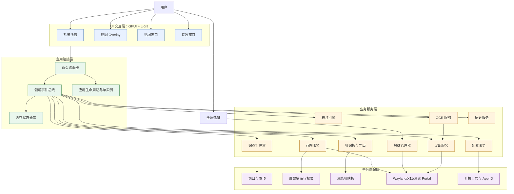

### 2.3 模块依赖规则

- `pinora-app` 是唯一编排入口，负责组装依赖和分发命令；不承载绘制、OCR 算法或平台细节。
- `pinora-core`（领域模型）只依赖标准库或纯数据类型，不依赖 GPUI、平台 SDK 或具体 OCR 引擎。
- UI 只能通过 `Command`、`Query` 和 `DomainEvent` 与服务交互，禁止直接修改服务内部状态。
- 平台适配器实现能力 trait；服务层通过 trait 注入，测试时使用内存/假实现。
- `history` 只保存索引和可配置的本地文件引用，不反向依赖 UI 或窗口句柄。

---

## 3. 软件架构

### 3.1 分层架构图

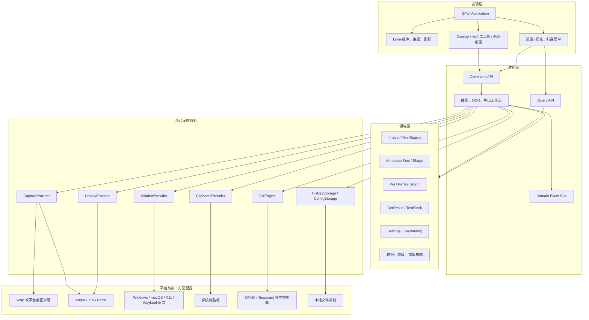

### 3.2 运行时组件关系

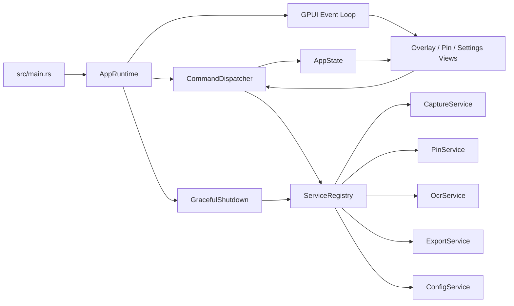

### 3.3 领域核心数据模型

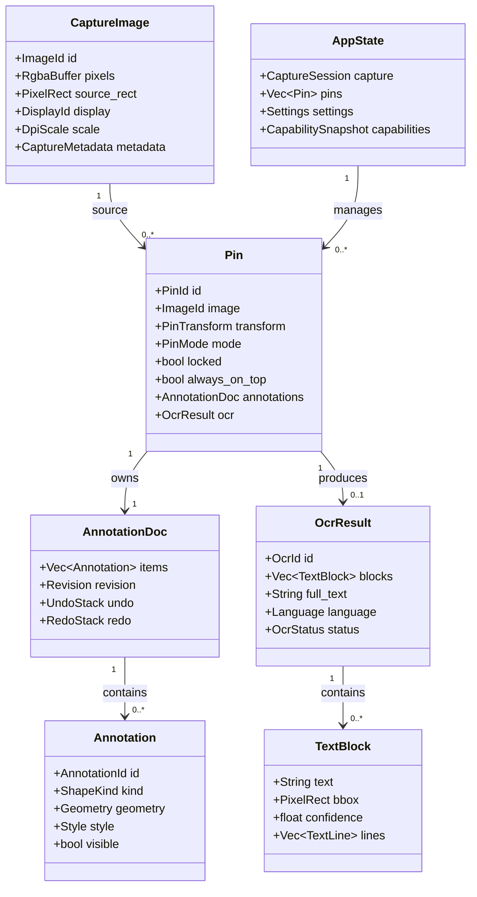

### 3.4 命令与事件约定

命令表示用户意图，事件表示已发生事实。命令可以失败；事件必须携带可诊断的关联 ID。

| 类别 | 示例 | 处理者 | 成功事件 | 失败事件 |
| --- | --- | --- | --- | --- |
| 截图 | `StartRegionCapture`、`ConfirmSelection` | CaptureWorkflow | `CaptureCompleted` | `CaptureFailed` |
| 贴图 | `CreatePin`、`SetPinTransform`、`ClosePin` | PinService | `PinCreated`、`PinUpdated` | `PinOperationFailed` |
| 标注 | `BeginAnnotation`、`CommitAnnotation`、`Undo` | AnnotationService | `AnnotationChanged` | `AnnotationRejected` |
| OCR | `RunOcr`、`ToggleTextLayer`、`CopySelection` | Ocr/Export | `OcrCompleted`、`TextCopied` | `OcrFailed`、`ClipboardFailed` |
| 配置 | `UpdateHotkey`、`SetTheme` | ConfigService | `SettingsChanged` | `SettingsRejected` |

事件至少包含 `event_id`、`occurred_at`、`correlation_id` 和实体 ID；日志不得写入截图像素、OCR 全文或凭据。

---

## 4. 功能详细规格

以下每节都包含入口、详细行为、边界行为和验收标准。P0/P1/P2 是交付优先级，不代表当前已经实现。

### 4.1 应用启动、单实例与退出（P0）

**入口**：用户启动程序、系统登录自启、第二次启动。

**详细功能**：

1. 初始化日志、配置目录、平台能力探测和 UI 运行时。
2. 创建单实例锁；已有实例时将启动参数转换为激活命令并退出第二进程。
3. 恢复上次主题、热键、保存路径和启动选项；配置损坏时回退默认值并提示。
4. 启动托盘和热键监听，再按需创建设置窗口，不在启动阶段加载 OCR 模型。
5. 收到退出命令后停止接收新命令，保存配置和历史索引，关闭贴图窗口，释放平台句柄。

**边界与失败**：

- 单实例锁不可创建：显示明确的文件路径和权限错误，不覆盖其他实例。
- 配置版本过旧：执行可回滚迁移；迁移失败时保留原文件并使用默认配置。
- 平台能力探测失败：应用仍可启动，托盘中显示受限能力。

**验收**：重复启动只有一个活动实例；配置损坏不阻塞启动；退出后没有残留锁文件或后台热键。

### 4.2 区域、全屏、显示器与窗口截图（P0）

**入口**：全局热键、托盘菜单、设置页快捷操作。

**详细功能**：

- **区域截图**：覆盖相关显示器的透明 Overlay；拖拽、调整四边和四角、键盘微调、显示物理像素尺寸。
- **全屏截图**：捕获当前显示器或所有显示器；支持设置默认目标。
- **显示器选择**：显示器列表包含名称、逻辑坐标、物理分辨率、缩放因子和主屏标记。
- **窗口截图（P1）**：候选窗口高亮、标题识别、点击确认；无法获取窗口列表时退回区域截图。
- **延迟截图**：1/3/5 秒倒计时；倒计时期间允许取消，隐藏 Pinora 自身窗口和托盘菜单。
- **坐标转换**：内部统一使用物理像素；UI 使用逻辑像素，转换集中在 `CoordinateSpace`。
- **捕获后动作**：进入标注、直接贴图、复制到剪贴板或保存，由配置决定。

**边界与失败**：

- 用户按 `Esc`：取消会话，不生成空截图。
- 选区小于最小尺寸（默认 2×2 物理像素）：显示尺寸提示，禁止确认。
- 权限拒绝：不重试死循环，显示系统设置路径和“复制诊断信息”操作。
- 多显示器热插拔：刷新显示器快照；已开始的会话使用开始时坐标并在失效时安全取消。

**验收**：P0 必须在单屏和双屏完成区域截图；HiDPI 下像素尺寸与保存图像一致；取消和权限拒绝均不丢失既有贴图。

#### 区域截图流程图

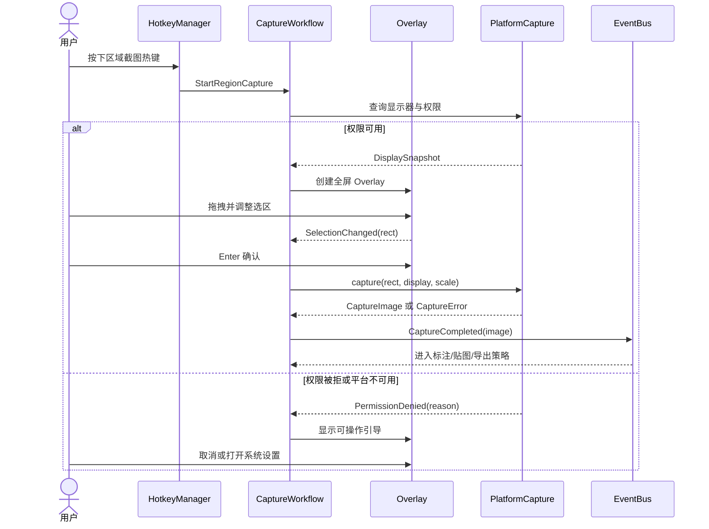

#### 截图会话状态图

```mermaid
stateDiagram-v2
    [*] --> Idle
    Idle --> Preparing: StartCapture
    Preparing --> Selecting: OverlayReady
    Preparing --> Failed: PermissionDenied / DisplayUnavailable
    Selecting --> Selecting: PointerMove / KeyboardNudge
    Selecting --> Confirming: ConfirmSelection
    Selecting --> Cancelled: Escape / CloseOverlay
    Confirming --> Captured: CaptureSucceeded
    Confirming --> Failed: CaptureError
    Captured --> [*]: DispatchPostCaptureAction
    Cancelled --> [*]
    Failed --> [*]: ShowRecoverableError
```

### 4.3 贴图窗口与多贴图管理（P0）

**入口**：截图完成后的贴图动作、历史条目、剪贴板图像导入。

**详细功能**：

- 创建无边框、可拖动、可缩放、可置顶的贴图窗口；默认位置避开截图来源区域。
- 支持拖动、四角/四边缩放、滚轮缩放、按比例缩放和窗口适应原图。
- 支持透明度滑块、锁定/解锁、置顶/取消置顶、点击穿透（P2）。
- `Esc`、中键、窗口菜单可关闭；关闭前不弹出阻塞确认，提供撤销关闭入口（P1）。
- 多贴图同时存在；提供全部显示、全部隐藏、全部关闭、按最近使用排序。
- 贴图重新进入标注模式时保留同一个 `PinId` 和版本历史；保存/复制使用当前合成结果。
- 支持贴图标题、来源时间、OCR 状态和锁定状态的无障碍描述。

**边界与失败**：

- 锁定状态拒绝拖动和缩放，但允许复制、OCR、关闭和显示菜单。
- 窗口创建失败时保留图像对象并提供重试/保存，不丢失截图。
- 置顶能力不可用时显示“平台受限”状态，不伪造置顶成功。
- 多贴图达到可配置上限时提示清理历史或关闭旧贴图。

**验收**：至少同时管理 10 个贴图；拖动、缩放、透明度和锁定状态在重绘后保持；关闭不会影响其他贴图。

#### 贴图生命周期图

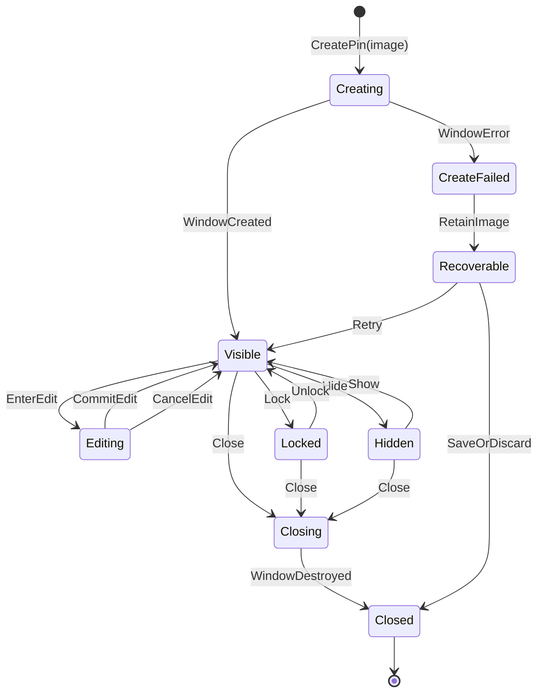

### 4.4 标注工具链（P0）

**入口**：截图后标注、贴图菜单中的“编辑”、历史条目编辑。

**工具**：选择、矩形、圆角矩形、椭圆、直线、箭头、自由画笔、文本、序号、马赛克、模糊、取色器。

**详细功能**：

- 标注对象使用图像物理像素坐标，渲染时根据视图变换统一缩放。
- 每种工具定义 `pointer_down`、`pointer_move`、`pointer_up` 和键盘修饰键行为。
- 矩形/椭圆支持描边、填充、透明度和圆角半径；箭头支持端点样式。
- 文本支持字体、字号、颜色、背景、自动换行和文本框尺寸调整。
- 马赛克/模糊只作用于选区像素，原始图像保留在不可变源图层中，允许撤销。
- 序号自动递增，可设置起始数字和颜色；删除序号后不自动重排已提交对象。
- 取色器支持贴图内取色；屏幕取色需要平台截图权限，取色结果可复制为 HEX/RGB。
- 撤销/重做按事务记录，一次拖拽或一次文字提交作为一个事务；清空标注可整体撤销。
- 标注数据和渲染缓存分离，导出前生成确定性合成图。

**边界与失败**：

- 文本提交为空时不生成对象。
- 图形超出画布时裁剪显示但保留原始几何，便于再次编辑。
- 图像缩放、旋转（P2）不改变标注数据的逻辑坐标。
- 渲染失败时仍可导出原始图像并显示标注错误。

**验收**：所有 P0 工具可撤销/重做；导出的标注位置在 100%、200% 缩放下与预览一致；取色器输出值可复现。

#### 标注交互流程图

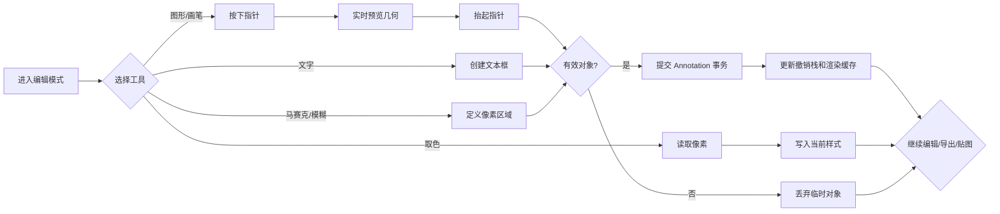

### 4.5 OCR 与可交互文字层（P1，基础产品能力）

**入口**：贴图菜单、标注工具条、OCR 全局热键。

**详细功能**：

- 首次使用时按需加载本地 OCR 引擎和中文/英文模型；启动不阻塞。
- 支持对原始截图、当前贴图合成图或用户框选区域识别。
- 识别任务带 `OcrJobId`，支持取消、超时、进度和并发上限；同一图像可按内容哈希复用缓存。
- 输出文字块、行、词/字符边界框、置信度、语言和引擎版本；坐标统一为图像物理像素。
- 文字层支持显示/隐藏、透明度、字号适配和按置信度过滤；默认不覆盖原始图像。
- 鼠标拖选支持跨块、跨行选择；自动按阅读顺序拼接，保留换行策略。
- 快捷复制当前选择或全部识别文本；复制失败时保留文本预览和重试入口。
- 识别失败不影响贴图和导出；用户可更换语言、重试或复制诊断信息。

**边界与失败**：

- 没有模型或模型校验失败：显示下载/配置说明，不自动联网下载。
- 置信度低于阈值的文本以低置信状态显示，不静默删除。
- OCR 任务超过超时：取消后台任务，保留已有结果。
- 图像被关闭时取消关联任务，禁止结果写入已销毁 `PinId`。

**验收**：中英文样例可识别；文字层坐标在缩放后命中正确；拖选跨行复制顺序稳定；OCR 失败不阻塞关闭和保存。

#### OCR 流程图

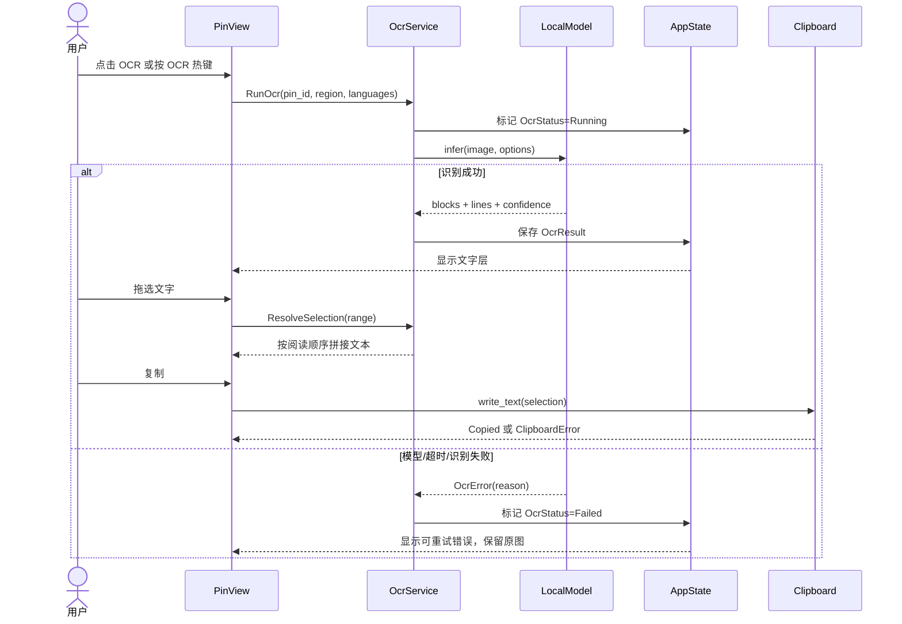

#### OCR 状态图

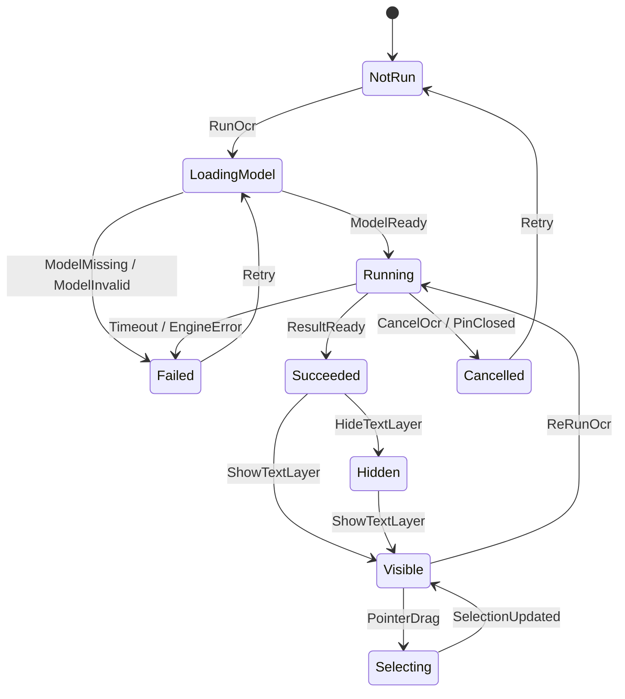

### 4.6 全局热键与冲突处理（P0）

**默认动作**：区域截图、全屏截图、显示/隐藏全部贴图、取色、对当前贴图 OCR。

**详细功能**：

- 设置页提供录制控件，显示修饰键、主键、平台显示名和当前占用状态。
- 绑定前做应用内重复检查；注册后接收平台回调并转成统一 `HotkeyEvent`。
- Windows 使用系统热键能力；macOS 使用全局快捷键能力；Linux X11 使用 X11 后端；Wayland 优先使用 XDG GlobalShortcuts Portal。
- Wayland Portal 首次绑定需要展示授权/配置流程和当前后端状态；不能静默假设注册成功。
- 冲突时提供冲突原因、建议组合和“改用系统快捷方式”降级路径。
- 热键配置热更新：先注册新组合，成功后解除旧组合，避免短暂无热键。
- 应用暂停/退出时解除注册；异常崩溃由平台会话自动回收，重启时重新校验。

**验收**：配置重复热键被阻止；Wayland 后端状态可见；注册失败不影响托盘和手动菜单操作。

#### 热键注册流程图

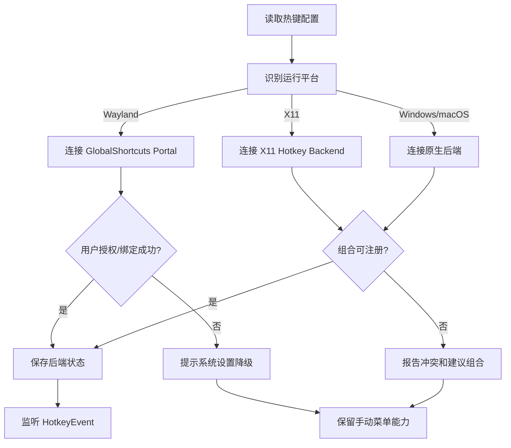

### 4.7 托盘、设置与主题（P0/P1）

**托盘菜单**：区域截图、全屏截图、贴图列表、显示/隐藏全部、关闭全部、设置、诊断、退出。

**设置分组**：

- 快捷键：录制、恢复默认、冲突状态和后端状态。
- 截图：默认模式、显示器、延迟、是否隐藏自身、截图后动作。
- 贴图：默认置顶、透明度、缩放行为、最大数量、关闭手势。
- OCR：语言、置信度阈值、模型目录、超时、文字层显示策略。
- 导出：格式、质量、命名模板、保存目录、覆盖策略。
- 外观：亮色、暗色、跟随系统、紧凑/舒适密度。
- 隐私与诊断：本地处理说明、日志级别、导出脱敏诊断包。

**配置规则**：配置有版本号和默认值；字段无效时逐项回退并记录原因；保存采用临时文件写入、校验、原子替换；敏感路径不写入普通日志。

### 4.8 剪贴板、导出与文件命名（P0）

**详细功能**：

- 复制图像优先保留 RGBA；若平台不支持透明通道，提示实际格式。
- 复制 OCR 当前选区或全文；图像和文本复制失败互不影响。
- 支持 PNG（无损默认）、JPEG（质量可选）、WebP（P1）；导出前选择原图、标注合成图或贴图当前视图。
- 命名模板支持日期、时间、序号、显示器和来源，例如 `Pinora_{yyyyMMdd}_{HHmmss}_{counter}`。
- 文件已存在时提供递增、覆盖（需显式设置）或取消；目录不可写时提供选择目录。
- 导出任务后台执行，界面显示进度和可取消状态；完成后可打开文件位置。

**验收**：PNG 导出像素与预览一致；文件名在跨平台路径规则下合法；导出失败保留内存图像。

#### 导出流程图

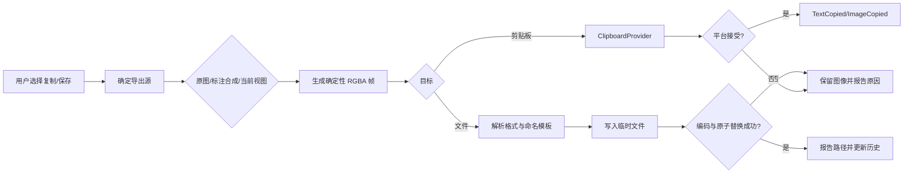

### 4.9 历史记录与复用（P1）

- 保存最近 N 条截图或贴图索引，可配置数量、最大磁盘占用和保留天数。
- 条目包含缩略图、创建时间、来源显示器、标签（P2）、OCR 状态和文件引用。
- 支持预览、再次贴图、再次编辑、复制文本、删除单条、清空全部。
- 使用内容哈希去重；原图丢失时条目显示失效状态，不阻塞其他条目。
- 清理任务只删除 Pinora 管理目录中的文件，禁止误删用户任意选择的外部文件。

### 4.10 诊断、权限和隐私（P0）

- 能力检测页显示平台、显示服务器、截图权限、热键后端、置顶能力、剪贴板能力和 OCR 模型状态。
- 错误分为用户可修复（权限、路径、冲突）、可重试（临时平台错误）和不可恢复（模型损坏、内部不变量破坏）。
- 日志采用结构化字段：时间、级别、模块、事件 ID、错误码；默认不记录像素、OCR 全文和剪贴板内容。
- “导出诊断包”只包含版本、平台能力、最近错误码和脱敏配置，不包含截图和个人路径，除非用户明确选择。
- 所有平台权限通过正规系统 API；不通过后台截屏、键盘监听或绕过 Portal 的方式实现功能。

---

## 5. 关键流程总览

### 5.1 首次启动流程

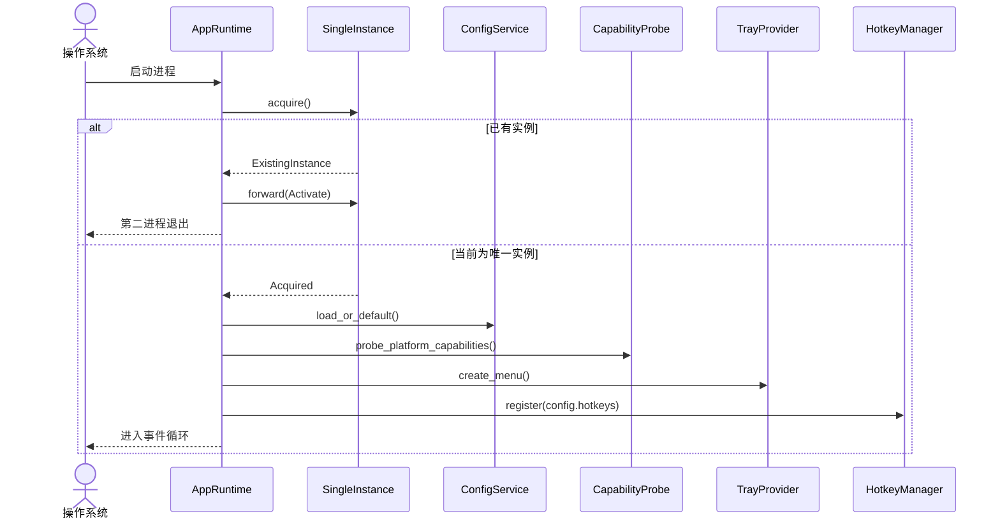

### 5.2 快速截图到贴图

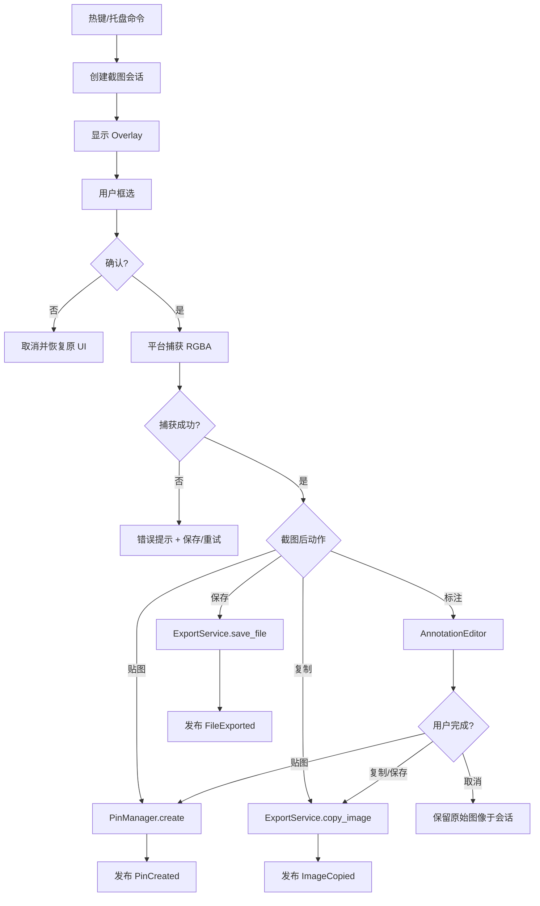

### 5.3 权限拒绝与降级路径

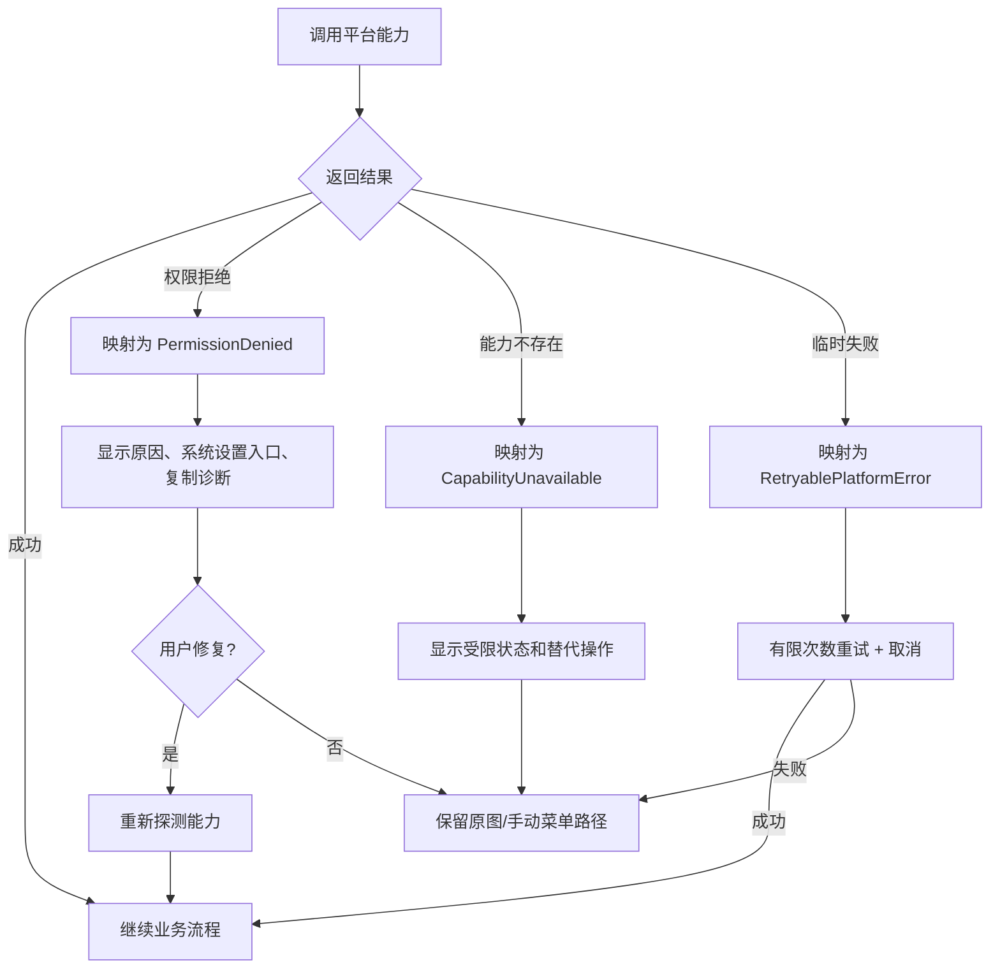

---

## 6. UI / UX 设计契约

### 6.1 Overlay

- 暗色半透明遮罩，选区内部保持原始亮度；四角和四边控制点有可见热区。
- 顶部或选区旁显示宽×高、坐标和当前显示器；数值使用物理像素，避免缩放误解。
- `Enter` 确认、`Esc` 取消、方向键移动 1 像素，`Shift+方向键` 移动 10 像素，`Space` 暂停/恢复延迟。
- 多显示器 Overlay 的坐标原点和屏幕排列与系统一致；窗口不遮挡系统权限对话框。

### 6.2 标注工具条

- 工具分组：选择/撤销、图形、绘制、文本/序号、像素处理、导出。
- 当前工具、颜色、线宽和填充状态必须有明显选中态；工具条支持键盘导航。
- 标注提交前显示预览，提交后进入撤销栈；不允许隐式丢弃未提交文本。

### 6.3 贴图窗口

- 默认轻边框，悬停显示操作栏；鼠标离开后隐藏非必要控件。
- 右键菜单必须包含复制、OCR、编辑、锁定、透明度、置顶、另存为、关闭。
- 锁定后仍可打开菜单和复制；状态通过图标、提示和无障碍文本同时表达。

### 6.4 设置与反馈

- 设置按“快捷键、截图、贴图、OCR、导出、外观、隐私”分组，修改立即验证，保存失败保留原值。
- 所有异步操作显示进行中、成功、可重试失败三态；Toast 只用于短反馈，重要错误保留在诊断面板。
- 深色/浅色/跟随系统三种主题，颜色对比度满足可读性要求；不以颜色作为唯一状态信息。

---

## 7. 平台能力与降级矩阵

| 能力 | Windows | macOS | Linux X11 | Linux Wayland | 降级策略 |
| --- | --- | --- | --- | --- | --- |
| 全局热键 | 原生后端 | 原生后端 | X11 后端 | XDG GlobalShortcuts Portal | 系统快捷方式引导 + 托盘菜单 |
| 区域截图 | 屏幕捕获 API | 屏幕录制权限 | xcap/X11 | xcap + Screenshot/ScreenCast Portal | 手动选择文件或系统截图工具 |
| 窗口截图 | 可选 P1 | 可选 P1 | 窗口枚举 | 视合成器和 Portal 能力 | 退回区域截图 |
| 置顶/透明 | 通常可用 | 通常可用 | 窗口管理器相关 | 合成器相关 | 显示平台受限标识 |
| 剪贴板图像 | 原生/抽象层 | 原生/抽象层 | X11/桌面环境 | 桌面环境实现 | 保存到 PNG |
| 开机自启 | 启动项 | Login Item | `.desktop` | `.desktop` | 提供手动安装说明 |

平台适配层必须在启动时生成 `CapabilitySnapshot`，业务逻辑不得依赖环境变量直接分支。Wayland 的授权和合成器差异必须以用户可理解的状态呈现。

---

## 8. 配置、存储与生命周期

### 8.1 配置模型

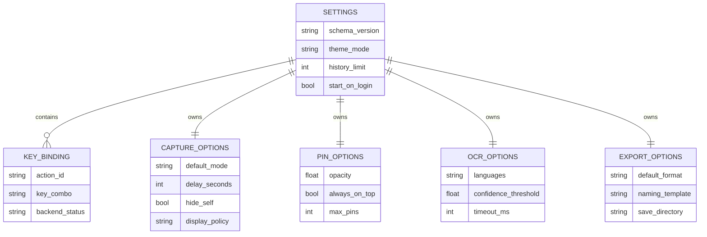

### 8.2 数据生命周期

- 原始截图在内存中由 `CaptureImage` 持有；贴图关闭后按历史策略保留或释放。
- 标注保存为结构化数据或导出合成图；不得只保存不可逆的预览而无法再次编辑。
- OCR 结果与图像内容哈希关联；原图变化后旧结果标记失效，不复用错误坐标。
- 历史文件放在应用管理目录，清理使用白名单路径；用户主动导出的文件不由自动清理管理。

---

## 9. 非功能需求与质量门禁

| 类别 | 目标 | 测量方式 |
| --- | --- | --- |
| 启动 | 热键监听和托盘可用优先，OCR 模型懒加载 | 冷启动/热启动日志时间戳 |
| 交互延迟 | 热键到 Overlay 可见目标 100–150ms（待实测） | 端到端埋点，按平台分组 |
| 截图准确性 | 物理像素与导出像素一致 | 多显示器/HiDPI 金样对比 |
| 稳定性 | 长时间运行无热键泄漏、窗口句柄泄漏 | soak test、句柄/内存曲线 |
| 可用性 | 权限/路径/冲突错误可解释且可恢复 | 场景测试与人工验收 |
| 隐私 | 默认不上传截图、OCR 文本或剪贴板内容 | 网络调用审计、日志脱敏检查 |
| 可维护性 | 平台代码集中在 adapter，核心逻辑可离线测试 | 依赖图与模块边界审查 |

### 9.1 测试分层

1. **纯领域单元测试**：坐标转换、选区约束、标注命中测试、撤销栈、OCR 文字选择、命名模板。
2. **服务契约测试**：使用 fake `CaptureProvider`、`ClipboardProvider`、`HotkeyProvider` 验证成功/失败/取消。
3. **平台探针**：在授权的隔离桌面会话运行截图、热键、置顶和剪贴板能力检查，不连接共享服务。
4. **UI 场景测试**：区域截图、编辑、贴图、OCR、导出的端到端操作；覆盖 Esc、权限拒绝和窗口关闭竞态。
5. **性能与稳定性**：多屏 HiDPI、10 个以上贴图、连续 OCR、长时间事件循环和异常退出恢复。

### 9.2 发布门禁

```text
cargo fmt --check
cargo clippy --all-targets --all-features -- -D warnings
cargo check
cargo test
平台隔离探针（按发布平台执行）
人工验收核心流程和降级提示
```

编译、打包成功不能替代业务测试；每个阶段必须把实际命令输出写入对应任务的完成记录。

---

## 10. 推荐仓库结构与依赖方向

进程入口固定为仓库根目录 `src/main.rs`（二进制 crate `pinora`）。业务库放在 `crates/` 下；`pinora-app` 只做生命周期与依赖组装库，不再单独提供 binary。

```text
pinora/
├── Cargo.toml                 # workspace + 根二进制 package `pinora`
├── src/
│   └── main.rs                # 唯一进程入口
├── crates/
│   ├── pinora-app/            # 生命周期、AppRuntime、依赖组装（库）
│   ├── pinora-core/           # 纯领域模型、命令、事件、错误码
│   ├── pinora-capture/        # 显示器、Overlay、截图工作流
│   ├── pinora-annotate/       # 标注数据、命中测试、撤销重做
│   ├── pinora-pin/            # 贴图实体与窗口生命周期
│   ├── pinora-ocr/            # OCR 引擎适配、文字层、选择器
│   ├── pinora-hotkey/         # 热键抽象和平台后端
│   ├── pinora-export/         # 剪贴板、编码、命名、文件导出
│   ├── pinora-history/        # 历史索引、清理、复用
│   ├── pinora-platform/       # 窗口、权限、启动项、能力探测
│   ├── pinora-diagnostics/    # 日志、错误映射、诊断包
│   └── pinora-ui/             # GPUI + Liora 视图和交互
├── assets/
└── docs/
    └── Pinora-开发设计文档.md
```

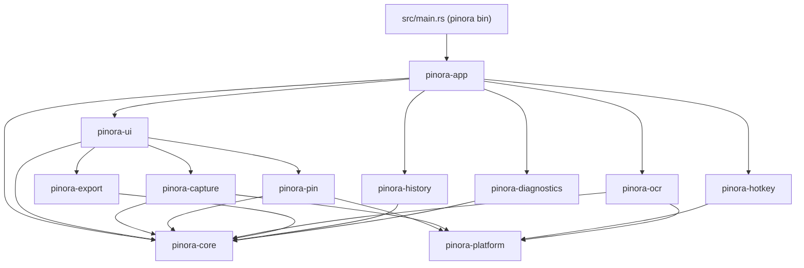

依赖方向只能由上层指向下层或能力接口；`pinora-core` 不得反向依赖 UI、平台适配器或具体第三方实现。根 `src/main.rs` 只负责启动编排，业务逻辑放在 `crates/` 中。

---

## 11. 开发阶段与交付拆分

### Phase 0：可运行骨架

- 建立 Cargo workspace 和最小 `AppRuntime`。
- 接入 GPUI/Liora 的版本验证、托盘、空设置页和单实例。
- 建立 `Command`、`DomainEvent`、错误码和 fake 平台能力。
- 验收：应用能启动、退出、第二次启动能激活首实例；离线单元测试可运行。

### Phase 1：截图 + 基础贴图 MVP（P0）

- 区域 Overlay、全屏截图、单/多显示器坐标、xcap/Portal 抽象。
- 贴图窗口拖动、缩放、透明度、锁定、置顶、关闭。
- PNG 复制和保存、基础热键、托盘菜单。
- 验收：完成“热键 → 区域截图 → 贴图 → 复制/保存”闭环。

### Phase 2：标注工作台（P0）

- 图形、画笔、文本、序号、马赛克/模糊、取色、撤销重做。
- 标注编辑与贴图双向进入，确定性合成导出。
- 验收：标注在缩放、导出和再次编辑后保持一致。

### Phase 3：OCR 与文字选择（P1）

- 本地引擎抽象、模型加载、中文/英文、文字层、跨行选择复制。
- 任务取消、超时、缓存、隐私说明和失败降级。
- 验收：标准样例识别、选择、复制和失败恢复均可测试。

### Phase 4：跨平台打磨与历史（P1）

- Wayland Portal 授权与降级、HiDPI、多屏热插拔、历史面板、配置迁移。
- 性能、稳定性、可访问性和诊断包。
- 验收：Windows、macOS、Linux X11、至少一个 Wayland 合成器完成核心场景。

### Phase 5：增强生态（P2）

- 长截图、短录屏、标签分组、插件化导出、自动更新和可选云端能力。
- 每项能力单独立项，默认不改变本地优先和隐私边界。

---

## 12. 风险、决策与待确认项

| 编号 | 风险/问题 | 影响 | 处理策略 | 决策时点 |
| --- | --- | --- | --- | --- |
| D-001 | GPUI/Liora 的版本与窗口能力 | 编译、窗口和托盘实现 | 先做最小可运行 spike，锁定兼容版本 | Phase 0 |
| D-002 | Wayland GlobalShortcuts 覆盖率 | 热键体验不一致 | Portal 优先，系统快捷方式降级 | Phase 0/4 |
| D-003 | OCR 引擎与模型分发 | 包体、启动、许可证 | 对比 ONNX/Tesseract，默认本地模型路径 | Phase 3 前 |
| D-004 | 透明置顶在不同合成器行为 | 贴图核心体验 | 能力探测、明确降级，不伪造成功 | Phase 1/4 |
| D-005 | 历史文件和用户导出边界 | 数据丢失或误删 | 白名单目录、内容哈希、原子写入 | Phase 4 |
| D-006 | 设计目标与实现状态混淆 | 计划失真 | 代码落地后同步 `.context/system/overview.md` 和任务完成记录 | 每个阶段 |

### 12.1 待确认问题

- 首发平台顺序是 Windows、macOS 还是 Linux Wayland 优先？
- Liora 是直接依赖上游仓库、workspace 子模块还是先以适配层隔离？
- OCR 模型是否随安装包发布，还是由用户导入本地模型？
- 首版是否支持窗口截图，还是只交付区域/全屏截图？
- 历史记录默认保存多久、最大磁盘占用是多少？
- 是否需要插件 API；若需要，插件沙箱和权限边界如何定义？

---

## 附录 A：建议接口草案

```rust
pub trait CaptureProvider {
    fn displays(&self) -> Result<Vec<DisplayInfo>, PlatformError>;
    fn capture(&self, request: CaptureRequest) -> Result<CaptureImage, CaptureError>;
}

pub trait WindowProvider {
    fn create_pin(&self, image: &CaptureImage) -> Result<WindowHandle, PlatformError>;
    fn set_transform(&self, handle: WindowHandle, transform: PinTransform) -> Result<(), PlatformError>;
    fn close(&self, handle: WindowHandle) -> Result<(), PlatformError>;
}

pub trait HotkeyProvider {
    fn register(&mut self, binding: KeyBinding) -> Result<(), HotkeyError>;
    fn unregister(&mut self, action: ActionId) -> Result<(), HotkeyError>;
}

pub trait OcrEngine {
    fn recognize(&self, image: &RgbaImage, options: OcrOptions) -> OcrFuture;
}
```

接口草案只表达能力边界，最终签名要结合所选依赖、线程模型和错误类型验证；不得直接复制为未经评审的公共 API。

## 附录 B：术语表

| 术语 | 定义 |
| --- | --- |
| CaptureImage | 一次截图产生的不可变像素和来源元数据 |
| Pin | 显示在桌面的可交互贴图实体 |
| Overlay | 覆盖屏幕用于选区、取色或窗口候选的临时 UI |
| AnnotationDoc | 与原图坐标绑定、可撤销重做的标注文档 |
| OcrResult | 带文字块、行、边界框和置信度的识别结果 |
| CapabilitySnapshot | 当前平台能力和权限探测结果 |
| DomainEvent | 已发生的领域事实，供 UI、服务和诊断订阅 |

*文档结束。实现阶段须把每个阶段拆成独立计划/任务，并用仓库证据更新本文和 `.context/`。*
