# Pinora 生产级重构开发设计文档

> 跨平台高性能截图、标注、贴图与本地 OCR 工具

| 项目 | 内容 |
| --- | --- |
| 文档版本 | v1.0 生产重构基线 |
| 日期 | 2026-08-01 |
| 状态 | 目标设计；不等同于当前实现或平台支持声明 |
| 产品代号 | Pinora（Pin + Liora，可后续更名） |
| 当前代码状态 | Rust 2024 workspace；`pinora-core` 与 `pinora-app` 已有 Linux/KDE 实验实现，尚未达到可发布架构 |

> **阅读说明**：本文是后续重构的目标设计，而非功能清单式承诺。任何模块、平台能力或性能目标，只有在对应任务完成代码、测试和授权的隔离探针后，才能写入已实现状态。UI 框架、平台 SDK 和 OCR 引擎均未在本文锁定；不得将草案直接复制为公共 API。

---

## 0. 接管结论与设计使用方式

### 0.1 三类信息边界

| 标记 | 含义 | 可用于什么决策 | 不可用于什么决策 |
| --- | --- | --- | --- |
| **已验证现状** | 已由源码、测试或命令输出证实 | 定义迁移输入、回归场景和风险 | 宣称未测平台或 GUI 行为正确 |
| **目标设计** | 本文要求后续实现达到的边界和行为 | 拆分任务、评审接口、设计测试 | 直接说明功能已交付 |
| **待验证决策** | 需要官方资料、原型或平台探针确认的选择 | 建立研究或 spike 任务 | 锁定依赖、版本、许可证或平台支持 |

### 0.2 已验证现状与处置

| 区域 | 已验证现状 | 处置 | 迁移前置条件 |
| --- | --- | --- | --- |
| 领域对象 | `pinora-core` 的像素几何、图像缓冲、选区约束和贴图状态有离线单元测试 | 保留并补强 | 保持 core 不依赖 UI、平台或外部进程 |
| 桌面编排 | `desktop_shell.rs` 集中窗口事件、截图、Overlay、标注、贴图、OCR、托盘和 IPC | 重做编排边界 | 新路径覆盖对应用户场景后才能删除旧路径 |
| 截图 | 当前优先 KDE `spectacle`，回退 xcap，再回退 fake | 重做平台捕获端口 | fake 仅限测试，运行时不能报告为成功截图 |
| OCR/剪贴板 | 通过外部命令和临时文件工作，缺少任务取消、generation 与退出绑定 | 重做任务监督和适配器 | 结果必须绑定资产版本和窗口/会话生命周期 |
| 平台支持 | Unix socket、KDE 命令和 Linux 剪贴板命令直接进入应用层 | 拆出平台适配器 | 未通过 target 编译和桌面探针的平台不对外声明支持 |
| 静态质量 | 2026-08-01 已通过 fmt、严格 Clippy、workspace check 和 75 个可执行单元测试 | 持续保持 | 不能替代 GUI、权限、多屏或跨平台验证 |

### 0.3 重构不可违反的产品契约

1. **真实能力语义**：截图、剪贴板、热键和置顶只有收到对应平台适配器的成功结果后，才能发布成功事件；内存副本、模拟实现和降级提示不能伪装为系统操作成功。
2. **资产不可变与版本化**：原始截图是不可变 `CaptureAsset`；标注、OCR 与导出只引用资产 ID、版本和坐标空间，不能通过共享可变像素缓冲相互污染。
3. **任务可取消且有归属**：所有耗时任务必须有 `JobId`、取消令牌、超时、输出上限、资产 generation 和拥有者；过期结果只能记录诊断，不能更新已关闭的窗口。
4. **平台边界单向**：领域层和应用工作流只依赖端口；平台 SDK、CLI、窗口句柄和环境变量不得泄漏到核心状态或公共命令。
5. **失败可恢复且可诊断**：错误必须携带稳定错误码、可否重试、用户可见下一步和脱敏诊断上下文；原始图像在可恢复错误后仍由会话持有。
6. **默认本地和最小数据暴露**：不上传图像、OCR 文本或剪贴板内容；日志和诊断包只记录脱敏元数据，导出诊断包需用户动作确认。

### 0.4 当前实现到目标架构的迁移图

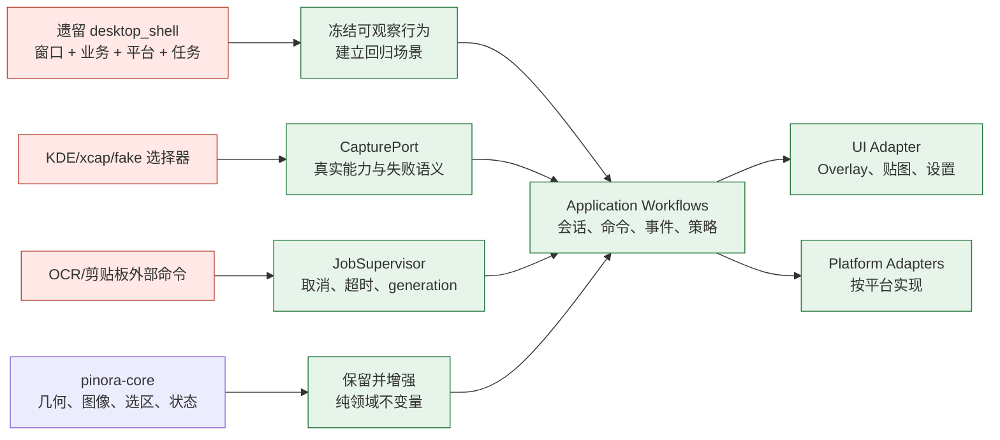
```mermaid
flowchart LR
    LegacyShell["遗留 desktop_shell\n窗口 + 业务 + 平台 + 任务"] --> Freeze["冻结可观察行为\n建立回归场景"]
    LegacyCapture["KDE/xcap/fake 选择器"] --> CapturePort["CapturePort\n真实能力与失败语义"]
    LegacyProcess["OCR/剪贴板外部命令"] --> JobSupervisor["JobSupervisor\n取消、超时、generation"]
    LegacyCore["pinora-core\n几何、图像、选区、状态"] --> Core["保留并增强\n纯领域不变量"]
    Freeze --> AppWorkflow["Application Workflows\n会话、命令、事件、策略"]
    CapturePort --> AppWorkflow
    JobSupervisor --> AppWorkflow
    Core --> AppWorkflow
    AppWorkflow --> UiAdapter["UI Adapter\nOverlay、贴图、设置"]
    AppWorkflow --> PlatformAdapters["Platform Adapters\n按平台实现"]

    classDef legacy fill:#ffe8e5,stroke:#b64231
    classDef target fill:#e7f4ea,stroke:#287a42
    class LegacyShell,LegacyCapture,LegacyProcess legacy
    class Freeze,CapturePort,JobSupervisor,Core,AppWorkflow,UiAdapter,PlatformAdapters target
```

### 0.5 技术决策状态

| 决策 | 状态 | 当前原则 | 完成条件 |
| --- | --- | --- | --- |
| UI 框架 | 待验证 | 先定义 UI Adapter 和离线状态机；不预设 GPUI/Liora | 通过官方文档、最小窗口 spike、许可证和可访问性评审 |
| 截图后端 | 待验证 | 每个发布平台使用正式系统 API/受支持 Portal；fake 仅测试 | target 编译、授权探针和多屏/HiDPI 场景通过 |
| OCR 引擎与模型分发 | 待验证 | 本地优先、按需加载、可取消、无隐式下载 | 许可证、包体、离线模型、取消和准确率场景完成验证 |
| 配置与历史存储 | 目标已定、实现待做 | 版本化本地文件、原子写、白名单清理 | 损坏恢复、迁移、并发写入和回滚测试通过 |
| 发布平台 | 待验证 | 仅声明已通过核心流程探针的平台 | 每个平台有 CI target、隔离桌面探针和人工验收证据 |

---

## 1. 产品定义与设计原则

### 1.1 产品定位

Pinora 是面向研发、设计和产品人员的桌面截图工作台，核心闭环是：

```text
全局热键 → 快速截图 → 精确标注 → 桌面贴图 → OCR 选字/复制 → 导出或复用
```

它对标 Snipaste，但把以下能力作为一等公民：

- Windows、macOS、Linux X11 和主流 Wayland 环境的统一体验。
- 截图后的贴图窗口生命周期管理，而非一次性图片预览。
- 图像上的中文/英文 OCR、可交互文字层和自由拖选复制。
- 本地优先、权限透明、无强制云端上传。

### 1.2 目标用户与典型场景

| 用户 | 高频场景 | 关键成功信号 |
| --- | --- | --- |
| 研发人员 | 对照接口文档、日志和设计稿 | 3 秒内完成截图并贴在代码旁 |
| 设计/产品人员 | 标注问题、取色、反馈尺寸 | 标注不丢失，导出清晰 |
| Linux 用户 | Wayland 下使用全局热键和截图 | 有 Portal 权限引导和可用降级 |
| 内容整理人员 | 从截图复制文字 | OCR 后可拖选跨行文本 |

### 1.3 设计原则

1. **快捷路径优先**：常用操作默认一步完成，高级选项不阻塞主流程。
2. **数据与视图分离**：截图、标注、OCR 结果和贴图变换是可测试的数据模型；任何 UI 框架只通过 UI Adapter 呈现和交互。
3. **平台差异隔离**：业务层只依赖能力接口，不直接依赖 Windows、macOS、X11 或 Wayland 类型。
4. **失败可恢复**：权限拒绝、OCR 失败、剪贴板失败都给出原因和下一步，不丢失原始图像。
5. **本地优先**：截图和 OCR 默认只在本机处理；任何上传能力必须显式启用并单独隔离。

### 1.4 范围优先级

| 优先级 | 定义 | 首版范围 |
| --- | --- | --- |
| P0 | 没有它就无法完成核心闭环 | 区域截图、基础贴图、基础标注、PNG 复制/保存、热键、托盘、单实例 |
| P1 | 显著提升效率，首版可分阶段交付 | OCR 文字层、拖选复制、多显示器、设置持久化、历史记录 |
| P2 | 增强体验或生态能力 | 长截图、录屏、分组标签、插件导出、自动更新、云端同步 |

---

## 2. 功能模块总览

### 2.1 模块清单

| 目标模块 | 主要职责 | P0/P1/P2 | 状态归属与关键约束 | 主要输入/输出 |
| --- | --- | --- | --- | --- |
| `pinora-core` | 坐标、不可变图像资产、标注文档、贴图领域状态、稳定错误码 | P0 | 只存领域不变量；禁止窗口、SDK 与进程句柄 | 命令值、状态快照、领域事件 |
| `pinora-application` | 用例编排、会话状态机、授权策略、事件发布、关闭顺序 | P0 | 拥有 `AppState` 和关联 ID；不绘制、不调用 CLI | `Command`/`Query` -> `Outcome`/事件 |
| `pinora-capture` | 显示器快照、捕获会话、选区确认、截屏后策略 | P0 | 快照在会话创建时固定；只接受真实捕获成功 | 用户意图 -> `CaptureAsset` 或受控失败 |
| `pinora-annotate` | 矢量标注、编辑事务、撤销重做、确定性合成 | P0 | 标注坐标绑定资产版本；源图不被原地修改 | 输入手势 -> `AnnotationDoc` revision |
| `pinora-pin` | 贴图实体、变换策略、窗口生命周期映射 | P0 | `PinId` 与 UI 窗口句柄分离；锁定是领域策略 | `PinCommand` -> `PinState`/窗口请求 |
| `pinora-ocr` | 识别请求、文字层、阅读顺序与文本选择 | P1 | 只接收资产快照；结果携带 generation 与引擎元数据 | `OcrRequest` -> `OcrResult` 或失败 |
| `pinora-export` | 图像合成、文件编码、系统剪贴板、命名与原子保存 | P0 | 成功事件必须来自实际目标确认 | 导出请求 -> 文件路径/系统剪贴板结果 |
| `pinora-jobs` | 耗时任务排队、并发限制、取消、超时、退出回收 | P0 | 外部进程和后台工作均由此监管 | `JobRequest` -> `JobOutcome` |
| `pinora-settings-history` | 版本化设置、历史索引、原子持久化和白名单清理 | P1 | 配置与用户导出路径分离；只管理自有目录 | 设置变更/资产引用 -> 本地记录 |
| `pinora-ui` | Overlay、工具栏、贴图、托盘、设置和可访问性呈现 | P0 | 仅通过命令/订阅交互；不直接改领域状态 | 输入事件 <-> ViewModel/Command |
| `pinora-platform-api` 与适配器 | 截屏、窗口、热键、剪贴板、单实例、权限、启动项 | P0 | 端口声明能力与失败原因；按平台隔离 | 端口调用 -> `CapabilityResult` |
| `pinora-diagnostics` | 结构化日志、能力快照、脱敏诊断包、运行探针 | P0/P1 | 不记录像素、OCR 全文、剪贴板内容或敏感路径 | 诊断事件 -> 可导出报告 |

### 2.2 功能模块总览结构图

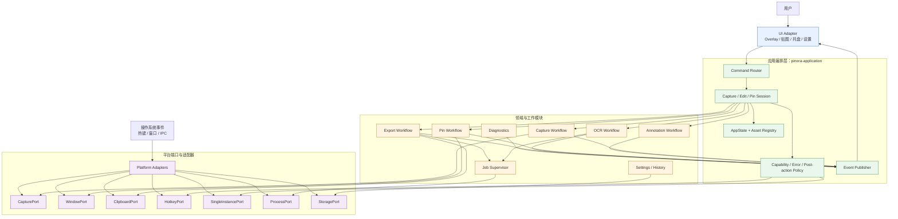
```mermaid
flowchart TB
    User["用户"] --> Ui["UI Adapter\nOverlay / 贴图 / 托盘 / 设置"]
    System["操作系统事件\n热键 / 窗口 / IPC"] --> PlatformAdapters

    subgraph Application["应用编排层：pinora-application"]
        Router["Command Router"]
        Session["Capture / Edit / Pin Session"]
        Store["AppState + Asset Registry"]
        Policy["Capability / Error / Post-action Policy"]
        Events["Event Publisher"]
    end

    subgraph Domain["领域与工作模块"]
        Capture["Capture Workflow"]
        Annotate["Annotation Workflow"]
        Pin["Pin Workflow"]
        Ocr["OCR Workflow"]
        Export["Export Workflow"]
        Jobs["Job Supervisor"]
        Persist["Settings / History"]
        Diagnostics["Diagnostics"]
    end

    subgraph Ports["平台端口与适配器"]
        PlatformAdapters["Platform Adapters"]
        Screen["CapturePort"]
        Window["WindowPort"]
        Clipboard["ClipboardPort"]
        Hotkey["HotkeyPort"]
        Instance["SingleInstancePort"]
        Process["ProcessPort"]
        Storage["StoragePort"]
    end

    Ui --> Router
    Router --> Session
    Session --> Policy
    Session --> Capture
    Session --> Annotate
    Session --> Pin
    Session --> Ocr
    Session --> Export
    Session --> Store
    Capture --> Screen
    Pin --> Window
    Ocr --> Jobs
    Export --> Clipboard
    Export --> Jobs
    Jobs --> Process
    Persist --> Storage
    Policy --> Hotkey
    Policy --> Instance
    Events --> Ui
    Capture --> Events
    Annotate --> Events
    Pin --> Events
    Ocr --> Events
    Export --> Events
    Diagnostics --> Events
    PlatformAdapters --> Screen
    PlatformAdapters --> Window
    PlatformAdapters --> Clipboard
    PlatformAdapters --> Hotkey
    PlatformAdapters --> Instance
    PlatformAdapters --> Process
    PlatformAdapters --> Storage

    classDef ui fill:#e8f1ff,stroke:#3167b1
    classDef app fill:#eaf7ed,stroke:#328048
    classDef domain fill:#fff4df,stroke:#b37711
    classDef port fill:#f5eafa,stroke:#8240a8
    class Ui ui
    class Router,Session,Store,Policy,Events app
    class Capture,Annotate,Pin,Ocr,Export,Jobs,Persist,Diagnostics domain
    class PlatformAdapters,Screen,Window,Clipboard,Hotkey,Instance,Process,Storage port
```

### 2.3 模块依赖规则

- `src/main.rs` 是薄入口：创建依赖图、启动宿主运行时、把进程级退出信号交给 `pinora-application`；不得持有窗口、捕获或 OCR 业务逻辑。
- `pinora-core` 只依赖标准库和纯数据类型，不依赖 UI 框架、平台 SDK、CLI、线程池或具体 OCR 引擎。
- UI 只能提交 `Command`、订阅 `Event`、读取不可变 `ViewModel`；禁止直接修改 `AppState`、`Pin`、标注或平台句柄。
- 平台适配器实现能力端口；每次调用返回实际结果、能力原因和可否重试。测试可用 fake，但 fake 类型必须显式注入且不得成为生产自动回退。
- `JobSupervisor` 是外部进程和耗时任务的唯一所有者；UI、贴图和 OCR 模块不得自行 `spawn` 后丢失句柄。
- 历史只保存应用管理目录中的索引与文件引用，不反向依赖 UI 或窗口句柄，也不接管用户主动导出的文件。

---

## 3. 软件架构

### 3.1 分层架构图

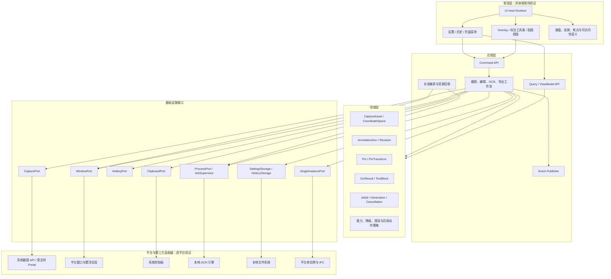
```mermaid
flowchart TB
    subgraph Presentation["表现层：具体框架待验证"]
        Host["UI Host Runtime"]
        OverlayUI["Overlay / 标注工具条 / 贴图视图"]
        SettingsUI["设置 / 历史 / 托盘菜单"]
        Accessibility["键盘、读屏、焦点与可访问性语义"]
    end

    subgraph Application["应用层"]
        Commands["Command API"]
        Queries["Query / ViewModel API"]
        Events["Event Publisher"]
        Workflow["截图、编辑、OCR、导出工作流"]
        Shutdown["关闭编排与资源回收"]
    end

    subgraph Domain["领域层"]
        ImageModel["CaptureAsset / CoordinateSpace"]
        AnnotationModel["AnnotationDoc / Revision"]
        PinModel["Pin / PinTransform"]
        OcrModel["OcrResult / TextBlock"]
        JobModel["JobId / Generation / Cancellation"]
        Policy["能力、降级、错误与后续动作策略"]
    end

    subgraph Infrastructure["基础设施端口"]
        CapturePort["CapturePort"]
        WindowPort["WindowPort"]
        HotkeyPort["HotkeyPort"]
        ClipboardPort["ClipboardPort"]
        ProcessPort["ProcessPort / JobSupervisor"]
        StoragePort["SettingsStorage / HistoryStorage"]
        InstancePort["SingleInstancePort"]
    end

    subgraph Adapters["平台与第三方适配器：逐平台验证"]
        NativeCapture["系统截图 API / 受支持 Portal"]
        NativeWindow["平台窗口与置顶实现"]
        NativeClipboard["系统剪贴板"]
        LocalOcr["本地 OCR 引擎"]
        FileStore["本地文件系统"]
        NativeInstance["平台单实例与 IPC"]
    end

    Host --> OverlayUI
    Host --> SettingsUI
    Host --> Accessibility
    OverlayUI --> Commands
    SettingsUI --> Commands
    SettingsUI --> Queries
    Commands --> Workflow
    Queries --> Domain
    Workflow --> Events
    Workflow --> Domain
    Workflow --> CapturePort
    Workflow --> WindowPort
    Workflow --> HotkeyPort
    Workflow --> ClipboardPort
    Workflow --> ProcessPort
    Workflow --> StoragePort
    Workflow --> InstancePort
    Shutdown --> ProcessPort
    Shutdown --> WindowPort
    CapturePort --> NativeCapture
    WindowPort --> NativeWindow
    ClipboardPort --> NativeClipboard
    ProcessPort --> LocalOcr
    StoragePort --> FileStore
    InstancePort --> NativeInstance
```

### 3.2 运行时组件关系

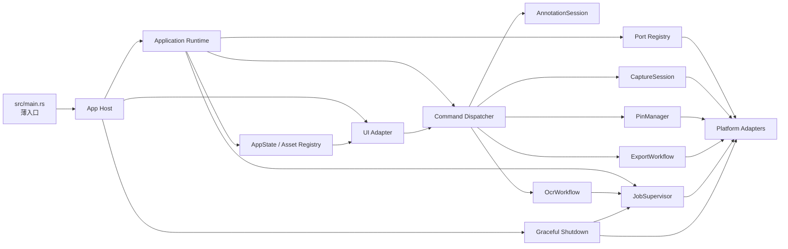
```mermaid
graph LR
    Main["src/main.rs\n薄入口"] --> Host["App Host"]
    Host --> App["Application Runtime"]
    Host --> Ui["UI Adapter"]
    App --> Dispatcher["Command Dispatcher"]
    App --> State["AppState / Asset Registry"]
    App --> Registry["Port Registry"]
    App --> Supervisor["JobSupervisor"]
    Dispatcher --> CaptureSvc["CaptureSession"]
    Dispatcher --> AnnotateSvc["AnnotationSession"]
    Dispatcher --> PinSvc["PinManager"]
    Dispatcher --> OcrSvc["OcrWorkflow"]
    Dispatcher --> ExportSvc["ExportWorkflow"]
    Ui --> Dispatcher
    State --> Ui
    Registry --> Platform["Platform Adapters"]
    CaptureSvc --> Platform
    PinSvc --> Platform
    ExportSvc --> Platform
    OcrSvc --> Supervisor
    Supervisor --> Platform
    Host --> Shutdown["Graceful Shutdown"]
    Shutdown --> Supervisor
    Shutdown --> Platform
```

### 3.3 领域核心数据模型

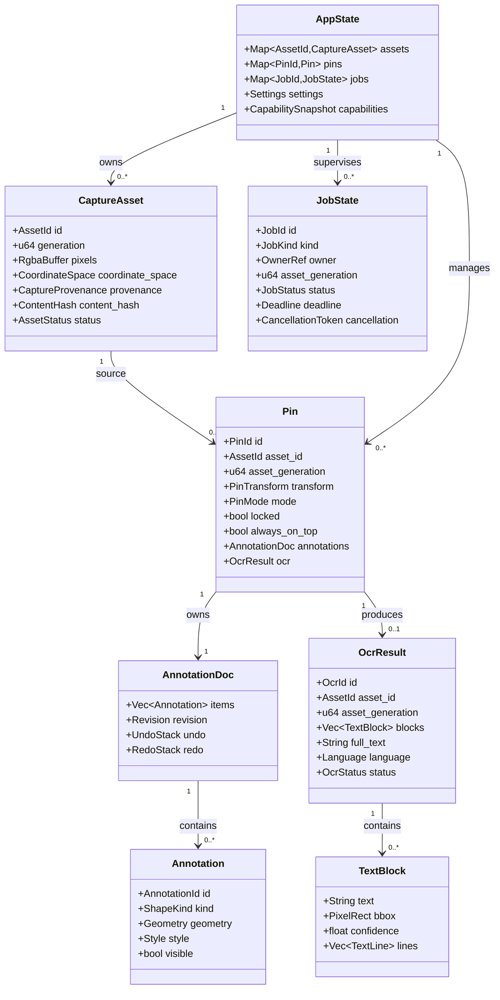
```mermaid
classDiagram
    class CaptureAsset {
        +AssetId id
        +u64 generation
        +RgbaBuffer pixels
        +CoordinateSpace coordinate_space
        +CaptureProvenance provenance
        +ContentHash content_hash
        +AssetStatus status
    }
    class AnnotationDoc {
        +Vec~Annotation~ items
        +Revision revision
        +UndoStack undo
        +RedoStack redo
    }
    class Annotation {
        +AnnotationId id
        +ShapeKind kind
        +Geometry geometry
        +Style style
        +bool visible
    }
    class Pin {
        +PinId id
        +AssetId asset_id
        +u64 asset_generation
        +PinTransform transform
        +PinMode mode
        +bool locked
        +bool always_on_top
        +AnnotationDoc annotations
        +OcrResult ocr
    }
    class OcrResult {
        +OcrId id
        +AssetId asset_id
        +u64 asset_generation
        +Vec~TextBlock~ blocks
        +String full_text
        +Language language
        +OcrStatus status
    }
    class TextBlock {
        +String text
        +PixelRect bbox
        +float confidence
        +Vec~TextLine~ lines
    }
    class AppState {
        +Map~AssetId,CaptureAsset~ assets
        +Map~PinId,Pin~ pins
        +Map~JobId,JobState~ jobs
        +Settings settings
        +CapabilitySnapshot capabilities
    }
    class JobState {
        +JobId id
        +JobKind kind
        +OwnerRef owner
        +u64 asset_generation
        +JobStatus status
        +Deadline deadline
        +CancellationToken cancellation
    }
    CaptureAsset "1" --> "0..*" Pin : source
    Pin "1" --> "1" AnnotationDoc : owns
    Pin "1" --> "0..1" OcrResult : produces
    AnnotationDoc "1" --> "0..*" Annotation : contains
    OcrResult "1" --> "0..*" TextBlock : contains
    AppState "1" --> "0..*" Pin : manages
    AppState "1" --> "0..*" CaptureAsset : owns
    AppState "1" --> "0..*" JobState : supervises
```

### 3.4 命令与事件约定

命令表示用户意图，事件表示已发生事实。命令可以失败；事件必须携带可诊断的关联 ID。

| 类别 | 示例 | 处理者 | 成功事件 | 失败事件 |
| --- | --- | --- | --- | --- |
| 截图 | `StartRegionCapture`、`ConfirmSelection` | CaptureWorkflow | `CaptureCompleted` | `CaptureFailed` |
| 贴图 | `CreatePin`、`SetPinTransform`、`ClosePin` | PinService | `PinCreated`、`PinUpdated` | `PinOperationFailed` |
| 标注 | `BeginAnnotation`、`CommitAnnotation`、`Undo` | AnnotationService | `AnnotationChanged` | `AnnotationRejected` |
| OCR | `RunOcr`、`ToggleTextLayer`、`CopySelection` | Ocr/Export | `OcrCompleted`、`TextCopied` | `OcrFailed`、`ClipboardFailed` |
| 配置 | `UpdateHotkey`、`SetTheme` | ConfigService | `SettingsChanged` | `SettingsRejected` |

事件至少包含 `event_id`、`occurred_at`、`correlation_id` 和实体 ID；日志不得写入截图像素、OCR 全文或凭据。

### 3.5 任务监督、并发与退出边界

截图编码、OCR、文件保存、系统剪贴板写入和平台调用不得由 UI 回调自行启动。应用层创建 `JobRequest`，其中必须包含 `JobId`、关联 `correlation_id`、资产 ID 与 generation、拥有者（会话或 `PinId`）、超时、取消令牌、输入/输出大小上限和幂等键。

- `JobSupervisor` 按任务类型设置独立并发上限。一个 OCR 引擎实例或平台捕获会话不可被并行任务重入时，必须串行化而不是依赖隐式全局锁。
- 工作线程只产生不可变 `JobOutcome`；只有应用事件循环能在 owner 仍有效、generation 相同、任务未被取消时提交结果。
- 超时首先请求协作式取消；适配器在宽限期后终止自己拥有的子进程或平台请求。任何强制终止都必须有错误码和脱敏诊断记录。
- 退出顺序固定为“停止接收命令 -> 标记会话关闭 -> 取消任务 -> 在截止时间内等待 -> 关闭窗口/适配器 -> 持久化最小状态 -> 释放单实例”。不得让后台任务在进程退出后继续持有临时文件或窗口引用。

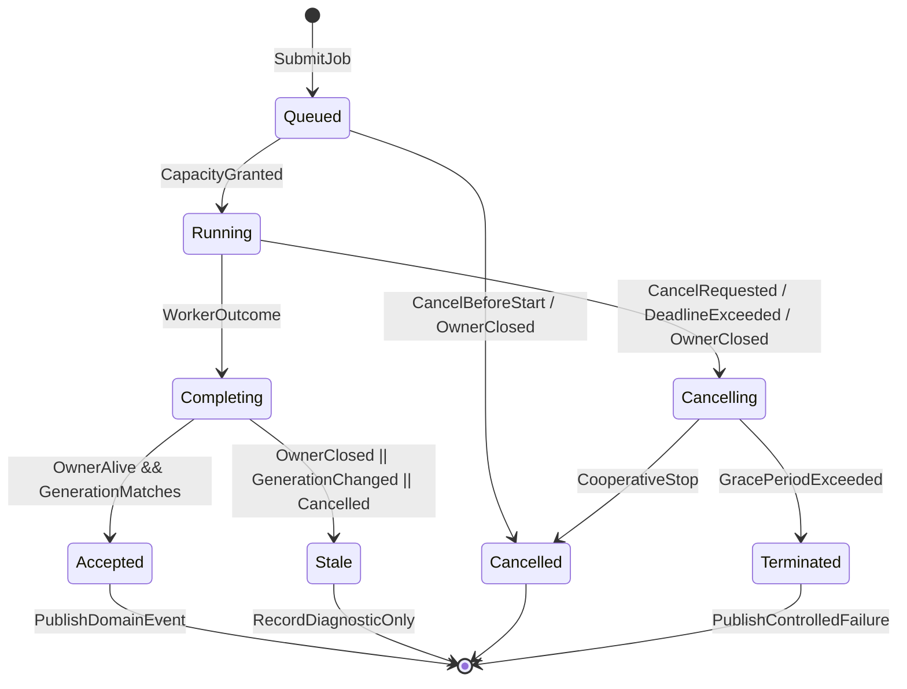
```mermaid
stateDiagram-v2
    [*] --> Queued: SubmitJob
    Queued --> Running: CapacityGranted
    Queued --> Cancelled: CancelBeforeStart / OwnerClosed
    Running --> Completing: WorkerOutcome
    Running --> Cancelling: CancelRequested / DeadlineExceeded / OwnerClosed
    Cancelling --> Cancelled: CooperativeStop
    Cancelling --> Terminated: GracePeriodExceeded
    Completing --> Accepted: OwnerAlive && GenerationMatches
    Completing --> Stale: OwnerClosed || GenerationChanged || Cancelled
    Accepted --> [*]: PublishDomainEvent
    Stale --> [*]: RecordDiagnosticOnly
    Cancelled --> [*]
    Terminated --> [*]: PublishControlledFailure
```

### 3.6 能力探测与降级语义

`CapabilitySnapshot` 不是简单的布尔集合。每项能力必须记录平台、后端标识、权限状态、可用范围、最后探测时间、错误码、修复建议和是否允许启动降级。业务工作流只依据这个快照和端口结果决策，不能读取环境变量绕开能力层。

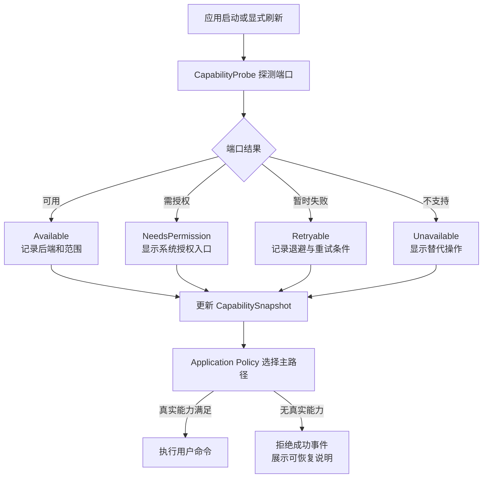
```mermaid
flowchart TD
    Start["应用启动或显式刷新"] --> Probe["CapabilityProbe 探测端口"]
    Probe --> Result{"端口结果"}
    Result -->|可用| Available["Available\n记录后端和范围"]
    Result -->|需授权| NeedsPermission["NeedsPermission\n显示系统授权入口"]
    Result -->|暂时失败| Retryable["Retryable\n记录退避与重试条件"]
    Result -->|不支持| Unsupported["Unavailable\n显示替代操作"]
    Available --> Snapshot["更新 CapabilitySnapshot"]
    NeedsPermission --> Snapshot
    Retryable --> Snapshot
    Unsupported --> Snapshot
    Snapshot --> Policy["Application Policy 选择主路径"]
    Policy -->|真实能力满足| Execute["执行用户命令"]
    Policy -->|无真实能力| Explain["拒绝成功事件\n展示可恢复说明"]
```

---

## 4. 功能详细规格

以下每节都包含入口、详细行为、边界行为和验收标准。P0/P1/P2 是交付优先级，不代表当前已经实现。

### 4.1 应用启动、单实例与退出（P0）

**入口**：用户启动程序、系统登录自启、第二次启动。

**详细功能**：

1. 初始化日志、配置目录、平台能力探测和 UI 运行时。
2. 通过 `SingleInstancePort` 创建单实例；已有实例时将启动参数转换为有版本的激活命令，只有首实例确认接收后第二进程才退出。
3. 恢复上次主题、热键、保存路径和启动选项；配置损坏时回退默认值并提示。
4. 启动托盘和热键监听，再按需创建设置窗口，不在启动阶段加载 OCR 模型；每个受限能力在菜单中显示可用、待授权或不可用状态。
5. 收到退出命令后按 3.5 的关闭顺序拒绝新命令、取消受监督任务、保存配置和历史索引、关闭贴图窗口并释放平台句柄。

**边界与失败**：

- 单实例锁不可创建：显示明确的文件路径和权限错误，不覆盖其他实例。
- 转发协议版本或命令无效：首实例拒绝该请求并记录错误码；第二进程保留错误退出码，不把“无法转发”写成激活成功。
- 配置版本过旧：执行可回滚迁移；迁移失败时保留原文件并使用默认配置。
- 平台能力探测失败：应用仍可启动，托盘中显示受限能力。

**验收**：重复启动只有一个活动实例；配置损坏不阻塞启动；退出后没有残留锁文件或后台热键。

### 4.2 区域、全屏、显示器与窗口截图（P0）

**入口**：全局热键、托盘菜单、设置页快捷操作。

**详细功能**：

- **区域截图**：覆盖相关显示器的透明 Overlay；拖拽、调整四边和四角、键盘微调、显示物理像素尺寸。
- **全屏截图**：捕获当前显示器或所有显示器；支持设置默认目标。
- **显示器选择**：显示器列表包含名称、逻辑坐标、物理分辨率、缩放因子和主屏标记。
- **窗口截图（P1）**：候选窗口高亮、标题识别、点击确认；无法获取窗口列表时退回区域截图。
- **延迟截图**：1/3/5 秒倒计时；倒计时期间允许取消，隐藏 Pinora 自身窗口和托盘菜单。
- **坐标转换**：内部统一使用物理像素；UI 使用逻辑像素，转换集中在 `CoordinateSpace`。
- **会话快照**：开始时固定显示器拓扑、坐标变换、能力版本和会话 ID；禁止消费无来源、无 generation 或可能包含自身窗口的任意旧帧。
- **自隐藏与恢复**：需要隐藏 Pinora 自身窗口时，先请求窗口适配器确认隐藏完成，再开始捕获；取消或失败必须恢复原可见性与焦点策略。
- **捕获后动作**：只有 `CapturePort` 返回真实 `CaptureAsset` 后才进入标注、直接贴图、复制或保存；不可用时保留会话说明而不是生成 fake 图像。

**边界与失败**：

- 用户按 `Esc`：取消会话，不生成空截图。
- 选区小于最小尺寸（默认 2×2 物理像素）：显示尺寸提示，禁止确认。
- 权限拒绝：不重试死循环，显示系统设置路径和“复制诊断信息”操作。
- 多显示器热插拔：刷新显示器快照；已开始的会话使用开始时坐标并在失效时安全取消。
- 捕获后端不可用、像素大小不符或来源拓扑已失效：发布受控失败，不创建 `CaptureAsset`，更不以模拟像素替代成功结果。

**验收**：P0 必须在单屏和双屏完成区域截图；HiDPI 下像素尺寸与保存图像一致；取消和权限拒绝均不丢失既有贴图。

#### 区域截图流程图

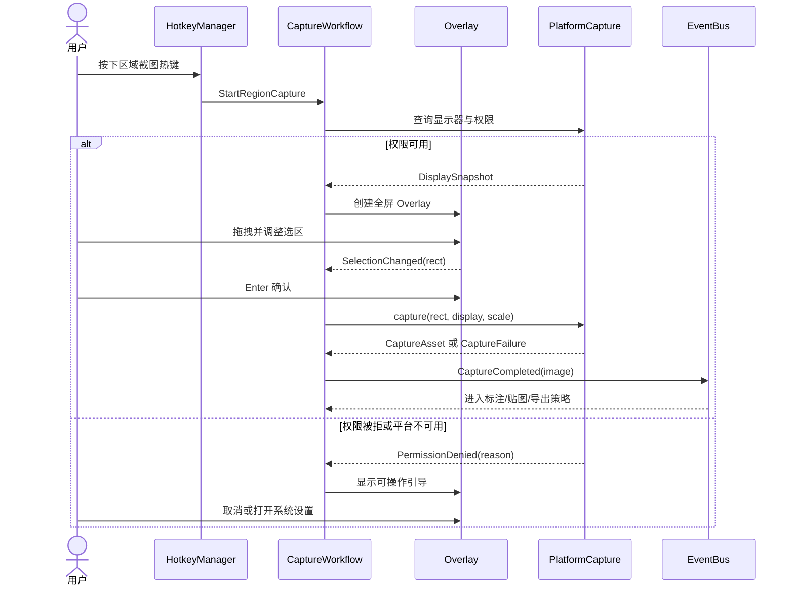
```mermaid
sequenceDiagram
    actor U as 用户
    participant H as HotkeyManager
    participant W as CaptureWorkflow
    participant O as Overlay
    participant P as PlatformCapture
    participant B as EventBus
    U->>H: 按下区域截图热键
    H->>W: StartRegionCapture
    W->>P: 查询显示器与权限
    alt 权限可用
        P-->>W: DisplaySnapshot
        W->>O: 创建全屏 Overlay
        U->>O: 拖拽并调整选区
        O-->>W: SelectionChanged(rect)
        U->>O: Enter 确认
        W->>P: capture(rect, display, scale)
        P-->>W: CaptureAsset 或 CaptureFailure
        W->>B: CaptureCompleted(image)
        B-->>W: 进入标注/贴图/导出策略
    else 权限被拒或平台不可用
        P-->>W: PermissionDenied(reason)
        W->>O: 显示可操作引导
        U->>O: 取消或打开系统设置
    end
```

#### 截图会话状态图

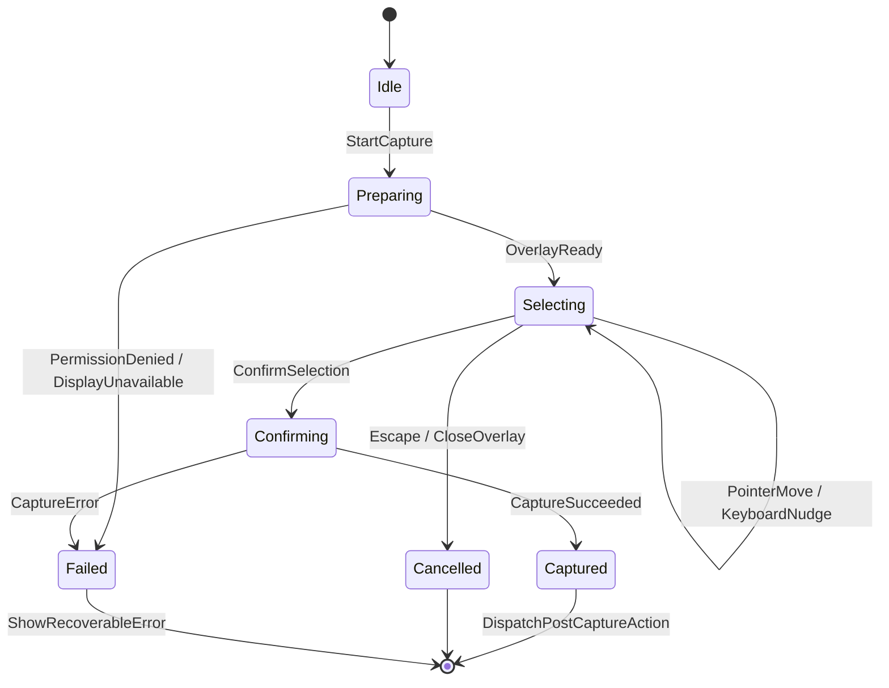
```mermaid
stateDiagram-v2
    [*] --> Idle
    Idle --> Preparing: StartCapture
    Preparing --> Selecting: OverlayReady
    Preparing --> Failed: PermissionDenied / DisplayUnavailable
    Selecting --> Selecting: PointerMove / KeyboardNudge
    Selecting --> Confirming: ConfirmSelection
    Selecting --> Cancelled: Escape / CloseOverlay
    Confirming --> Captured: CaptureSucceeded
    Confirming --> Failed: CaptureError
    Captured --> [*]: DispatchPostCaptureAction
    Cancelled --> [*]
    Failed --> [*]: ShowRecoverableError
```

### 4.3 贴图窗口与多贴图管理（P0）

**入口**：截图完成后的贴图动作、历史条目、剪贴板图像导入。

**详细功能**：

- 创建无边框、可拖动、可缩放、可置顶的贴图窗口；默认位置避开截图来源区域。
- 支持拖动、四角/四边缩放、滚轮缩放、按比例缩放和窗口适应原图。
- 支持透明度滑块、锁定/解锁、置顶/取消置顶、点击穿透（P2）。
- `Esc`、中键、窗口菜单可关闭；关闭前不弹出阻塞确认，提供撤销关闭入口（P1）。
- 多贴图同时存在；提供全部显示、全部隐藏、全部关闭、按最近使用排序。
- 贴图重新进入标注模式时保留同一个 `PinId` 和版本历史；保存/复制使用当前合成结果。
- 支持贴图标题、来源时间、OCR 状态和锁定状态的无障碍描述。
- 每个窗口只保存 `PinId` 与当前渲染快照；窗口句柄由 UI/平台适配器持有，领域状态不保留句柄或回调。
- 关闭贴图会先使其 owner 失效，再取消其 OCR、导出和动画任务；延迟到达的结果按 generation 丢弃，不能重新创建已关闭窗口。

**边界与失败**：

- 锁定状态拒绝拖动和缩放，但允许复制、OCR、关闭和显示菜单。
- 窗口创建失败时保留图像对象并提供重试/保存，不丢失截图。
- 置顶能力不可用时显示“平台受限”状态，不伪造置顶成功。
- 多贴图达到可配置上限时提示清理历史或关闭旧贴图。

**验收**：至少同时管理 10 个贴图；拖动、缩放、透明度和锁定状态在重绘后保持；关闭不会影响其他贴图。

#### 贴图生命周期图

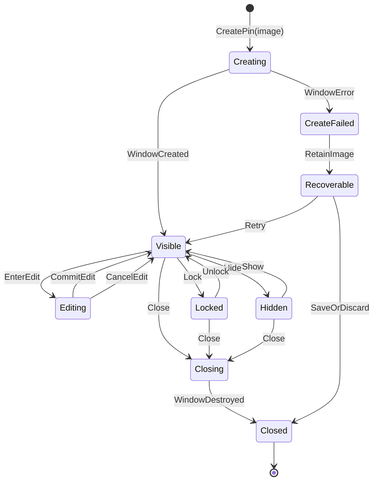
```mermaid
stateDiagram-v2
    [*] --> Creating: CreatePin(image)
    Creating --> Visible: WindowCreated
    Creating --> CreateFailed: WindowError
    Visible --> Editing: EnterEdit
    Visible --> Locked: Lock
    Visible --> Hidden: Hide
    Visible --> Closing: Close
    Editing --> Visible: CommitEdit
    Editing --> Visible: CancelEdit
    Locked --> Visible: Unlock
    Locked --> Closing: Close
    Hidden --> Visible: Show
    Hidden --> Closing: Close
    Closing --> Closed: WindowDestroyed
    CreateFailed --> Recoverable: RetainImage
    Recoverable --> Visible: Retry
    Recoverable --> Closed: SaveOrDiscard
    Closed --> [*]
```

### 4.4 标注工具链（P0）

**入口**：截图后标注、贴图菜单中的“编辑”、历史条目编辑。

**工具**：选择、矩形、圆角矩形、椭圆、直线、箭头、自由画笔、文本、序号、马赛克、模糊、取色器。

**详细功能**：

- 标注对象使用图像物理像素坐标，渲染时根据视图变换统一缩放。
- 每种工具定义 `pointer_down`、`pointer_move`、`pointer_up` 和键盘修饰键行为。
- 矩形/椭圆支持描边、填充、透明度和圆角半径；箭头支持端点样式。
- 文本支持字体、字号、颜色、背景、自动换行和文本框尺寸调整。
- 马赛克/模糊只作用于选区像素，原始图像保留在不可变源图层中，允许撤销。
- 序号自动递增，可设置起始数字和颜色；删除序号后不自动重排已提交对象。
- 取色器支持贴图内取色；屏幕取色需要平台截图权限，取色结果可复制为 HEX/RGB。
- 撤销/重做按事务记录，一次拖拽或一次文字提交作为一个事务；清空标注可整体撤销。
- 标注数据和渲染缓存分离，导出前生成确定性合成图。
- 每次提交产生单调递增 revision；撤销/重做、渲染缓存和 OCR 请求必须显式引用该 revision，避免编辑期间的陈旧合成结果覆盖新文档。

**边界与失败**：

- 文本提交为空时不生成对象。
- 图形超出画布时裁剪显示但保留原始几何，便于再次编辑。
- 图像缩放、旋转（P2）不改变标注数据的逻辑坐标。
- 渲染失败时仍可导出原始图像并显示标注错误。

**验收**：所有 P0 工具可撤销/重做；导出的标注位置在 100%、200% 缩放下与预览一致；取色器输出值可复现。

#### 标注交互流程图

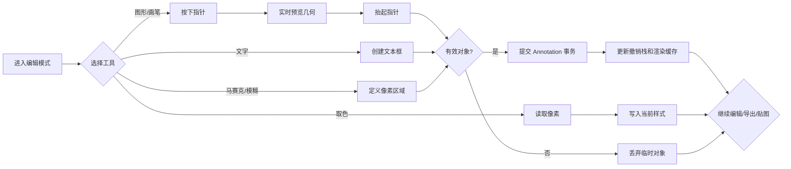
```mermaid
flowchart LR
    A[进入编辑模式] --> B{选择工具}
    B -->|图形/画笔| C[按下指针]
    B -->|文字| D[创建文本框]
    B -->|取色| E[读取像素]
    B -->|马赛克/模糊| F[定义像素区域]
    C --> G[实时预览几何]
    G --> H[抬起指针]
    H --> I{有效对象?}
    D --> I
    E --> J[写入当前样式]
    F --> I
    I -->|是| K[提交 Annotation 事务]
    I -->|否| L[丢弃临时对象]
    K --> M[更新撤销栈和渲染缓存]
    M --> N{继续编辑/导出/贴图}
    J --> N
    L --> N
```

### 4.5 OCR 与可交互文字层（P1，基础产品能力）

**入口**：贴图菜单、标注工具条、OCR 全局热键。

**详细功能**：

- 首次使用时按需加载本地 OCR 引擎和中文/英文模型；启动不阻塞。
- 支持对原始截图、当前贴图合成图或用户框选区域识别。
- 识别任务带 `OcrJobId`，支持取消、超时、进度和并发上限；同一图像可按内容哈希复用缓存。
- 任务提交时冻结资产 ID、资产 generation、标注 revision、语言和引擎配置摘要；命中缓存也必须匹配这些输入，不能只按 `PinId` 复用。
- 输出文字块、行、词/字符边界框、置信度、语言和引擎版本；坐标统一为图像物理像素。
- 文字层支持显示/隐藏、透明度、字号适配和按置信度过滤；默认不覆盖原始图像。
- 鼠标拖选支持跨块、跨行选择；自动按阅读顺序拼接，保留换行策略。
- 快捷复制当前选择或全部识别文本；复制失败时保留文本预览和重试入口。
- 识别失败不影响贴图和导出；用户可更换语言、重试或复制诊断信息。

**边界与失败**：

- 没有模型或模型校验失败：显示下载/配置说明，不自动联网下载。
- 置信度低于阈值的文本以低置信状态显示，不静默删除。
- OCR 任务超过超时：由 `JobSupervisor` 请求取消并在宽限期后回收其拥有的进程；保留最后一个匹配版本的结果，绝不使用外部不受控的全局 kill 命令。
- 图像被关闭时取消关联任务，禁止结果写入已销毁 `PinId`。

**验收**：中英文样例可识别；文字层坐标在缩放后命中正确；拖选跨行复制顺序稳定；OCR 失败不阻塞关闭和保存。

#### OCR 流程图

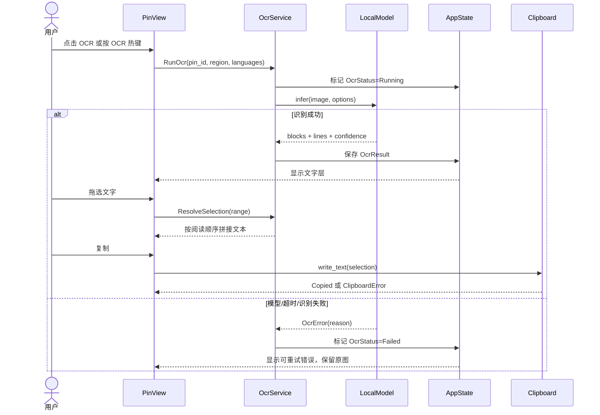
```mermaid
sequenceDiagram
    actor U as 用户
    participant V as PinView
    participant O as OcrService
    participant M as LocalModel
    participant S as AppState
    participant C as Clipboard
    U->>V: 点击 OCR 或按 OCR 热键
    V->>O: RunOcr(pin_id, region, languages)
    O->>S: 标记 OcrStatus=Running
    O->>M: infer(image, options)
    alt 识别成功
        M-->>O: blocks + lines + confidence
        O->>S: 保存 OcrResult
        S-->>V: 显示文字层
        U->>V: 拖选文字
        V->>O: ResolveSelection(range)
        O-->>V: 按阅读顺序拼接文本
        U->>V: 复制
        V->>C: write_text(selection)
        C-->>V: Copied 或 ClipboardError
    else 模型/超时/识别失败
        M-->>O: OcrError(reason)
        O->>S: 标记 OcrStatus=Failed
        S-->>V: 显示可重试错误，保留原图
    end
```

#### OCR 状态图

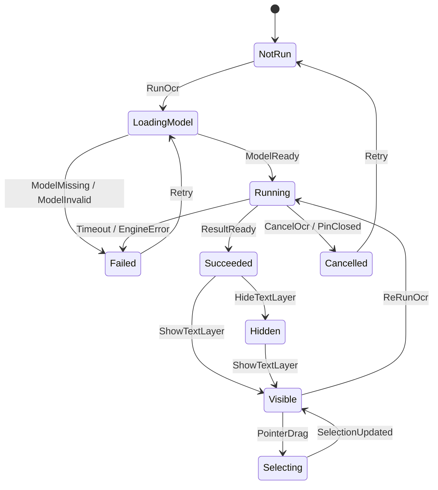
```mermaid
stateDiagram-v2
    [*] --> NotRun
    NotRun --> LoadingModel: RunOcr
    LoadingModel --> Running: ModelReady
    LoadingModel --> Failed: ModelMissing / ModelInvalid
    Running --> Succeeded: ResultReady
    Running --> Failed: Timeout / EngineError
    Running --> Cancelled: CancelOcr / PinClosed
    Succeeded --> Visible: ShowTextLayer
    Succeeded --> Hidden: HideTextLayer
    Visible --> Selecting: PointerDrag
    Selecting --> Visible: SelectionUpdated
    Visible --> Running: ReRunOcr
    Hidden --> Visible: ShowTextLayer
    Failed --> LoadingModel: Retry
    Cancelled --> NotRun: Retry
```

### 4.6 全局热键与冲突处理（P0）

**默认动作**：区域截图、全屏截图、显示/隐藏全部贴图、取色、对当前贴图 OCR。

**详细功能**：

- 设置页提供录制控件，显示修饰键、主键、平台显示名和当前占用状态。
- 绑定前做应用内重复检查；注册后接收平台回调并转成统一 `HotkeyEvent`。
- Windows 使用系统热键能力；macOS 使用全局快捷键能力；Linux X11 使用 X11 后端；Wayland 优先使用 XDG GlobalShortcuts Portal。
- Wayland Portal 首次绑定需要展示授权/配置流程和当前后端状态；不能静默假设注册成功。
- 冲突时提供冲突原因、建议组合和“改用系统快捷方式”降级路径。
- 热键配置热更新：先注册新组合，成功后解除旧组合，避免短暂无热键。
- 应用暂停/退出时解除注册；异常崩溃由平台会话自动回收，重启时重新校验。

**验收**：配置重复热键被阻止；Wayland 后端状态可见；注册失败不影响托盘和手动菜单操作。

#### 热键注册流程图

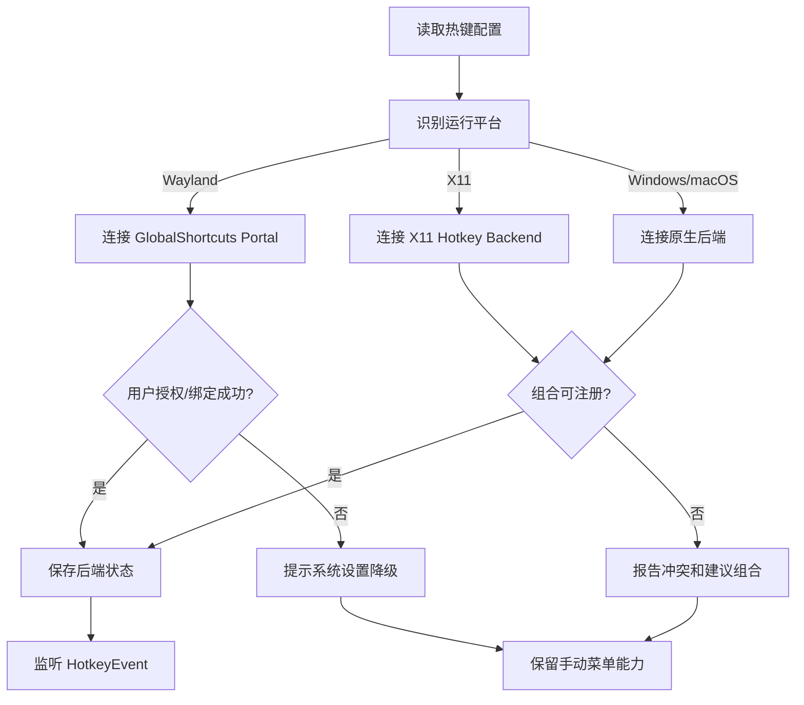
```mermaid
flowchart TD
    A[读取热键配置] --> B[识别运行平台]
    B -->|Wayland| C[连接 GlobalShortcuts Portal]
    B -->|X11| D[连接 X11 Hotkey Backend]
    B -->|Windows/macOS| E[连接原生后端]
    C --> F{用户授权/绑定成功?}
    D --> G{组合可注册?}
    E --> G
    F -->|是| H[保存后端状态]
    F -->|否| I[提示系统设置降级]
    G -->|是| H
    G -->|否| J[报告冲突和建议组合]
    H --> K[监听 HotkeyEvent]
    I --> L[保留手动菜单能力]
    J --> L
```

### 4.7 托盘、设置与主题（P0/P1）

**托盘菜单**：区域截图、全屏截图、贴图列表、显示/隐藏全部、关闭全部、设置、诊断、退出。

**设置分组**：

- 快捷键：录制、恢复默认、冲突状态和后端状态。
- 截图：默认模式、显示器、延迟、是否隐藏自身、截图后动作。
- 贴图：默认置顶、透明度、缩放行为、最大数量、关闭手势。
- OCR：语言、置信度阈值、模型目录、超时、文字层显示策略。
- 导出：格式、质量、命名模板、保存目录、覆盖策略。
- 外观：亮色、暗色、跟随系统、紧凑/舒适密度。
- 隐私与诊断：本地处理说明、日志级别、导出脱敏诊断包。

**配置规则**：配置有版本号和默认值；字段无效时逐项回退并记录原因；保存采用临时文件写入、校验、原子替换；敏感路径不写入普通日志。

### 4.8 剪贴板、导出与文件命名（P0）

**详细功能**：

- 复制图像优先保留 RGBA；若平台不支持透明通道，提示实际格式。
- 复制 OCR 当前选区或全文；图像和文本复制失败互不影响。
- 支持 PNG（无损默认）、JPEG（质量可选）、WebP（P1）；导出前选择原图、标注合成图或贴图当前视图。
- 命名模板支持日期、时间、序号、显示器和来源，例如 `Pinora_{yyyyMMdd}_{HHmmss}_{counter}`。
- 文件已存在时提供递增、覆盖（需显式设置）或取消；目录不可写时提供选择目录。
- 导出任务后台执行，界面显示进度和可取消状态；完成后可打开文件位置。
- 系统剪贴板成功与内存缓存是两个不同结果：系统写入失败时返回 `ClipboardFailed`，可保留内存预览供重试，但禁止发布“已复制到系统”的成功事件。
- 文件保存采用同目录临时文件、编码完成后原子替换，并在成功后校验目标存在性与可读性；取消或失败清理仅属于当前任务的临时文件。

**验收**：PNG 导出像素与预览一致；文件名在跨平台路径规则下合法；导出失败保留内存图像。

#### 导出流程图

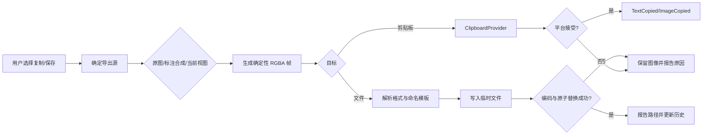
```mermaid
flowchart LR
    A[用户选择复制/保存] --> B[确定导出源]
    B --> C{原图/标注合成/当前视图}
    C --> D[生成确定性 RGBA 帧]
    D --> E{目标}
    E -->|剪贴板| F[ClipboardProvider]
    E -->|文件| G[解析格式与命名模板]
    G --> H[写入临时文件]
    H --> I{编码与原子替换成功?}
    I -->|是| J[报告路径并更新历史]
    I -->|否| K[保留图像并报告原因]
    F --> L{平台接受?}
    L -->|是| M[TextCopied/ImageCopied]
    L -->|否| K
```

### 4.9 历史记录与复用（P1）

- 保存最近 N 条截图或贴图索引，可配置数量、最大磁盘占用和保留天数。
- 条目包含缩略图、创建时间、来源显示器、标签（P2）、OCR 状态和文件引用。
- 支持预览、再次贴图、再次编辑、复制文本、删除单条、清空全部。
- 使用内容哈希去重；原图丢失时条目显示失效状态，不阻塞其他条目。
- 清理任务只删除 Pinora 管理目录中的文件，禁止误删用户任意选择的外部文件。
- 删除、配额清理与恢复使用 tombstone 和事务日志：索引先标记、文件操作成功后再提交；中断后可恢复或安全重试，避免索引与文件分叉。

### 4.10 诊断、权限和隐私（P0）

- 能力检测页显示平台、显示服务器、截图权限、热键后端、置顶能力、剪贴板能力和 OCR 模型状态。
- 错误分为用户可修复（权限、路径、冲突）、可重试（临时平台错误）和不可恢复（模型损坏、内部不变量破坏）。
- 日志采用结构化字段：时间、级别、模块、事件 ID、错误码；默认不记录像素、OCR 全文和剪贴板内容。
- “导出诊断包”只包含版本、平台能力、最近错误码和脱敏配置，不包含截图和个人路径，除非用户明确选择。
- 所有平台权限通过正规系统 API；不通过后台截屏、键盘监听或绕过 Portal 的方式实现功能。
- 每个操作的错误反馈至少包含稳定错误码、是否可重试、下一步建议、关联 ID 和脱敏后端摘要；详情页可复制诊断，但默认不自动上报。

---

## 5. 关键流程总览

### 5.1 首次启动流程

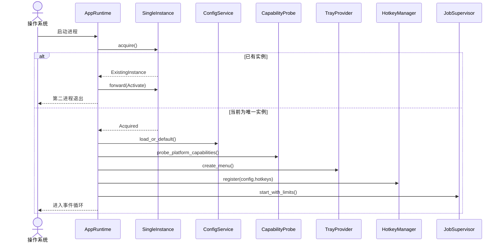
```mermaid
sequenceDiagram
    actor OS as 操作系统
    participant App as AppRuntime
    participant Lock as SingleInstance
    participant Config as ConfigService
    participant Cap as CapabilityProbe
    participant Tray as TrayProvider
    participant HK as HotkeyManager
    participant Jobs as JobSupervisor
    OS->>App: 启动进程
    App->>Lock: acquire()
    alt 已有实例
        Lock-->>App: ExistingInstance
        App->>Lock: forward(Activate)
        App-->>OS: 第二进程退出
    else 当前为唯一实例
        Lock-->>App: Acquired
        App->>Config: load_or_default()
        App->>Cap: probe_platform_capabilities()
        App->>Tray: create_menu()
        App->>HK: register(config.hotkeys)
        App->>Jobs: start_with_limits()
        App-->>OS: 进入事件循环
    end
```

### 5.2 快速截图到贴图

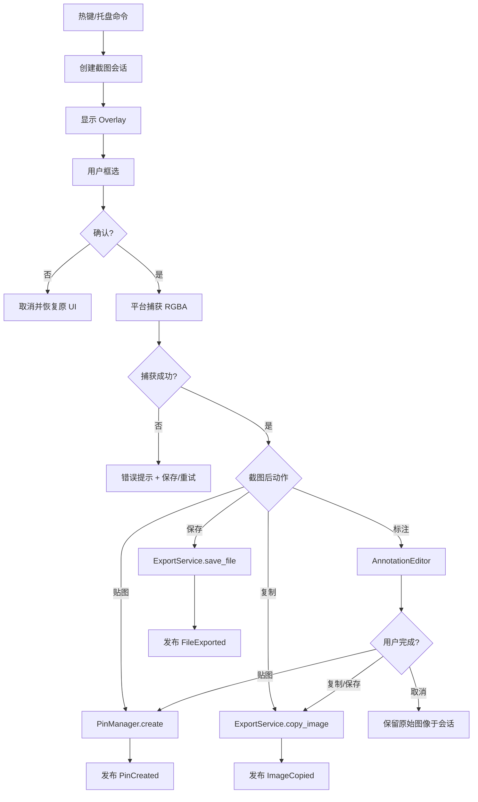
```mermaid
flowchart TD
    A[热键/托盘命令] --> B[创建截图会话]
    B --> C[显示 Overlay]
    C --> D[用户框选]
    D --> E{确认?}
    E -->|否| F[取消并恢复原 UI]
    E -->|是| G[平台捕获 RGBA]
    G --> H{捕获成功?}
    H -->|否| I[错误提示 + 保存/重试]
    H -->|是| J{截图后动作}
    J -->|标注| K[AnnotationEditor]
    J -->|贴图| L[PinManager.create]
    J -->|复制| M[ExportService.copy_image]
    J -->|保存| N[ExportService.save_file]
    K --> O{用户完成?}
    O -->|贴图| L
    O -->|复制/保存| M
    O -->|取消| P[保留原始图像于会话]
    L --> Q[发布 PinCreated]
    M --> R[发布 ImageCopied]
    N --> S[发布 FileExported]
```

### 5.3 权限拒绝与降级路径

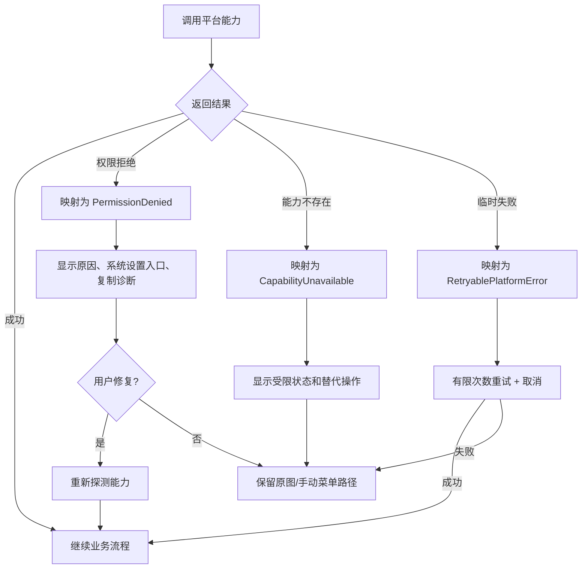
```mermaid
flowchart TD
    A[调用平台能力] --> B{返回结果}
    B -->|成功| C[继续业务流程]
    B -->|权限拒绝| D[映射为 PermissionDenied]
    B -->|能力不存在| E[映射为 CapabilityUnavailable]
    B -->|临时失败| F[映射为 RetryablePlatformError]
    D --> G[显示原因、系统设置入口、复制诊断]
    E --> H[显示受限状态和替代操作]
    F --> I[有限次数重试 + 取消]
    G --> J{用户修复?}
    J -->|是| K[重新探测能力]
    J -->|否| L[保留原图/手动菜单路径]
    H --> L
    I -->|成功| C
    I -->|失败| L
    K --> C
```

---

## 6. UI / UX 设计契约

### 6.1 Overlay

- 暗色半透明遮罩，选区内部保持原始亮度；四角和四边控制点有可见热区。
- 顶部或选区旁显示宽×高、坐标和当前显示器；数值使用物理像素，避免缩放误解。
- `Enter` 确认、`Esc` 取消、方向键移动 1 像素，`Shift+方向键` 移动 10 像素，`Space` 暂停/恢复延迟。
- 多显示器 Overlay 的坐标原点和屏幕排列与系统一致；窗口不遮挡系统权限对话框。

### 6.2 标注工具条

- 工具分组：选择/撤销、图形、绘制、文本/序号、像素处理、导出。
- 当前工具、颜色、线宽和填充状态必须有明显选中态；工具条支持键盘导航。
- 标注提交前显示预览，提交后进入撤销栈；不允许隐式丢弃未提交文本。

### 6.3 贴图窗口

- 默认轻边框，悬停显示操作栏；鼠标离开后隐藏非必要控件。
- 右键菜单必须包含复制、OCR、编辑、锁定、透明度、置顶、另存为、关闭。
- 锁定后仍可打开菜单和复制；状态通过图标、提示和无障碍文本同时表达。

### 6.4 设置与反馈

- 设置按“快捷键、截图、贴图、OCR、导出、外观、隐私”分组，修改立即验证，保存失败保留原值。
- 所有异步操作显示进行中、成功、可重试失败三态；Toast 只用于短反馈，重要错误保留在诊断面板。
- 深色/浅色/跟随系统三种主题，颜色对比度满足可读性要求；不以颜色作为唯一状态信息。

---

## 7. 平台能力、验证和降级矩阵

下表是**目标验证矩阵**，不是当前支持声明。当前仅有 Linux/KDE 实验路径；Windows target 检查目前仍受 GTK/pkg-config 依赖阻塞，macOS/X11/通用 Wayland 都没有完整核心流程证据。

| 能力 | Windows 目标 | macOS 目标 | Linux X11 目标 | Linux Wayland 目标 | 当前验证状态 | 无真实能力时的行为 |
| --- | --- | --- | --- | --- | --- |
| 单实例与激活 | 原生 IPC 适配器 | 原生 IPC 适配器 | 桌面会话适配器 | 桌面会话适配器 | Unix 实验实现已存在；其余未验证 | 不宣称激活成功，显示可诊断启动错误 |
| 全局热键 | 系统热键端口 | 系统热键端口 | X11 端口 | 受支持全局快捷方式机制 | 当前 Linux 实验热键；逐平台未验证 | 保留托盘/设置手动入口并显示能力状态 |
| 区域/全屏截图 | 正式屏幕捕获 API | 正式屏幕录制授权 API | 经验证捕获端口 | 经验证 Portal/合成器能力 | KDE `spectacle`/xcap/fake 实验路径 | 不创建 fake 资产；显示授权、不可用或替代操作 |
| 窗口截图 | P1，独立能力探针 | P1，独立能力探针 | P1，窗口管理器探针 | P1，仅在合成器正式支持时 | 未验证 | 隐藏或禁用入口，退回区域截图 |
| 置顶、透明与点击穿透 | WindowPort 能力探针 | WindowPort 能力探针 | 窗口管理器能力探针 | 合成器能力探针 | 当前行为未经跨环境验证 | 保留贴图、明确显示受限；不伪造置顶/透明成功 |
| 图像/文本剪贴板 | 原生剪贴板端口 | 原生剪贴板端口 | 桌面环境端口 | 桌面环境端口 | Linux CLI 实验实现；系统写入需复验 | 返回失败、保留内存预览和文件导出，不发系统复制成功事件 |
| 开机自启 | 平台启动项适配器 | 登录项适配器 | `.desktop` 适配器 | `.desktop` 适配器 | 未验证 | 提供文档化手动说明，不写入不兼容配置 |

每个发布平台必须先完成：目标编译、能力快照探针、授权的核心流程探针、失败/权限拒绝场景、关闭回收场景和人工可访问性验收。平台适配层必须在启动时生成 `CapabilitySnapshot`，业务逻辑不得依赖环境变量直接分支。

---

## 8. 配置、存储与生命周期

### 8.1 配置模型

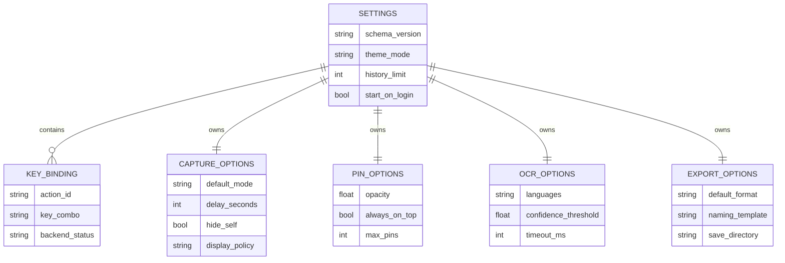
```mermaid
erDiagram
    SETTINGS ||--o{ KEY_BINDING : contains
    SETTINGS ||--|| CAPTURE_OPTIONS : owns
    SETTINGS ||--|| PIN_OPTIONS : owns
    SETTINGS ||--|| OCR_OPTIONS : owns
    SETTINGS ||--|| EXPORT_OPTIONS : owns
    SETTINGS {
        string schema_version
        string theme_mode
        int history_limit
        bool start_on_login
    }
    KEY_BINDING {
        string action_id
        string key_combo
        string backend_status
    }
    CAPTURE_OPTIONS {
        string default_mode
        int delay_seconds
        bool hide_self
        string display_policy
    }
    PIN_OPTIONS {
        float opacity
        bool always_on_top
        int max_pins
    }
    OCR_OPTIONS {
        string languages
        float confidence_threshold
        int timeout_ms
    }
    EXPORT_OPTIONS {
        string default_format
        string naming_template
        string save_directory
    }
```

### 8.2 数据生命周期

- 原始截图以不可变 `CaptureAsset` 持有，包含来源、内容哈希、坐标空间和 generation；贴图关闭后按历史策略保留引用或释放，不允许 UI 直接修改像素。
- 标注以结构化 `AnnotationDoc` 和 revision 保存；导出合成图是可再生派生物，不能替代可编辑的源资产与标注事务。
- OCR 结果关联资产 ID、generation、标注 revision、引擎摘要和输入内容哈希；任一输入不匹配时标记失效，不复用错误坐标。
- 历史文件仅放在应用管理目录，清理使用白名单和 tombstone；用户主动导出的文件永不由自动清理接管。
- 配置保存、历史索引写入和导出落盘均使用临时文件、校验和原子替换。启动恢复会扫描未提交临时文件，按所属事务删除或恢复，不读取半写入文件。

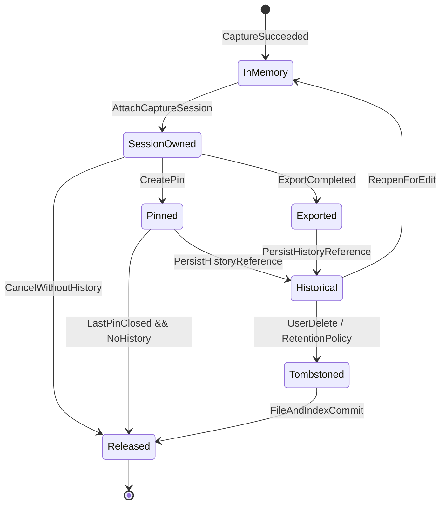
```mermaid
stateDiagram-v2
    [*] --> InMemory: CaptureSucceeded
    InMemory --> SessionOwned: AttachCaptureSession
    SessionOwned --> Pinned: CreatePin
    SessionOwned --> Exported: ExportCompleted
    Pinned --> Historical: PersistHistoryReference
    Exported --> Historical: PersistHistoryReference
    SessionOwned --> Released: CancelWithoutHistory
    Pinned --> Released: LastPinClosed && NoHistory
    Historical --> Tombstoned: UserDelete / RetentionPolicy
    Tombstoned --> Released: FileAndIndexCommit
    Historical --> InMemory: ReopenForEdit
    Released --> [*]
```

---

## 9. 非功能需求与质量门禁

| 类别 | 目标 | 测量方式 |
| --- | --- | --- |
| 启动 | 热键监听和托盘可用优先，OCR 模型懒加载 | 冷启动/热启动日志时间戳 |
| 交互延迟 | 热键到 Overlay 可见目标 100–150ms（待实测） | 端到端埋点，按平台分组 |
| 截图准确性 | 物理像素与导出像素一致 | 多显示器/HiDPI 金样对比 |
| 稳定性 | 长时间运行无热键泄漏、窗口句柄泄漏 | soak test、句柄/内存曲线 |
| 可用性 | 权限/路径/冲突错误可解释且可恢复 | 场景测试与人工验收 |
| 隐私 | 默认不上传截图、OCR 文本或剪贴板内容 | 网络调用审计、日志脱敏检查 |
| 可维护性 | 平台代码集中在 adapter，核心逻辑可离线测试 | 依赖图与模块边界审查 |

### 9.1 测试分层

1. **纯领域单元测试**：坐标转换、选区约束、标注命中测试、撤销栈、OCR 文字选择、命名模板。
2. **服务契约测试**：显式注入 fake `CapturePort`、`ClipboardPort`、`HotkeyPort`，验证成功、失败、取消和陈旧结果拒绝；fake 不参与生产后端选择。
3. **平台探针**：在授权的隔离桌面会话运行截图、热键、置顶和剪贴板能力检查，不连接共享服务。
4. **UI 场景测试**：区域截图、编辑、贴图、OCR、导出的端到端操作；覆盖 Esc、权限拒绝和窗口关闭竞态。
5. **性能与稳定性**：多屏 HiDPI、10 个以上贴图、连续 OCR、长时间事件循环和异常退出恢复。

### 9.2 发布门禁

```text
cargo fmt --check
cargo check --workspace
cargo clippy --workspace --all-targets -- -D warnings
cargo test --workspace
变更模块的领域/服务契约测试
目标平台的编译与授权隔离探针
核心流程、失败路径、关闭回收与可访问性人工验收
```

静态门禁、业务契约和桌面探针是三类独立证据。编译、打包或 fake 测试成功不能替代真实能力验证；每个阶段必须把实际命令输出、测试场景、已跳过条件和残留风险写入对应任务的完成记录。任何发布平台若缺少目标编译或授权探针，均保持“未验证”状态。

---

## 10. 推荐仓库结构与依赖方向

进程入口固定为仓库根目录 `src/main.rs`（二进制 crate `pinora`）。下列是**目标逻辑边界**，不是一次性拆 crate 的要求：先在现有 crate 中以内部模块和契约测试建立边界，只有独立编译、依赖隔离或平台分发确有收益时才拆出 crate。`src/main.rs`、注册器和路由聚合文件必须保持薄。

```text
pinora/
├── Cargo.toml                 # workspace + 根二进制 package `pinora`
├── src/
│   └── main.rs                # 唯一进程入口
├── crates/
│   ├── pinora-core/           # 纯领域模型、命令、事件、错误码
│   ├── pinora-application/    # 会话、工作流、依赖端口、关闭编排
│   ├── pinora-platform-api/   # 平台能力端口与 CapabilitySnapshot
│   ├── pinora-platform-*/     # 逐平台适配器，仅在实现后存在
│   ├── pinora-ui/             # 待选 UI 框架的 Adapter、视图和可访问性
│   ├── pinora-jobs/           # 任务监督、取消、超时和进程封装
│   ├── pinora-storage/        # 设置、历史、原子文件操作与清理
│   └── pinora-diagnostics/    # 日志、错误映射、诊断包与探针
├── assets/
└── docs/
    └── Pinora-开发设计文档.md
```

```mermaid
graph TD
    Main["src/main.rs (pinora bin)"] --> App[pinora-application]
    App --> UI[pinora-ui]
    App --> Core[pinora-core]
    App --> PlatformApi[pinora-platform-api]
    App --> Jobs[pinora-jobs]
    App --> Storage[pinora-storage]
    App --> Diagnostics[pinora-diagnostics]
    UI --> Core
    UI --> App
    Jobs --> Core
    Storage --> Core
    Diagnostics --> Core
    PlatformLinux[pinora-platform-linux] --> PlatformApi
    PlatformWindows[pinora-platform-windows] --> PlatformApi
    PlatformMac[pinora-platform-macos] --> PlatformApi
```

依赖方向只能由上层指向下层或能力接口；`pinora-core` 不得反向依赖 UI、平台适配器或具体第三方实现。UI 依赖 `pinora-application` 的命令/视图模型，不得绕过应用层直连平台适配器。根 `src/main.rs` 只负责启动编排，业务逻辑放在聚焦模块中。

---

## 11. 开发阶段与交付拆分

### 阶段 0：行为冻结与重构护栏

- 为现有区域截图、选区取消、贴图创建/关闭、导出、OCR 失败和单实例转发建立可观察场景清单；没有等价场景不得删除旧路径。
- 保持 `cargo fmt --check`、workspace check、严格 Clippy 和测试通过；记录真实桌面测试被跳过的条件。
- 将 `desktop_shell` 中的状态修改集中到可测试的应用状态机接口，不增加新 UI 功能。
- 验收：每项遗留功能被标为“保留、迁移、重做或废弃”，并有回滚点和最小契约测试。

### 阶段 1：领域边界、应用工作流与任务监督（P0 基础）

- 引入 `CaptureAsset` generation、`AppState` 所有权、`CapabilitySnapshot`、稳定错误语义和 `JobSupervisor`，先提供 fake/内存契约实现。
- 将截图、导出、OCR、窗口生命周期的命令编排从 UI 事件循环移出；入口文件保持薄。
- 验收：取消、超时、关闭、陈旧结果丢弃和退出回收均有离线契约测试，且不请求真实桌面权限。

### 阶段 2：单一发布平台的真实截图与应用会话（P0）

- 在明确选定的首发平台实现 `CapturePort`，覆盖显示器快照、授权、区域/全屏、坐标转换、自隐藏和失败反馈。
- 禁用生产自动 fake 回退；平台不可用必须阻止“截图成功”事件。
- 验收：目标编译、单屏/双屏/HiDPI、取消、授权拒绝和自隐藏的隔离桌面探针通过。

### 阶段 3：Overlay、贴图与导出垂直切片（P0）

- 用 UI Adapter 迁移区域 Overlay、工具栏、贴图窗口、锁定/缩放/置顶能力显示和 PNG 导出。
- 剪贴板、保存和窗口创建必须采用真实结果语义；窗口关闭取消所属任务。
- 验收：完成“热键/托盘 -> 区域截图 -> 贴图 -> 系统复制或原子保存”闭环，包含失败和关闭竞态场景。

### 阶段 4：标注工作台与可编辑资产（P0）

- 迁移矢量标注事务、撤销重做、渲染缓存、坐标空间和确定性合成；保留原始资产不可变。
- 优先交付矩形、箭头、画笔、文本和马赛克等核心工具，其他工具按独立任务扩展。
- 验收：编辑、撤销重做、缩放、导出和重新打开在资产/revision 一致性测试及桌面场景中通过。

### 阶段 5：OCR、历史与设置（P1）

- 在 `JobSupervisor` 内实现本地 OCR 引擎适配、模型可用性、取消、超时、缓存和文字层选择；不隐式下载模型。
- 实现版本化设置、历史索引、配额清理、诊断和故障恢复。
- 验收：中英文样例、取消/关闭、失败重试、配置损坏恢复和历史清理均有离线测试；目标平台上完成授权探针。

### 阶段 6：逐平台适配与发布准备（P1）

- 每个新增平台单独建立 adapter、target 编译、能力矩阵和核心流程探针；不以共享 UI/领域测试替代平台验证。
- 完成可访问性、性能、长时运行、崩溃恢复、诊断包和发布材料。
- 验收：仅对通过完整证据链的平台声明正式支持；未完成的能力保留实验标记或隐藏入口。

### 阶段 7：增强生态（P2）

- 长截图、短录屏、标签分组、插件导出、自动更新和可选云端能力均需独立 ADR、隐私评审和可回滚任务。
- 默认不改变本地优先、最小权限和不可变资产边界。

#### 遗留实现迁移流程图

```mermaid
flowchart LR
    Audit["016 接管审计"] --> Freeze["冻结场景与契约测试"]
    Freeze --> Boundary["阶段 1\n状态机 + 端口 + JobSupervisor"]
    Boundary --> Platform["阶段 2\n首发平台真实 CapturePort"]
    Platform --> Vertical["阶段 3\nOverlay / Pin / Export"]
    Vertical --> Annotation["阶段 4\nAnnotation"]
    Annotation --> OcrHistory["阶段 5\nOCR / 设置 / 历史"]
    OcrHistory --> Release["阶段 6\n平台验证与发布"]
    Legacy["遗留路径"] --> Freeze
    Legacy --> Keep["保留直到等价场景通过"]
    Vertical --> Compare{"等价契约\n和桌面场景通过？"}
    Compare -->|否| Keep
    Compare -->|是| Retire["受控废弃遗留路径"]
```

---

## 12. 风险、决策与待确认项

| 编号 | 风险/问题 | 影响 | 处理策略 | 决策时点 |
| --- | --- | --- | --- | --- |
| D-001 | UI 宿主框架与窗口能力 | 编译、窗口、托盘、可访问性实现 | 先实现 UI Adapter；以官方文档、最小窗口 spike、许可证和可访问性评审选型 | 阶段 1 前 |
| D-002 | Wayland 全局热键和截图授权覆盖率 | 核心交互体验不一致 | 单独验证受支持机制；手动入口降级；不读环境变量伪造能力 | 对应平台阶段前 |
| D-003 | OCR 引擎与模型分发 | 包体、启动、许可证、取消语义 | 对比本地引擎；验证模型来源、离线策略、输出边界和子进程回收 | 阶段 5 前 |
| D-004 | 置顶、透明和点击穿透的合成器差异 | 贴图核心体验 | WindowPort 能力探测、明确降级、逐环境探针，不伪造成功 | 阶段 3/6 |
| D-005 | 历史文件和用户导出边界 | 数据丢失或误删 | 自有目录白名单、tombstone、内容哈希、原子写入和恢复测试 | 阶段 5 |
| D-006 | 设计目标与实现状态混淆 | 计划失真 | 代码落地后同步 `.context/system/overview.md` 和任务完成记录；发布能力须有证据链接 | 每个阶段 |
| D-007 | 旧桌面壳迁移期间行为回退 | 用户核心流程中断 | 先冻结场景，双路径比较，按能力切换；未通过不删除旧路径 | 阶段 0-4 |
| D-008 | 生产 fake 回退与陈旧帧 | 将模拟图或自身窗口误报为截图 | fake 仅测试注入；资产记录来源/generation；会话拒绝任意旧帧 | 阶段 1-2 |

### 12.1 待确认问题

- 首发平台顺序是 Windows、macOS 还是 Linux Wayland 优先？
- UI 宿主框架的窗口、托盘、可访问性和跨平台许可是否满足阶段 3 的需求？
- OCR 模型是否随安装包发布，还是由用户导入本地模型？
- 首版是否支持窗口截图，还是只交付区域/全屏截图？
- 历史记录默认保存多久、最大磁盘占用是多少？
- 是否需要插件 API；若需要，插件沙箱和权限边界如何定义？

---

## 附录 A：建议接口草案

```rust
pub trait CapturePort {
    fn snapshot(&self) -> CapabilityResult<DisplaySnapshot>;
    fn capture(&self, request: CaptureRequest) -> CapabilityResult<CaptureAsset>;
}

pub trait WindowPort {
    fn create_pin(&mut self, request: CreatePinWindow) -> CapabilityResult<()>;
    fn apply_pin_view(&mut self, pin_id: PinId, view: PinViewModel) -> CapabilityResult<()>;
    fn destroy_pin(&mut self, pin_id: PinId) -> CapabilityResult<()>;
}

pub trait ClipboardPort {
    fn write_image(&mut self, image: ExportImage) -> CapabilityResult<SystemClipboardReceipt>;
    fn write_text(&mut self, text: ClipboardText) -> CapabilityResult<SystemClipboardReceipt>;
}

pub trait JobSupervisor {
    fn submit(&mut self, request: JobRequest) -> Result<JobId, JobAdmissionError>;
    fn cancel(&mut self, job_id: JobId, reason: CancelReason);
    fn poll(&mut self) -> Vec<JobOutcome>;
    fn shutdown(&mut self, deadline: Deadline) -> ShutdownReport;
}
```

`CapabilityResult<T>` 必须区分可用、需授权、暂时失败、不支持和内部故障，并携带稳定错误码、是否可重试及脱敏后端信息。`JobRequest` 必须引用资产 ID/generation、owner、截止时间、取消令牌、输入输出上限和关联 ID。接口草案只表达能力边界，最终签名要结合所选依赖、线程模型、错误类型和平台探针验证；不得直接复制为未经评审的公共 API。

## 附录 B：术语表

| 术语 | 定义 |
| --- | --- |
| CaptureAsset | 一次真实截图产生的不可变像素、来源、坐标空间、内容哈希和 generation |
| Pin | 显示在桌面的可交互贴图实体 |
| Overlay | 覆盖屏幕用于选区、取色或窗口候选的临时 UI |
| AnnotationDoc | 与原图坐标绑定、可撤销重做的标注文档 |
| OcrResult | 带文字块、行、边界框和置信度的识别结果 |
| CapabilitySnapshot | 当前平台能力和权限探测结果 |
| DomainEvent | 已发生的领域事实，供 UI、服务和诊断订阅 |
| JobSupervisor | 管理耗时工作、取消、超时、并发和退出回收的应用服务 |
| generation | 资产或编辑版本号，用于拒绝陈旧任务结果 |

*文档结束。实现阶段须把每个阶段拆成独立计划/任务，并用仓库证据更新本文和 `.context/`。*
